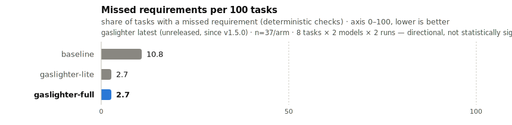
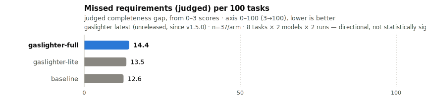

# Gaslighter

A Claude Code plugin that catches Claude at the exact moment it thinks it's finished, and makes it doubt itself just enough to go back and re-read what you actually asked for.

 

You write five requirements. Claude implements four, says "Done!", and means it. The fifth one was in the middle of your second paragraph, and nothing errors, so you find out in review. Or in production. That's the failure this plugin exists for, and it's measurable:

<p align="center">
  <picture>
    <source media="(prefers-color-scheme: dark)" srcset="assets/benchmark-dark.svg">
    
  </picture>
</p>

Deterministic checks tell one story; an LLM judge scoring the same runs for completeness tells a more cautious one — both are shown so neither is cherry-picked:

<p align="center">
  <picture>
    <source media="(prefers-color-scheme: dark)" srcset="assets/benchmark-completeness-dark.svg">
    
  </picture>
</p>

Headless Claude Code sessions on tasks built around the ways models actually drop requirements. The current numbers are a small, single-run sample (see the caveat on each chart) — treat them as directional. Full numbers, per-task breakdown, and the turn/cost overhead of `full` mode are below.

## What it looks like

Say you ask for a webhook handler: 
```
Accept a URL and payload, format messages like the other handlers do, handle errors the same way, and make it available when the package is imported.
```

Without gaslighter, Claude writes a clean `webhook_handler.py` and declares victory. It never touches `__init__.py`. The handler exists, the package doesn't export it, and that last requirement was sitting right there in the prompt. This is the single most common miss in our eval data, by a wide margin.

With gaslighter, just as Claude tries to finish:

> Hold on — are you absolutely sure you've addressed every single requirement from the original request? Don't just assume you did. Go back, re-read what was asked, and confirm each point is actually implemented. If anything is missing, fix it now.

Claude re-reads the request, catches "available alongside the existing handlers", and registers the handler before finishing.

## How it works

Each time Claude tries to finish a response, a [Stop hook](https://code.claude.com/docs/en/hooks) fires and asks it to re-verify the original request against what it actually did. It's built not to become a nag loop: one nudge per stop, a session cap, and an escape hatch — once Claude answers a nudge without changing anything (no tool calls) or declares it's 100% certain everything is covered, the nudging stops for the session. The first nudge only fires if the turn actually touched files (`Edit`/`Write`/`Bash`) — pure Q&A turns get no nudge, no added latency. Lite mode's nudge is invisible by default (hidden from the transcript, still reaches the model); full mode's block always shows a one-line status so you know why the turn continued.

| Mode | Delivery | Default cap |
|------|----------|-------------|
| `lite` (default) | Soft nudge, Claude can still finish | 3 / session |
| `full` | Hard block, Claude can't finish until it re-verifies | unlimited |
| `smart` | Asks a cheap model (Haiku) whether anything was actually missed before nudging; only blocks when it says so | 2 / session |
| `off` | Hook exits silently | 0 |

`smart` trades latency for precision: instead of nudging on every gated Stop, it spends ~2-5s and one Haiku call asking whether the turn actually missed a requirement, and only hard-blocks when it flags a specific gap. If the check itself fails (no `claude` binary, timeout, malformed output) it never blocks on the failure — it falls back to a plain nudge instead. Not yet in the numbers below; it's new and hasn't been benchmarked against the other modes yet.

## The numbers

The chart up top comes from real agent sessions, not single prompts: headless Claude Code runs coding tasks engineered around requirement-dropping failure modes — buried constraints, conventions that live in the code instead of the prompt, changes that cascade across files. Every workspace gets scored by deterministic code checks plus an independent LLM judge. The chart and the table below regenerate straight from the eval data, so they can't drift from what was measured.

<!-- RENDER:RESULTS_TABLE:START — auto-generated by evals/render_findings.py, do not hand-edit -->
Merged across 2 eval runs (111 cells total: 8 tasks × 3 arms × 2 models, 1, 2 runs/cell across the runs):

| Arm | Correct | Auto Complete | Judge Completeness | Judge Overcorrection |
|---|---|---|---|---|
| baseline | 0.892 | 0.918 | 2.62 | 0.19 |
| gaslighter-lite | 0.973 | 0.952 | 2.59 | 0.22 |
| gaslighter-full | 0.973 | 0.936 | 2.57 | 0.35 |
<!-- RENDER:RESULTS_TABLE:END -->

<!-- RENDER:RESULTS_PROSE:START — auto-generated by evals/render_findings.py, do not hand-edit -->
No single arm leads on every quality metric — per-metric leaders are correct: `gaslighter-lite`, auto complete: `gaslighter-lite`, judge completeness: `baseline`.
<!-- RENDER:RESULTS_PROSE:END -->

Here's the part worth slowing down on: the `nudge-prompt` arm bakes the same "re-read and verify" advice into the system prompt instead of a hook, and it scores *worse than doing nothing*. The words aren't what works. The interruption is — it lands at the exact moment Claude tries to stop, when the request is cold and the miss is already sitting in the diff.

The trade is real, though. `full` mode spends roughly 45% more turns than baseline, because re-checking is the whole point. If a silently missed requirement costs you more than half an agent invocation, that math works for you. And no, it doesn't nag Claude into gold-plating: the judge's overcorrection score barely moves.

Method, per-task breakdowns, every individual score, and the limitations (single LLM judge, one mid-run hook fix in the merged data): [docs/eval-findings.md](docs/eval-findings.md). Or run it yourself: [evals/](evals/).

## Install

In Claude Code, as two separate prompts:

```
/plugin marketplace add LarryGF/gaslighter
```
```
/plugin install gaslighter@larrygf
```

Or from the command line:

```bash
claude plugin marketplace add LarryGF/gaslighter
claude plugin install gaslighter@larrygf
```

The hook is a tiny Node.js script, so `node` needs to be on your PATH. If it isn't, the plugin stays quiet instead of erroring on every stop.

Working on gaslighter itself? Run against a local clone without installing:

```bash
claude --plugin-dir /path/to/gaslighter
```

### Configure

Run `/gaslighter:config` once, pick a mode and nudge cap, and it persists across sessions. To override for a single session without touching that:

```bash
export GASLIGHTER_MODE=full        # off / lite / full
export GASLIGHTER_MAX_NUDGES=5     # a number, or infinite / unlimited / -1
```

Env var beats persisted config beats mode default, for mode and cap independently.

`smart` mode's backing model and CLI are configurable via `GASLIGHTER_SMART_MODEL` / `GASLIGHTER_SMART_CMD` (or the `smartModel` / `smartCmd` config keys); they default to the `claude` binary at Haiku.

### OpenCode

gaslighter also runs under [OpenCode](https://opencode.ai) from the same decision engine — only the I/O differs (`session.idle` instead of the Stop hook, a follow-up prompt instead of a block). See [opencode/README.md](opencode/README.md) for install and the small behavioral differences.

### Uninstall

```
/plugin remove gaslighter
```

That leaves the persisted config and session state behind in `~/.claude/plugins/data/gaslighter/` — delete that directory to remove every trace.

## Commands

| Command | What it does |
|---------|--------------|
| `/gaslighter` | Routes to the sub-commands below; with no argument, asks what you want |
| `/gaslighter:config` | Set mode and nudge cap, persisted across sessions |
| `/gaslighter:eval` | Run the benchmark suite |
| `/gaslighter:judge runs/<stamp>` | LLM-judge a completed eval run |

## Development

```bash
node tests/test-nudge-decision.js   # Claude adapter + hook logic
node tests/test-agnostic.js         # shared core, env/store, OpenCode adapter

cd evals
python3 run.py --selftest           # validate scorers against reference solutions, no API spend
python3 run.py --all --runs 4       # full eval run
```

`run.py` refuses to spend API money if the selftest fails, and verifies per cell that the hook actually fired where it should have. After judging, `render_findings.py` regenerates the findings doc, the results table above, and the chart — details in [evals/README.md](evals/README.md).

## FAQ

**Isn't "gaslighting" the model a bad thing?**
The nudge never lies. Every requirement it asks Claude to re-check was really in your request — it just refuses to accept "done" at face value.

**Won't it loop forever?**
No. One nudge per stop, a per-session cap, and an escape hatch once Claude re-checks without changing anything or declares 100% certainty.

**Why not just put "double-check your work" in the system prompt?**
We tested exactly that. It scored below doing nothing. Timing beats wording.

**Is `full` worth 45% more turns?**
Depends what a missed requirement costs you. Shipping code: probably yes. Throwaway exploration: use `lite`, or turn it off.

**Does it fire on non-coding turns?**
Right now it fires whenever Claude tries to finish, coding or not, up to the cap. Gating it on actual file edits is on the roadmap.

## License

[MIT](LICENSE).
