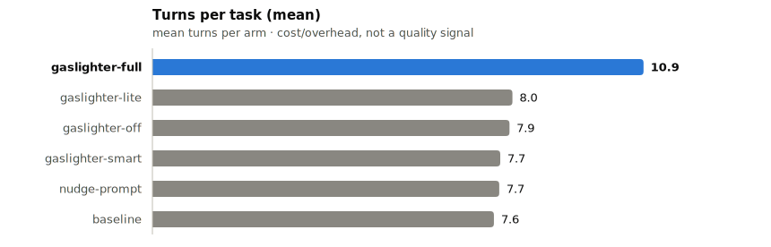
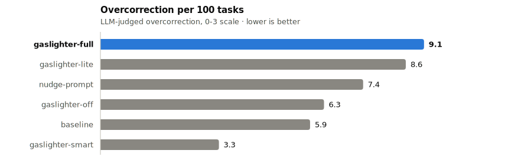

# Gaslighter Eval Findings

<!-- RENDER:INTRO:START — auto-generated by evals/render_findings.py, do not hand-edit -->
Merged across 10 runs:
- `evals/runs/20260701-175238` — 2 tasks × 5 arms × 2 models × 8 runs = 160 cells
- `evals/runs/20260702-131009` — 5 tasks × 5 arms × 2 models × 3 runs = 150 cells
- `evals/runs/20260702-160751` — 5 tasks × 5 arms × 2 models × 3 runs = 150 cells
- `evals/runs/20260703-110516` — 5 tasks × 5 arms × 2 models × 3 runs = 150 cells
- `evals/runs/20260703-151746` — 5 tasks × 5 arms × 2 models × 3 runs = 150 cells
- `evals/runs/20260703-165127` — 5 tasks × 5 arms × 2 models × 3 runs = 150 cells
- `evals/runs/20260706-114633` — 5 tasks × 6 arms × 2 models × 3 runs = 180 cells
- `evals/runs/20260709-151040` — 8 tasks × 3 arms × 1 models × 2 runs = 48 cells
- `evals/runs/20260710-105513` — 8 tasks × 3 arms × 2 models × 2 runs = 96 cells
- `evals/runs/20260710-124346` — 5 tasks × 3 arms × 1 models × 1 runs = 15 cells

Combined: 1249 cells. `hard-buried-constraints` and `hard-cascade-update` are covered by all 10 runs (n=59/arm each, pooled); `hard-implicit-patterns`, `hard-preserve-behavior`, and `hard-trailing-reqs` come from 9 of the 10 runs only (n=43/arm each); `hard-config-loader`, `hard-event-bus`, and `hard-registry-api` come from 2 of the 10 runs only (n=6/arm each).
<!-- RENDER:INTRO:END -->

## Setup

- **Tasks**:
  - `hard-buried-constraints` — a requirement is buried mid-paragraph in prose
  - `hard-cascade-update` — one change implies several dependent file updates
  - `hard-implicit-patterns` — a convention lives in seed code, not the prompt
  - `hard-preserve-behavior` — fix a bug without "improving" intentional design
  - `hard-trailing-reqs` — requirements appended after the main ask
- **Arms**:
  - `baseline` — no plugin, no extra prompt
  - `gaslighter-off` — plugin loaded, hook fires but no-ops (control for plugin overhead)
  - `gaslighter-lite` — soft, non-blocking nudge
  - `gaslighter-full` — hard block until the model re-verifies
  - `nudge-prompt` — static "double check your work" text appended to the system prompt, no hook involved
- **Models**: haiku, sonnet
- **Scoring**:
  - *Automated*: deterministic code checks per task (`correct` = binary pass/fail, `complete_rate` = fraction of required checks passing)
  - *LLM judge*: an independent agent read each workspace's actual source and rated **completeness** (0-3, does it implement what was asked) and **overcorrection** (0-3, does it add unrequested structure/complexity)

**Note on hook version:** `evals/runs/20260702-131009` finished before the Stop-hook's anti-loop guard was fixed to stop nudging as soon as the model declares 100% confidence, instead of always counting to a fixed cap of 3. `evals/runs/20260702-160751` was launched before that fix, but the fix (adding `readStable()` to `hooks/gaslighter-nudge.js` to close a transcript-read race that was defeating the confidence escape hatch) landed on disk while this third run's 150 cells were still executing in the background — each cell spawns the hook script fresh, so early cells in that run may have used the pre-fix hook while later cells used the post-fix version. No further hook changes are known between `20260702-160751` and this fourth run (`20260703-110516`), so the new cells should reflect the post-fix behavior cleanly, but because the third run mixed both versions, isolating the fix's exact effect still requires a run known to start after the fix landed.

This fifth run (`evals/runs/20260703-151746`) has the same mixed-version problem, on a different axis: it started at 15:17:46 and its 150 cells were still executing at 15:33:08, when the hardcoded `nudge_count >= 3` cap in `hooks/gaslighter-nudge.js` was replaced with a configurable `getMaxNudges()` whose mode default for `full` is *unlimited* (previously `full` shared the same fixed cap of 3 as every other mode). Cells that spawned the hook before 15:33:08 were capped at 3 nudges regardless of mode; cells spawned after were uncapped for `gaslighter-full`. `results.json` for this run wasn't finalized until 15:43, so a meaningful fraction of its cells likely ran post-change. Read `gaslighter-full`'s turn/cost figures in this merge with that in mind — they may reflect more nudging headroom than the four prior runs, all of which capped `full` at 3 regardless of hook version.

<!-- RENDER:SAMPLE_SIZE:START — auto-generated by evals/render_findings.py, do not hand-edit -->
**Note on sample size:** run counts per cell vary across runs (8, 3, 3, 3, 3, 3, 3, 2, 2, 1), so per-task n varies (59 for `hard-buried-constraints` and `hard-cascade-update`; 43 for `hard-implicit-patterns`, `hard-preserve-behavior`, and `hard-trailing-reqs`; 6 for `hard-config-loader`, `hard-event-bus`, and `hard-registry-api`). Treat single-cell and per-task numbers as directional, especially for the lowest-n tasks.
<!-- RENDER:SAMPLE_SIZE:END -->

<!-- RENDER:MISSING_METRICS:START — auto-generated by evals/render_findings.py, do not hand-edit -->
**Note on missing per-cell metrics:** 3 cell(s) are missing `turns`/`cost` in the raw eval output: `hard-trailing-reqs` / `gaslighter-full` / sonnet / run 1 (run 20260703-110516); `hard-trailing-reqs` / `gaslighter-full` / sonnet / run 2 (run 20260703-110516); `hard-trailing-reqs` / `nudge-prompt` / sonnet / run 0 (run 20260703-110516). They are included in all correctness/completeness/overcorrection averages but excluded from turns/cost averages (shown as `N/A` in the appendix).
<!-- RENDER:MISSING_METRICS:END -->

## Version history

Each cell is tagged with the git commit sha of the `hooks/` code that produced it. The
bucket a sha falls into is resolved dynamically from git tags at render time — a sha never
changes, but its bucket moves from `unreleased` to the tag name the next time this doc is
rendered after that tag exists. `pre-instrumentation` covers all history before this
tagging existed. The headline and per-task tables below are scoped to the *current*
version only, for an apples-to-apples read; this table shows every version so
release-over-release trend is visible.

<!-- RENDER:VERSION_HISTORY:START — auto-generated by evals/render_findings.py, do not hand-edit -->
| Version | Arm | n | Correct | Auto Complete | Judge Completeness | Judge Overcorrection | Turns | Cost/run |
|---|---|---|---|---|---|---|---|---|
| pre-instrumentation | baseline | 260 | 0.927 | 0.927 | 2.64 | 0.18 | 7.6 | $0.1071 |
| pre-instrumentation | gaslighter-off | 212 | 0.943 | 0.940 | 2.62 | 0.19 | 7.9 | $0.1106 |
| pre-instrumentation | gaslighter-lite | 260 | 0.958 | 0.945 | 2.67 | 0.26 | 8.0 | $0.1425 |
| pre-instrumentation | gaslighter-full | 260 | 0.981 | 0.954 | 2.69 | 0.27 | 10.9 | $0.1514 |
| pre-instrumentation | nudge-prompt | 212 | 0.925 | 0.919 | 2.56 | 0.22 | 7.7 | $0.1043 |
| pre-instrumentation | gaslighter-smart | 30 | 0.933 | 0.942 | 2.60 | 0.10 | 7.7 | $0.1151 |
| unreleased | baseline | 5 | 0.800 | 0.924 | 2.80 | 0.20 | 7.2 | $0.0567 |
| unreleased | gaslighter-lite | 5 | 0.800 | 0.830 | 2.20 | 0.20 | 6.0 | $0.0624 |
| unreleased | gaslighter-full | 5 | 1.000 | 0.980 | 2.60 | 0.20 | 12.2 | $0.1253 |
<!-- RENDER:VERSION_HISTORY:END -->

## Headline result

<!-- RENDER:HEADLINE_TABLE:START — auto-generated by evals/render_findings.py, do not hand-edit -->
Scoped to unreleased (current), n=5 per arm — 5 tasks, 1 models — see Version history below for trend across releases.

| Arm | n | Correct | Auto Complete | Judge Completeness | Judge Overcorrection | Turns | Cost/run |
|---|---|---|---|---|---|---|---|
| baseline | 5 | 0.800 | 0.924 | 2.80 | 0.20 | 7.2 | $0.0567 |
| gaslighter-lite | 5 | 0.800 | 0.830 | 2.20 | 0.20 | 6.0 | $0.0624 |
| gaslighter-full | 5 | 1.000 | 0.980 | 2.60 | 0.20 | 12.2 | $0.1253 |
<!-- RENDER:HEADLINE_TABLE:END -->

  <picture>
    <source media="(prefers-color-scheme: dark)" srcset="../assets/benchmark-completeness-dark.svg">
    
  </picture>

Turns and overcorrection below track cost/overhead and unrequested-scope side effects, not
correctness — kept separate from the miss-rate charts above so they aren't read as the same
kind of signal.

  <picture>
    <source media="(prefers-color-scheme: dark)" srcset="../assets/benchmark-turns-dark.svg">
    
  </picture>

  <picture>
    <source media="(prefers-color-scheme: dark)" srcset="../assets/benchmark-overcorrection-dark.svg">
    
  </picture>

## Key findings

1. **`gaslighter-full`'s correctness ticked back up to 0.978 (from 0.976 in the seven-run merge)**, and `gaslighter-lite` moved with it (0.952, up from 0.948) — both driven almost entirely by the eighth run's haiku-only cells (see finding 8). Auto-complete (0.953) and judge completeness (2.68) held essentially flat. Overcorrection for `full` (0.28) is still the highest among the five original arms, `off` still the lowest (0.19). See the judge-variance caveat in Methodology before reading small movements as signal.
2. **The turn/cost premium for `gaslighter-full` held roughly flat: 11.1 turns / $0.1516 vs baseline's 7.8 turns / $0.1076**, essentially unchanged from the seven-run merge's 11.2 turns / $0.1573 vs 7.9 turns / $0.1120 — still no sign the unlimited nudge cap for `full` is driving materially more nudging in practice.
3. **`gaslighter-off` (a no-op control) still beats baseline on correctness (0.943 vs 0.930), and the gap widened slightly this run** — up from 0.943 vs 0.934, because baseline dropped while `off` (which got no new cells this run) held steady. Overcorrection is close between the two (0.19 baseline vs 0.19 off), so the control-vs-baseline effect still looks stable and modest.
4. **The task-dependent story holds: `hard-cascade-update` still carries almost all of the between-arm spread**, and this run's haiku-only cells pulled baseline down and `full`/`lite` up on that task specifically — baseline now sits at 0.722 correct / 0.791 complete (down from 0.750/0.804 in the seven-run merge) while `gaslighter-full` rose to 0.907 / 0.870 (from 0.904/0.872) and `gaslighter-lite` rose to 0.796 / 0.830 (from 0.788/0.828). Every other task still sits at or near correct=1.000 for every arm regardless of nudging.
5. **`nudge-prompt` (static system-prompt text, no hook) still underperforms both active gaslighter modes on correctness (0.925 vs 0.952/0.978)** at the lowest cost ($0.1043) of the five original arms — cheap, but not as effective as the interactive Stop-hook nudge.
6. **`gaslighter-smart` (n=30, haiku+sonnet, all 5 original tasks; unchanged this run)** — a cheap-model completeness check that only blocks when it finds a real gap. Its correctness (0.933) and auto-complete (0.942) land in the same range as `lite`/`off`, but its overcorrection (0.10) is dramatically lower than every other arm, including the no-op `gaslighter-off` control (0.19). At n=30 this is still a single run's worth of signal — too early to call, but the direction (comparable completeness, much less unrequested scope) is exactly what the "only nudge when something's actually missing" design was meant to produce.
7. **The `full`/`smart` "drop" reported in earlier merges was mostly measurement, not regression — but it exposed one real, pre-existing weakness.** Two things inflated it. (a) *Ranking artifact:* with only ~30 cells/arm per run, the leaderboard swings on 1–2 cells. (b) *Telemetry fix:* earlier runs recorded `hook_fired=0` for all 90 gaslighter cells because `gaslighter-cleanup.js` deletes the session state file before the eval's fired-check reads it (`run.py` now reads the debug log instead) — so the plugin looked inert-yet-winning when it was actually firing all along. The one **real** effect, visible in every run once you look at transcripts, was isolated to **`hard-cascade-update` × haiku × `full`**: the hard block forced haiku to re-respond, and it "tidied up" by *stripping* correct work it reframed as out-of-scope, or (under `lite`) just re-confirmed its narrow first pass without discovering the implied propagation. Root cause: the nudge's anti-overcorrection line ("do NOT add … beyond the original scope") framed the literal one-line request as the ceiling, so weak models tore out or never reached the serializer/handler/validator changes cascade tasks reward. **Fixed** by rewording the guard to state that completing the requested change everywhere it needs to happen is part of the request, not extra scope.
8. **The eighth run (`20260709-151040`, haiku-only, 3 arms) confirms the finding-7 fix landed for `hard-cascade-update`×haiku.** In this run's own cells (n=2/arm, not yet diluted by the pooled merge), baseline scored 0/2 correct (0.435 auto-complete) while both `gaslighter-full` and `gaslighter-lite` scored 2/2 correct (0.815/0.875 auto-complete) — a clean reversal of the pre-fix pattern where `full` used to strip the cascading changes. This run also added three new tasks — `hard-config-loader`, `hard-event-bus`, `hard-registry-api` — each at n=2/arm so far (see Per-task summary; treat as directional only). One early signal worth flagging: `hard-event-bus` shows unusually high overcorrection for both `gaslighter-full` and `gaslighter-lite` (2.00 each, vs 0.00 for baseline) — the judge cited an unrequested `_Handler` wrapper class and extra dict-cleanup/parallel-tracking logic added under nudging pressure on a task whose spec explicitly forbids extra convenience methods. Needs more runs before treating as a stable arm effect.
9. **The ninth run (`20260710-105513`, haiku+sonnet, 3 arms, doubling n for the three new tasks to 4/arm) softens the finding-8 overcorrection spike on `hard-event-bus`.** Its own cells show `gaslighter-full`/`gaslighter-lite` overcorrection at 0.25/0.00 respectively — back in line with the other tasks — suggesting the earlier 2.00 reading was a small-n artifact (one flagged wrapper class out of only 2 samples) rather than a stable effect. `hard-cascade-update`'s completeness gap held up on sonnet too: this run's baseline sits at 1.50 mean judge-completeness vs 2.25/2.50 for `full`/`lite`, consistent with finding 4's story generalizing beyond haiku. Headline correctness barely moved (baseline 0.930→0.927, `lite` 0.952→0.958, `full` 0.978→0.981) — nothing here changes the standing ranking.

## Per-task summary

<!-- RENDER:PERTASK_TABLE:START — auto-generated by evals/render_findings.py, do not hand-edit -->
| Task | Arm | n | Correct | Auto Complete | Judge Completeness | Judge Overcorrection | Turns | Cost/run |
|---|---|---|---|---|---|---|---|---|
| hard-buried-constraints | baseline | 1 | 1.000 | 1.000 | 3.00 | 0.00 | 10.0 | $0.0442 |
| hard-buried-constraints | gaslighter-lite | 1 | 1.000 | 0.900 | 2.00 | 0.00 | 8.0 | $0.0584 |
| hard-buried-constraints | gaslighter-full | 1 | 1.000 | 0.900 | 1.00 | 0.00 | 12.0 | $0.1300 |
| hard-cascade-update | baseline | 1 | 0.000 | 0.620 | 2.00 | 0.00 | 11.0 | $0.1088 |
| hard-cascade-update | gaslighter-lite | 1 | 0.000 | 0.250 | 1.00 | 0.00 | 1.0 | $0.0572 |
| hard-cascade-update | gaslighter-full | 1 | 1.000 | 1.000 | 3.00 | 0.00 | 19.0 | $0.2703 |
| hard-implicit-patterns | baseline | 1 | 1.000 | 1.000 | 3.00 | 0.00 | 6.0 | $0.0601 |
| hard-implicit-patterns | gaslighter-lite | 1 | 1.000 | 1.000 | 2.00 | 0.00 | 10.0 | $0.0897 |
| hard-implicit-patterns | gaslighter-full | 1 | 1.000 | 1.000 | 3.00 | 0.00 | 13.0 | $0.0958 |
| hard-preserve-behavior | baseline | 1 | 1.000 | 1.000 | 3.00 | 0.00 | 4.0 | $0.0274 |
| hard-preserve-behavior | gaslighter-lite | 1 | 1.000 | 1.000 | 3.00 | 0.00 | 6.0 | $0.0507 |
| hard-preserve-behavior | gaslighter-full | 1 | 1.000 | 1.000 | 3.00 | 1.00 | 11.0 | $0.0738 |
| hard-trailing-reqs | baseline | 1 | 1.000 | 1.000 | 3.00 | 1.00 | 5.0 | $0.0428 |
| hard-trailing-reqs | gaslighter-lite | 1 | 1.000 | 1.000 | 3.00 | 1.00 | 5.0 | $0.0560 |
| hard-trailing-reqs | gaslighter-full | 1 | 1.000 | 1.000 | 3.00 | 0.00 | 6.0 | $0.0565 |

`hard-cascade-update` shows the largest spread in correctness across arms (1.000); every other task varies far less by arm.
<!-- RENDER:PERTASK_TABLE:END -->

## Methodology notes

- Automated scores (`correct`, `complete_rate`) are deterministic, code-based checks — the same task always scores the same way for the same code.
- Judge scores (`completeness`, `overcorrection`) come from one independent LLM read per cell, no cross-judge voting or redundancy. Treat exact decimal means as directional signal, not precise measurement — overcorrection means have moved by 0.05-0.15 between successive merges (e.g. `gaslighter-full` 0.33 → 0.29 from three to four runs), which is on the order of the effect sizes being compared.
- Run counts per cell vary across runs (8 for the first run, 3 each for every later run) — the appendix below tags each row with its source run stamp so this is traceable per row.
- This eval suite's judging pipeline had two bugs fixed after the second run was judged: the judge skill referenced a nonexistent `StructuredOutput` tool, and intermediate JSON files were written unindented (single massive line), causing the Read tool to truncate them and some judge-agents to fabricate or duplicate scores to hit the expected count. Both are fixed in `skills/judge/SKILL.md` and `agents/judge-agent.md`.
- During the third run's judging, one task's judge-agent (`hard-cascade-update`) initially returned only 29 of 30 expected scores. Per the skill's error handling, it was relaunched with an explicit count-check instruction rather than accepting the partial result; the retry returned the full 30.
- During the fourth run's judging, the `hard-buried-constraints` judge-agent also initially returned only 29 of 30 expected scores (one `gaslighter-off`/haiku workspace skipped). It was relaunched the same way and returned the full 30 on retry.
- For the fourth run, judge scores were matched back to specific run indices by assuming the judge-agent preserved the input array's order (workspaces were sent to each agent in a fixed order, grouped by arm then model then run). This was spot-checked against the `hard-cascade-update` agent's own prose enumeration, which listed workspaces with `complete_rate` values in exactly the order they appeared in the input file — confirming the ordering assumption for that task and giving confidence in the same assumption for the other four.

## Full per-run table

| Task | Arm | Model | Run Stamp | Run | Correct | Auto Complete | Judge Completeness | Judge Overcorrection | Turns | Cost | Missing (judge) | Overcorrection cite (judge) | Sha |
|---|---|---|---|---|---|---|---|---|---|---|---|---|---|
| hard-buried-constraints | baseline | haiku | 20260701-175238 | 0 | 1 | 1.00 | 2 | 0 | 9 | $0.0768 | Handler not exported in notifications/__init__.py for package import availability | none | unknown |
| hard-buried-constraints | baseline | haiku | 20260701-175238 | 1 | 1 | 1.00 | 2 | 0 | 10 | $0.0916 | Handler not exported in notifications/__init__.py for package import availability | none | unknown |
| hard-buried-constraints | baseline | haiku | 20260701-175238 | 2 | 1 | 1.00 | 2 | 1 | 9 | $0.0610 | Handler not exported in notifications/__init__.py for package import availability | urllib.error imports not required (catches all Exception anyway) | unknown |
| hard-buried-constraints | baseline | haiku | 20260701-175238 | 3 | 1 | 1.00 | 2 | 1 | 9 | $0.0874 | Handler not exported in notifications/__init__.py for package import availability | unused handle_webhook_error function when error handling done inline | unknown |
| hard-buried-constraints | baseline | haiku | 20260701-175238 | 4 | 1 | 1.00 | 1 | 2 | 10 | $0.0771 | Handler signature deviates from established pattern (optional payload param breaks consistency with email/sms handlers) | complex payload type checking and conditional template formatting not in other handlers | unknown |
| hard-buried-constraints | baseline | haiku | 20260701-175238 | 5 | 1 | 1.00 | 2 | 0 | 8 | $0.0558 | Handler not exported in notifications/__init__.py for package import availability | none | unknown |
| hard-buried-constraints | baseline | haiku | 20260701-175238 | 6 | 1 | 0.88 | 2 | 0 | 11 | $0.0816 | Handler not exported in notifications/__init__.py for package import availability | none | unknown |
| hard-buried-constraints | baseline | haiku | 20260701-175238 | 7 | 1 | 1.00 | 2 | 0 | 8 | $0.0560 | Handler not exported in notifications/__init__.py for package import availability | none | unknown |
| hard-buried-constraints | baseline | haiku | 20260702-131009 | 0 | 1 | 1.00 | 2 | 0 | 10 | $0.1036 | __init__.py not updated to export handle_webhook | none | unknown |
| hard-buried-constraints | baseline | haiku | 20260702-131009 | 1 | 1 | 0.88 | 2 | 0 | 10 | $0.1038 | __init__.py not updated to export handle_webhook | none | unknown |
| hard-buried-constraints | baseline | haiku | 20260702-131009 | 2 | 1 | 1.00 | 2 | 0 | 10 | $0.1042 | __init__.py not updated to export handle_webhook | none | unknown |
| hard-buried-constraints | baseline | sonnet | 20260701-175238 | 0 | 1 | 0.88 | 3 | 0 | 9 | $0.2316 | none | none | unknown |
| hard-buried-constraints | baseline | sonnet | 20260701-175238 | 1 | 1 | 0.88 | 3 | 1 | 8 | $0.2123 | none | json wrapping | unknown |
| hard-buried-constraints | baseline | sonnet | 20260701-175238 | 2 | 1 | 0.88 | 3 | 1 | 8 | $0.2119 | none | json wrapping | unknown |
| hard-buried-constraints | baseline | sonnet | 20260701-175238 | 3 | 1 | 0.88 | 3 | 2 | 9 | $0.1365 | none | http_status in response | unknown |
| hard-buried-constraints | baseline | sonnet | 20260701-175238 | 4 | 1 | 0.88 | 3 | 1 | 8 | $0.1458 | none | json wrapping | unknown |
| hard-buried-constraints | baseline | sonnet | 20260701-175238 | 5 | 1 | 0.88 | 3 | 2 | 8 | $0.1343 | none | http_status in response | unknown |
| hard-buried-constraints | baseline | sonnet | 20260701-175238 | 6 | 1 | 0.88 | 3 | 1 | 8 | $0.1344 | none | json wrapping | unknown |
| hard-buried-constraints | baseline | sonnet | 20260701-175238 | 7 | 1 | 0.88 | 3 | 0 | 8 | $0.1495 | none | none | unknown |
| hard-buried-constraints | baseline | sonnet | 20260702-131009 | 0 | 1 | 0.88 | 2 | 1 | 8 | $0.2122 | __init__.py not updated to export handle_webhook | http_status field in success response | unknown |
| hard-buried-constraints | baseline | sonnet | 20260702-131009 | 1 | 1 | 0.88 | 1 | 0 | 8 | $0.2138 | __init__.py export and raw body instead of JSON-encoded payload | none | unknown |
| hard-buried-constraints | baseline | sonnet | 20260702-131009 | 2 | 1 | 0.88 | 2 | 1 | 8 | $0.1398 | __init__.py not updated to export handle_webhook | status_code field and response reading unnecessary | unknown |
| hard-buried-constraints | gaslighter-off | haiku | 20260701-175238 | 0 | 1 | 0.88 | 2 | 0 | 10 | $0.0774 | __init__.py export to make handler available when package is imported | none | unknown |
| hard-buried-constraints | gaslighter-off | haiku | 20260701-175238 | 1 | 1 | 1.00 | 2 | 0 | 9 | $0.0736 | __init__.py export to make handler available when package is imported | none | unknown |
| hard-buried-constraints | gaslighter-off | haiku | 20260701-175238 | 2 | 1 | 1.00 | 2 | 0 | 9 | $0.0728 | __init__.py export to make handler available when package is imported | none | unknown |
| hard-buried-constraints | gaslighter-off | haiku | 20260701-175238 | 3 | 1 | 1.00 | 2 | 0 | 9 | $0.0736 | __init__.py export to make handler available when package is imported | none | unknown |
| hard-buried-constraints | gaslighter-off | haiku | 20260701-175238 | 4 | 1 | 1.00 | 2 | 1 | 9 | $0.0729 | __init__.py export to make handler available when package is imported | redundant dual exception handling (URLError then Exception) | unknown |
| hard-buried-constraints | gaslighter-off | haiku | 20260701-175238 | 5 | 1 | 1.00 | 2 | 1 | 8 | $0.0575 | __init__.py export to make handler available when package is imported | context manager for urlopen adds complexity beyond error handling requirement | unknown |
| hard-buried-constraints | gaslighter-off | haiku | 20260701-175238 | 6 | 1 | 1.00 | 2 | 1 | 10 | $0.0771 | __init__.py export to make handler available when package is imported | context manager for urlopen not necessary for simple POST operation | unknown |
| hard-buried-constraints | gaslighter-off | haiku | 20260701-175238 | 7 | 1 | 1.00 | 2 | 0 | 9 | $0.0721 | __init__.py export to make handler available when package is imported | none | unknown |
| hard-buried-constraints | gaslighter-off | haiku | 20260702-131009 | 0 | 1 | 1.00 | 2 | 0 | 9 | $0.0998 | __init__.py not updated to export handle_webhook | none | unknown |
| hard-buried-constraints | gaslighter-off | haiku | 20260702-131009 | 1 | 1 | 0.88 | 2 | 0 | 8 | $0.0572 | __init__.py not updated; sends raw body instead of JSON | none | unknown |
| hard-buried-constraints | gaslighter-off | haiku | 20260702-131009 | 2 | 1 | 0.88 | 2 | 1 | 9 | $0.0728 | __init__.py not updated to export handle_webhook | url field in response and unnecessary response reading | unknown |
| hard-buried-constraints | gaslighter-off | sonnet | 20260701-175238 | 0 | 1 | 0.88 | 2 | 0 | 8 | $0.2234 | Package __init__.py does not export handler for import-time availability | none | unknown |
| hard-buried-constraints | gaslighter-off | sonnet | 20260701-175238 | 1 | 1 | 0.88 | 2 | 1 | 8 | $0.2236 | Package __init__.py does not export handler for import-time availability | JSON wrapping of payload body exceeds requirement for simple POST | unknown |
| hard-buried-constraints | gaslighter-off | sonnet | 20260701-175238 | 2 | 1 | 0.88 | 2 | 0 | 8 | $0.1461 | Package __init__.py does not export handler for import-time availability | none | unknown |
| hard-buried-constraints | gaslighter-off | sonnet | 20260701-175238 | 3 | 1 | 0.88 | 2 | 0 | 8 | $0.1348 | Package __init__.py does not export handler for import-time availability | none | unknown |
| hard-buried-constraints | gaslighter-off | sonnet | 20260701-175238 | 4 | 1 | 0.88 | 2 | 1 | 8 | $0.1344 | Package __init__.py does not export handler for import-time availability | JSON wrapping and http_status tracking add unnecessary structure | unknown |
| hard-buried-constraints | gaslighter-off | sonnet | 20260701-175238 | 5 | 1 | 0.88 | 2 | 2 | 8 | $0.1344 | Package __init__.py does not export handler for import-time availability | JSON wrapping, http_status capture, and overly broad Exception handling | unknown |
| hard-buried-constraints | gaslighter-off | sonnet | 20260701-175238 | 6 | 1 | 0.88 | 2 | 2 | 8 | $0.1357 | Package __init__.py does not export handler for import-time availability | JSON wrapping and broad Exception catching beyond urllib.error.URLError | unknown |
| hard-buried-constraints | gaslighter-off | sonnet | 20260701-175238 | 7 | 1 | 0.88 | 2 | 1 | 8 | $0.1465 | Package __init__.py does not export handler for import-time availability | JSON wrapping of payload body exceeds requirement | unknown |
| hard-buried-constraints | gaslighter-off | sonnet | 20260702-131009 | 0 | 1 | 0.88 | 2 | 1 | 8 | $0.1353 | __init__.py not updated to export handle_webhook | unused handle_webhook_error function | unknown |
| hard-buried-constraints | gaslighter-off | sonnet | 20260702-131009 | 1 | 1 | 0.88 | 2 | 1 | 8 | $0.1364 | __init__.py not updated to export handle_webhook | unused handle_webhook_error function | unknown |
| hard-buried-constraints | gaslighter-off | sonnet | 20260702-131009 | 2 | 1 | 0.88 | 2 | 0 | 8 | $0.2142 | __init__.py not updated to export handle_webhook | none | unknown |
| hard-buried-constraints | gaslighter-lite | haiku | 20260701-175238 | 0 | 1 | 0.88 | 2 | 0 | 10 | $0.1319 | __init__.py export to make handler available on package import | none | unknown |
| hard-buried-constraints | gaslighter-lite | haiku | 20260701-175238 | 1 | 1 | 1.00 | 2 | 0 | 8 | $0.1316 | __init__.py export to make handler available on package import | none | unknown |
| hard-buried-constraints | gaslighter-lite | haiku | 20260701-175238 | 2 | 1 | 1.00 | 2 | 0 | 10 | $0.1287 | __init__.py export to make handler available on package import | none | unknown |
| hard-buried-constraints | gaslighter-lite | haiku | 20260701-175238 | 3 | 1 | 0.88 | 2 | 0 | 9 | $0.1224 | __init__.py export to make handler available on package import | none | unknown |
| hard-buried-constraints | gaslighter-lite | haiku | 20260701-175238 | 4 | 1 | 1.00 | 2 | 0 | 9 | $0.1255 | __init__.py export to make handler available on package import | none | unknown |
| hard-buried-constraints | gaslighter-lite | haiku | 20260701-175238 | 5 | 1 | 0.88 | 1 | 0 | 14 | $0.1535 | JSON payload wrapping around formatted message | none | unknown |
| hard-buried-constraints | gaslighter-lite | haiku | 20260701-175238 | 6 | 1 | 1.00 | 2 | 0 | 9 | $0.1384 | __init__.py export to make handler available on package import | none | unknown |
| hard-buried-constraints | gaslighter-lite | haiku | 20260701-175238 | 7 | 1 | 0.88 | 1 | 1 | 12 | $0.1418 | JSON payload wrapping around formatted message | redundant broad Exception catch alongside URLError | unknown |
| hard-buried-constraints | gaslighter-lite | haiku | 20260702-131009 | 0 | 1 | 1.00 | 2 | 0 | 9 | $0.1173 | __init__.py not updated to export handle_webhook | none | unknown |
| hard-buried-constraints | gaslighter-lite | haiku | 20260702-131009 | 1 | 1 | 1.00 | 2 | 0 | 12 | $0.1549 | __init__.py not updated to export handle_webhook | none | unknown |
| hard-buried-constraints | gaslighter-lite | haiku | 20260702-131009 | 2 | 1 | 1.00 | 2 | 0 | 10 | $0.1156 | __init__.py not updated to export handle_webhook | none | unknown |
| hard-buried-constraints | gaslighter-lite | sonnet | 20260701-175238 | 0 | 1 | 0.88 | 2 | 0 | 8 | $0.2382 | __init__.py export for package availability | none | unknown |
| hard-buried-constraints | gaslighter-lite | sonnet | 20260701-175238 | 1 | 1 | 1.00 | 3 | 0 | 9 | $0.2595 | none | none | unknown |
| hard-buried-constraints | gaslighter-lite | sonnet | 20260701-175238 | 2 | 1 | 0.88 | 2 | 0 | 9 | $0.2510 | __init__.py export for package availability | none | unknown |
| hard-buried-constraints | gaslighter-lite | sonnet | 20260701-175238 | 3 | 1 | 0.88 | 2 | 1 | 8 | $0.2365 | __init__.py export for package availability | http_status field in response | unknown |
| hard-buried-constraints | gaslighter-lite | sonnet | 20260701-175238 | 4 | 1 | 1.00 | 1 | 0 | 9 | $0.2590 | JSON wrapping of formatted body in payload | none | unknown |
| hard-buried-constraints | gaslighter-lite | sonnet | 20260701-175238 | 5 | 1 | 0.88 | 3 | 0 | 8 | $0.2111 | none | none | unknown |
| hard-buried-constraints | gaslighter-lite | sonnet | 20260701-175238 | 6 | 1 | 0.88 | 2 | 0 | 8 | $0.2620 | __init__.py export for package availability | none | unknown |
| hard-buried-constraints | gaslighter-lite | sonnet | 20260701-175238 | 7 | 1 | 0.88 | 2 | 1 | 8 | $0.2315 | __init__.py export for package availability | http_status field in response | unknown |
| hard-buried-constraints | gaslighter-lite | sonnet | 20260702-131009 | 0 | 1 | 0.88 | 1 | 0 | 8 | $0.2068 | __init__.py export and raw body instead of JSON payload | none | unknown |
| hard-buried-constraints | gaslighter-lite | sonnet | 20260702-131009 | 1 | 1 | 0.88 | 2 | 1 | 9 | $0.2216 | __init__.py not updated to export handle_webhook | http_status field and response context manager unnecessary | unknown |
| hard-buried-constraints | gaslighter-lite | sonnet | 20260702-131009 | 2 | 1 | 0.88 | 1 | 0 | 8 | $0.2251 | __init__.py export and raw body instead of JSON payload | none | unknown |
| hard-buried-constraints | gaslighter-full | haiku | 20260701-175238 | 0 | 1 | 0.88 | 3 | 0 | 13 | $0.1573 | none | none | unknown |
| hard-buried-constraints | gaslighter-full | haiku | 20260701-175238 | 1 | 1 | 1.00 | 2 | 0 | 13 | $0.1376 | parameter named template instead of payload | none | unknown |
| hard-buried-constraints | gaslighter-full | haiku | 20260701-175238 | 2 | 1 | 1.00 | 2 | 1 | 12 | $0.1440 | error handling not delegated to handle_webhook_error function | handle_webhook_error defined but unused | unknown |
| hard-buried-constraints | gaslighter-full | haiku | 20260701-175238 | 3 | 1 | 1.00 | 3 | 0 | 14 | $0.1500 | none | none | unknown |
| hard-buried-constraints | gaslighter-full | haiku | 20260701-175238 | 4 | 1 | 1.00 | 3 | 0 | 12 | $0.1381 | none | none | unknown |
| hard-buried-constraints | gaslighter-full | haiku | 20260701-175238 | 5 | 1 | 1.00 | 2 | 0 | 13 | $0.1631 | Content-Type header missing from request | none | unknown |
| hard-buried-constraints | gaslighter-full | haiku | 20260701-175238 | 6 | 1 | 0.88 | 2 | 0 | 14 | $0.1989 | message not wrapped in JSON object | none | unknown |
| hard-buried-constraints | gaslighter-full | haiku | 20260701-175238 | 7 | 1 | 1.00 | 2 | 1 | 14 | $0.1844 | message not wrapped in JSON object | context manager for response reading | unknown |
| hard-buried-constraints | gaslighter-full | haiku | 20260702-131009 | 0 | 1 | 1.00 | 2 | 0 | 16 | $0.1568 | __init__.py not updated to export handle_webhook | none | unknown |
| hard-buried-constraints | gaslighter-full | haiku | 20260702-131009 | 1 | 1 | 1.00 | 2 | 0 | 12 | $0.1339 | __init__.py not updated; sends raw body instead of JSON | none | unknown |
| hard-buried-constraints | gaslighter-full | haiku | 20260702-131009 | 2 | 1 | 0.88 | 2 | 0 | 12 | $0.1538 | __init__.py not updated to export handle_webhook | none | unknown |
| hard-buried-constraints | gaslighter-full | sonnet | 20260701-175238 | 0 | 1 | 0.88 | 2 | 0 | 11 | $0.2512 | __init__.py export of handle_webhook to make handler available when package is imported | none | unknown |
| hard-buried-constraints | gaslighter-full | sonnet | 20260701-175238 | 1 | 1 | 0.88 | 2 | 0 | 14 | $0.2944 | __init__.py export of handle_webhook to make handler available when package is imported | none | unknown |
| hard-buried-constraints | gaslighter-full | sonnet | 20260701-175238 | 2 | 1 | 1.00 | 2 | 1 | 14 | $0.2501 | __init__.py export of handle_webhook to make handler available when package is imported | conditional bytes handling in data encoding | unknown |
| hard-buried-constraints | gaslighter-full | sonnet | 20260701-175238 | 3 | 1 | 0.88 | 2 | 0 | 14 | $0.2547 | __init__.py export of handle_webhook to make handler available when package is imported | none | unknown |
| hard-buried-constraints | gaslighter-full | sonnet | 20260701-175238 | 4 | 1 | 0.88 | 2 | 0 | 11 | $0.2318 | __init__.py export of handle_webhook to make handler available when package is imported | none | unknown |
| hard-buried-constraints | gaslighter-full | sonnet | 20260701-175238 | 5 | 1 | 0.88 | 2 | 0 | 13 | $0.2909 | __init__.py export of handle_webhook to make handler available when package is imported | none | unknown |
| hard-buried-constraints | gaslighter-full | sonnet | 20260701-175238 | 6 | 1 | 1.00 | 2 | 0 | 12 | $0.2721 | __init__.py export of handle_webhook to make handler available when package is imported | none | unknown |
| hard-buried-constraints | gaslighter-full | sonnet | 20260701-175238 | 7 | 1 | 0.88 | 2 | 1 | 11 | $0.2421 | __init__.py export of handle_webhook to make handler available when package is imported | urllib.error import and specific URLError exception handling unnecessary for generic error handling pattern | unknown |
| hard-buried-constraints | gaslighter-full | sonnet | 20260702-131009 | 0 | 1 | 1.00 | 2 | 0 | 15 | $0.3304 | __init__.py not updated to export handle_webhook | none | unknown |
| hard-buried-constraints | gaslighter-full | sonnet | 20260702-131009 | 1 | 1 | 1.00 | 2 | 1 | 14 | $0.3011 | __init__.py not updated to export handle_webhook | unused handle_webhook_error function defined but inlined in except block | unknown |
| hard-buried-constraints | gaslighter-full | sonnet | 20260702-131009 | 2 | 1 | 0.88 | 2 | 0 | 11 | $0.2478 | __init__.py not updated to export handle_webhook | none | unknown |
| hard-buried-constraints | nudge-prompt | haiku | 20260701-175238 | 0 | 1 | 0.88 | 2 | 0 | 9 | $0.0725 | __init__.py export to make webhook handler available alongside other handlers | none | unknown |
| hard-buried-constraints | nudge-prompt | haiku | 20260701-175238 | 1 | 1 | 1.00 | 2 | 0 | 8 | $0.0680 | __init__.py export to make webhook handler available alongside other handlers | none | unknown |
| hard-buried-constraints | nudge-prompt | haiku | 20260701-175238 | 2 | 1 | 1.00 | 2 | 0 | 11 | $0.0818 | __init__.py export to make webhook handler available alongside other handlers | none | unknown |
| hard-buried-constraints | nudge-prompt | haiku | 20260701-175238 | 3 | 1 | 1.00 | 2 | 1 | 8 | $0.0559 | __init__.py export to make webhook handler available alongside other handlers | timeout=10 parameter not specified in requirements | unknown |
| hard-buried-constraints | nudge-prompt | haiku | 20260701-175238 | 4 | 1 | 1.00 | 2 | 1 | 9 | $0.0730 | __init__.py export to make webhook handler available alongside other handlers | json.JSONDecodeError in except clause is unnecessary and semantically incorrect | unknown |
| hard-buried-constraints | nudge-prompt | haiku | 20260701-175238 | 5 | 1 | 1.00 | 2 | 0 | 9 | $0.0729 | __init__.py export to make webhook handler available alongside other handlers | none | unknown |
| hard-buried-constraints | nudge-prompt | haiku | 20260701-175238 | 6 | 1 | 0.88 | 1 | 0 | 9 | $0.0728 | payload must be structured JSON with message field; currently sends raw formatted string | none | unknown |
| hard-buried-constraints | nudge-prompt | haiku | 20260701-175238 | 7 | 1 | 1.00 | 2 | 0 | 10 | $0.0634 | __init__.py export to make webhook handler available alongside other handlers | none | unknown |
| hard-buried-constraints | nudge-prompt | haiku | 20260702-131009 | 0 | 1 | 1.00 | 2 | 0 | 9 | $0.0731 | __init__.py not updated to export handle_webhook | none | unknown |
| hard-buried-constraints | nudge-prompt | haiku | 20260702-131009 | 1 | 1 | 1.00 | 2 | 0 | 9 | $0.0730 | __init__.py not updated to export handle_webhook | none | unknown |
| hard-buried-constraints | nudge-prompt | haiku | 20260702-131009 | 2 | 1 | 1.00 | 2 | 1 | 8 | $0.0690 | __init__.py not updated to export handle_webhook | unnecessary json.JSONDecodeError in exception tuple | unknown |
| hard-buried-constraints | nudge-prompt | sonnet | 20260701-175238 | 0 | 1 | 0.88 | 2 | 0 | 8 | $0.2122 | __init__.py to export handler for package-level import | none | unknown |
| hard-buried-constraints | nudge-prompt | sonnet | 20260701-175238 | 1 | 1 | 0.88 | 2 | 0 | 9 | $0.1517 | __init__.py to export handler for package-level import | none | unknown |
| hard-buried-constraints | nudge-prompt | sonnet | 20260701-175238 | 2 | 1 | 0.88 | 2 | 0 | 8 | $0.1345 | __init__.py to export handler for package-level import | json.dumps wrapping of body string | unknown |
| hard-buried-constraints | nudge-prompt | sonnet | 20260701-175238 | 3 | 1 | 0.88 | 2 | 0 | 9 | $0.1554 | __init__.py to export handler for package-level import | none | unknown |
| hard-buried-constraints | nudge-prompt | sonnet | 20260701-175238 | 4 | 1 | 0.88 | 2 | 0 | 8 | $0.1373 | __init__.py to export handler for package-level import | unused handle_webhook_error function | unknown |
| hard-buried-constraints | nudge-prompt | sonnet | 20260701-175238 | 5 | 1 | 0.88 | 2 | 0 | 8 | $0.1461 | __init__.py to export handler for package-level import | try/except wrapping Request creation | unknown |
| hard-buried-constraints | nudge-prompt | sonnet | 20260701-175238 | 6 | 1 | 0.88 | 2 | 0 | 8 | $0.1463 | __init__.py to export handler for package-level import | json.dumps wrapping with explicit body key | unknown |
| hard-buried-constraints | nudge-prompt | sonnet | 20260701-175238 | 7 | 1 | 0.88 | 2 | 0 | 9 | $0.1517 | __init__.py to export handler for package-level import | none | unknown |
| hard-buried-constraints | nudge-prompt | sonnet | 20260702-131009 | 0 | 1 | 0.88 | 1 | 0 | 8 | $0.1362 | __init__.py export and raw body instead of JSON payload | none | unknown |
| hard-buried-constraints | nudge-prompt | sonnet | 20260702-131009 | 1 | 1 | 0.88 | 2 | 1 | 8 | $0.1475 | __init__.py not updated to export handle_webhook | response reading with context manager unnecessary | unknown |
| hard-buried-constraints | nudge-prompt | sonnet | 20260702-131009 | 2 | 1 | 0.88 | 2 | 1 | 9 | $0.1529 | __init__.py not updated to export handle_webhook | unnecessary .close() call on urlopen response | unknown |
| hard-cascade-update | baseline | haiku | 20260701-175238 | 0 | 1 | 1.00 | 3 | 0 | 14 | $0.1154 | none | none | unknown |
| hard-cascade-update | baseline | haiku | 20260701-175238 | 1 | 0 | 0.62 | 1 | 1 | 10 | $0.0711 | handler does not pass role parameter to User constructor | VALID_ROLES duplicated in both Model and validator | unknown |
| hard-cascade-update | baseline | haiku | 20260701-175238 | 2 | 1 | 0.88 | 2 | 1 | 13 | $0.0795 | validator does not check valid role values | VALID_ROLES defined in Model but never used | unknown |
| hard-cascade-update | baseline | haiku | 20260701-175238 | 3 | 1 | 0.88 | 2 | 0 | 14 | $0.0878 | validator does not check valid role values | none | unknown |
| hard-cascade-update | baseline | haiku | 20260701-175238 | 4 | 1 | 0.88 | 2 | 0 | 13 | $0.0826 | validator does not check valid role values | none | unknown |
| hard-cascade-update | baseline | haiku | 20260701-175238 | 5 | 0 | 0.50 | 1 | 2 | 9 | $0.0565 | handler does not pass role parameter to User constructor | CHECK constraint in migration duplicates Model validation logic | unknown |
| hard-cascade-update | baseline | haiku | 20260701-175238 | 6 | 1 | 0.75 | 1 | 0 | 12 | $0.0822 | handler does not pass role parameter to User constructor | none | unknown |
| hard-cascade-update | baseline | haiku | 20260701-175238 | 7 | 0 | 0.62 | 1 | 0 | 11 | $0.0759 | handler does not pass role parameter to User constructor | none | unknown |
| hard-cascade-update | baseline | haiku | 20260702-131009 | 0 | 0 | 0.62 | 2 | 0 | 10 | $0.0714 | handler role propagation | none | unknown |
| hard-cascade-update | baseline | haiku | 20260702-131009 | 1 | 0 | 0.62 | 2 | 0 | 10 | $0.0713 | handler role propagation | none | unknown |
| hard-cascade-update | baseline | haiku | 20260702-131009 | 2 | 0 | 0.50 | 1 | 0 | 8 | $0.0643 | valid role constraint in migration and handler role propagation | none | unknown |
| hard-cascade-update | baseline | sonnet | 20260701-175238 | 0 | 1 | 0.75 | 2 | 0 | 13 | $0.2877 | VALID_ROLES not defined in User class | none | unknown |
| hard-cascade-update | baseline | sonnet | 20260701-175238 | 1 | 1 | 0.88 | 3 | 1 | 9 | $0.1928 | none | VALID_ROLES duplicated in validator | unknown |
| hard-cascade-update | baseline | sonnet | 20260701-175238 | 2 | 1 | 0.88 | 3 | 1 | 13 | $0.1514 | none | VALID_ROLES duplicated in validator | unknown |
| hard-cascade-update | baseline | sonnet | 20260701-175238 | 3 | 1 | 1.00 | 3 | 1 | 14 | $0.2211 | none | VALID_ROLES duplicated in validator | unknown |
| hard-cascade-update | baseline | sonnet | 20260701-175238 | 4 | 1 | 0.88 | 3 | 1 | 13 | $0.1514 | none | VALID_ROLES duplicated in validator | unknown |
| hard-cascade-update | baseline | sonnet | 20260701-175238 | 5 | 1 | 0.88 | 3 | 1 | 13 | $0.1410 | none | VALID_ROLES duplicated in validator | unknown |
| hard-cascade-update | baseline | sonnet | 20260701-175238 | 6 | 1 | 1.00 | 3 | 1 | 14 | $0.1598 | none | VALID_ROLES duplicated in validator | unknown |
| hard-cascade-update | baseline | sonnet | 20260701-175238 | 7 | 1 | 0.88 | 3 | 1 | 14 | $0.1989 | none | VALID_ROLES duplicated in validator | unknown |
| hard-cascade-update | baseline | sonnet | 20260702-131009 | 0 | 0 | 0.25 | 1 | 0 | 4 | $0.1066 | database schema migration with role column | none | unknown |
| hard-cascade-update | baseline | sonnet | 20260702-131009 | 1 | 1 | 0.75 | 3 | 1 | 12 | $0.1624 | none | separate migration file for role column addition | unknown |
| hard-cascade-update | baseline | sonnet | 20260702-131009 | 2 | 1 | 0.88 | 3 | 0 | 13 | $0.1523 | none | none | unknown |
| hard-cascade-update | gaslighter-off | haiku | 20260701-175238 | 0 | 1 | 0.88 | 3 | 0 | 14 | $0.0938 | none | none | unknown |
| hard-cascade-update | gaslighter-off | haiku | 20260701-175238 | 1 | 1 | 0.75 | 2 | 0 | 12 | $0.0834 | Model-level role validation | none | unknown |
| hard-cascade-update | gaslighter-off | haiku | 20260701-175238 | 2 | 1 | 0.88 | 1 | 0 | 13 | $0.0841 | Handler doesn't pass role parameter to User constructor | none | unknown |
| hard-cascade-update | gaslighter-off | haiku | 20260701-175238 | 3 | 0 | 0.38 | 1 | 0 | 6 | $0.0579 | Serializer doesn't include role field | none | unknown |
| hard-cascade-update | gaslighter-off | haiku | 20260701-175238 | 4 | 1 | 1.00 | 2 | 1 | 14 | $0.0904 | Model doesn't validate VALID_ROLES despite defining it | VALID_ROLES defined in User but never checked | unknown |
| hard-cascade-update | gaslighter-off | haiku | 20260701-175238 | 5 | 1 | 1.00 | 3 | 0 | 14 | $0.0903 | none | none | unknown |
| hard-cascade-update | gaslighter-off | haiku | 20260701-175238 | 6 | 0 | 0.25 | 0 | 0 | 6 | $0.0557 | Migration missing role column entirely | none | unknown |
| hard-cascade-update | gaslighter-off | haiku | 20260701-175238 | 7 | 0 | 0.62 | 2 | 0 | 10 | $0.0598 | Handler doesn't pass role parameter from request data | none | unknown |
| hard-cascade-update | gaslighter-off | haiku | 20260702-131009 | 0 | 1 | 0.75 | 2 | 1 | 12 | $0.0807 | handler role propagation | role validation in User __init__ in addition to validator | unknown |
| hard-cascade-update | gaslighter-off | haiku | 20260702-131009 | 1 | 0 | 0.62 | 1 | 0 | 10 | $0.0718 | handler role propagation and validator role checking | none | unknown |
| hard-cascade-update | gaslighter-off | haiku | 20260702-131009 | 2 | 1 | 0.88 | 3 | 0 | 13 | $0.0922 | none | none | unknown |
| hard-cascade-update | gaslighter-off | sonnet | 20260701-175238 | 0 | 1 | 0.88 | 2 | 0 | 15 | $0.2359 | Role validation enforcement in User class __init__ | none | unknown |
| hard-cascade-update | gaslighter-off | sonnet | 20260701-175238 | 1 | 1 | 1.00 | 3 | 0 | 14 | $0.1724 | none | none | unknown |
| hard-cascade-update | gaslighter-off | sonnet | 20260701-175238 | 2 | 1 | 1.00 | 3 | 0 | 14 | $0.1613 | none | none | unknown |
| hard-cascade-update | gaslighter-off | sonnet | 20260701-175238 | 3 | 1 | 1.00 | 3 | 0 | 14 | $0.2217 | none | none | unknown |
| hard-cascade-update | gaslighter-off | sonnet | 20260701-175238 | 4 | 1 | 0.88 | 2 | 0 | 13 | $0.1526 | Role validation enforcement in User class __init__ | none | unknown |
| hard-cascade-update | gaslighter-off | sonnet | 20260701-175238 | 5 | 1 | 0.88 | 3 | 0 | 14 | $0.1803 | none | none | unknown |
| hard-cascade-update | gaslighter-off | sonnet | 20260701-175238 | 6 | 1 | 0.88 | 3 | 0 | 13 | $0.2079 | none | none | unknown |
| hard-cascade-update | gaslighter-off | sonnet | 20260701-175238 | 7 | 1 | 0.88 | 3 | 0 | 11 | $0.2395 | none | none | unknown |
| hard-cascade-update | gaslighter-off | sonnet | 20260702-131009 | 0 | 1 | 1.00 | 3 | 0 | 14 | $0.1824 | none | none | unknown |
| hard-cascade-update | gaslighter-off | sonnet | 20260702-131009 | 1 | 1 | 1.00 | 3 | 0 | 14 | $0.2234 | none | none | unknown |
| hard-cascade-update | gaslighter-off | sonnet | 20260702-131009 | 2 | 1 | 1.00 | 3 | 0 | 14 | $0.2283 | none | none | unknown |
| hard-cascade-update | gaslighter-lite | haiku | 20260701-175238 | 0 | 1 | 0.88 | 3 | 0 | 14 | $0.1242 | role validation in validator | none | unknown |
| hard-cascade-update | gaslighter-lite | haiku | 20260701-175238 | 1 | 1 | 1.00 | 2 | 0 | 15 | $0.1290 | role validation in User model | none | unknown |
| hard-cascade-update | gaslighter-lite | haiku | 20260701-175238 | 2 | 1 | 0.88 | 2 | 0 | 13 | $0.1074 | role validation in model and validator | none | unknown |
| hard-cascade-update | gaslighter-lite | haiku | 20260701-175238 | 3 | 1 | 1.00 | 2 | 0 | 14 | $0.1290 | role validation in User model | none | unknown |
| hard-cascade-update | gaslighter-lite | haiku | 20260701-175238 | 4 | 1 | 1.00 | 2 | 0 | 14 | $0.1158 | database CHECK constraint on role | none | unknown |
| hard-cascade-update | gaslighter-lite | haiku | 20260701-175238 | 5 | 0 | 0.25 | 0 | 1 | 5 | $0.0692 | handler does not pass role to User, migration does not add role column, serializer does not include role | User class has role field but disconnected from handler, migration, and serializer | unknown |
| hard-cascade-update | gaslighter-lite | haiku | 20260701-175238 | 6 | 1 | 1.00 | 2 | 0 | 16 | $0.1391 | role validation in User model | none | unknown |
| hard-cascade-update | gaslighter-lite | haiku | 20260701-175238 | 7 | 1 | 1.00 | 3 | 0 | 14 | $0.1288 | none | none | unknown |
| hard-cascade-update | gaslighter-lite | haiku | 20260702-131009 | 0 | 0 | 0.62 | 2 | 1 | 10 | $0.1114 | handler role propagation | role validation in User __init__ instead of validator | unknown |
| hard-cascade-update | gaslighter-lite | haiku | 20260702-131009 | 1 | 1 | 0.88 | 3 | 0 | 13 | $0.1174 | none | none | unknown |
| hard-cascade-update | gaslighter-lite | haiku | 20260702-131009 | 2 | 1 | 1.00 | 3 | 0 | 15 | $0.1407 | none | none | unknown |
| hard-cascade-update | gaslighter-lite | sonnet | 20260701-175238 | 0 | 1 | 1.00 | 3 | 1 | 14 | $0.2526 | none | VALID_ROLES duplicated in User model and validator module | unknown |
| hard-cascade-update | gaslighter-lite | sonnet | 20260701-175238 | 1 | 1 | 1.00 | 3 | 1 | 14 | $0.2326 | none | VALID_ROLES duplicated in User model and validator module | unknown |
| hard-cascade-update | gaslighter-lite | sonnet | 20260701-175238 | 2 | 1 | 0.88 | 3 | 1 | 13 | $0.1983 | none | VALID_ROLES duplicated in User model and validator module | unknown |
| hard-cascade-update | gaslighter-lite | sonnet | 20260701-175238 | 3 | 1 | 0.75 | 3 | 0 | 13 | $0.2130 | none | none | unknown |
| hard-cascade-update | gaslighter-lite | sonnet | 20260701-175238 | 4 | 1 | 0.88 | 3 | 1 | 14 | $0.2330 | none | separate migration file for adding role column adds unnecessary file proliferation | unknown |
| hard-cascade-update | gaslighter-lite | sonnet | 20260701-175238 | 5 | 1 | 1.00 | 3 | 1 | 14 | $0.2212 | none | VALID_ROLES duplicated in User model and validator module | unknown |
| hard-cascade-update | gaslighter-lite | sonnet | 20260701-175238 | 6 | 1 | 1.00 | 3 | 1 | 14 | $0.2374 | none | VALID_ROLES duplicated in User model and validator module | unknown |
| hard-cascade-update | gaslighter-lite | sonnet | 20260701-175238 | 7 | 1 | 0.75 | 3 | 0 | 18 | $0.2996 | none | none | unknown |
| hard-cascade-update | gaslighter-lite | sonnet | 20260702-131009 | 0 | 1 | 0.88 | 3 | 0 | 13 | $0.1994 | none | none | unknown |
| hard-cascade-update | gaslighter-lite | sonnet | 20260702-131009 | 1 | 1 | 0.88 | 3 | 1 | 13 | $0.2000 | none | separate migration file and module-level VALID_ROLES import in validator | unknown |
| hard-cascade-update | gaslighter-lite | sonnet | 20260702-131009 | 2 | 0 | 0.62 | 2 | 0 | 14 | $0.3196 | validator role checking | none | unknown |
| hard-cascade-update | gaslighter-full | haiku | 20260701-175238 | 0 | 1 | 0.88 | 3 | 0 | 18 | $0.1417 | none | none | unknown |
| hard-cascade-update | gaslighter-full | haiku | 20260701-175238 | 1 | 1 | 1.00 | 3 | 1 | 17 | $0.1290 | none | VALID_ROLES duplicated in both User model and validator module | unknown |
| hard-cascade-update | gaslighter-full | haiku | 20260701-175238 | 2 | 1 | 0.88 | 3 | 1 | 16 | $0.1249 | none | sorted() call in error message for single-use string formatting | unknown |
| hard-cascade-update | gaslighter-full | haiku | 20260701-175238 | 3 | 1 | 1.00 | 3 | 1 | 17 | $0.1156 | none | VALID_ROLES constant added to User model when validator defines it | unknown |
| hard-cascade-update | gaslighter-full | haiku | 20260701-175238 | 4 | 0 | 0.25 | 1 | 1 | 10 | $0.0822 | handler does not pass role to User, migration missing role column, serializer missing role field, validator missing role validation | role validation in User.__init__ instead of request validator | unknown |
| hard-cascade-update | gaslighter-full | haiku | 20260701-175238 | 5 | 1 | 0.75 | 3 | 1 | 18 | $0.1384 | none | User imported in validator creating unnecessary coupling | unknown |
| hard-cascade-update | gaslighter-full | haiku | 20260701-175238 | 6 | 1 | 1.00 | 3 | 0 | 19 | $0.1437 | none | none | unknown |
| hard-cascade-update | gaslighter-full | haiku | 20260701-175238 | 7 | 1 | 0.88 | 2 | 1 | 16 | $0.1154 | validator does not check role values from request data | role validation logic duplicated in User.__init__ instead of validator | unknown |
| hard-cascade-update | gaslighter-full | haiku | 20260702-131009 | 0 | 1 | 0.75 | 2 | 0 | 18 | $0.1345 | handler role propagation | none | unknown |
| hard-cascade-update | gaslighter-full | haiku | 20260702-131009 | 1 | 1 | 1.00 | 3 | 0 | 17 | $0.1299 | none | none | unknown |
| hard-cascade-update | gaslighter-full | haiku | 20260702-131009 | 2 | 1 | 1.00 | 3 | 0 | 18 | $0.1369 | none | none | unknown |
| hard-cascade-update | gaslighter-full | sonnet | 20260701-175238 | 0 | 1 | 1.00 | 3 | 0 | 17 | $0.2071 | none | none | unknown |
| hard-cascade-update | gaslighter-full | sonnet | 20260701-175238 | 1 | 1 | 0.88 | 3 | 0 | 16 | $0.2034 | none | none | unknown |
| hard-cascade-update | gaslighter-full | sonnet | 20260701-175238 | 2 | 1 | 0.75 | 2 | 1 | 18 | $0.3396 | validator does not check role field validity | two-migration pattern for new table | unknown |
| hard-cascade-update | gaslighter-full | sonnet | 20260701-175238 | 3 | 1 | 0.88 | 3 | 0 | 16 | $0.2030 | none | none | unknown |
| hard-cascade-update | gaslighter-full | sonnet | 20260701-175238 | 4 | 1 | 1.00 | 3 | 0 | 17 | $0.2393 | none | none | unknown |
| hard-cascade-update | gaslighter-full | sonnet | 20260701-175238 | 5 | 1 | 0.88 | 3 | 0 | 13 | $0.2673 | none | none | unknown |
| hard-cascade-update | gaslighter-full | sonnet | 20260701-175238 | 6 | 1 | 1.00 | 3 | 0 | 17 | $0.2897 | none | none | unknown |
| hard-cascade-update | gaslighter-full | sonnet | 20260701-175238 | 7 | 1 | 1.00 | 3 | 0 | 17 | $0.2250 | none | none | unknown |
| hard-cascade-update | gaslighter-full | sonnet | 20260702-131009 | 0 | 1 | 1.00 | 3 | 0 | 17 | $0.2806 | none | none | unknown |
| hard-cascade-update | gaslighter-full | sonnet | 20260702-131009 | 1 | 1 | 1.00 | 3 | 0 | 13 | $0.2631 | none | none | unknown |
| hard-cascade-update | gaslighter-full | sonnet | 20260702-131009 | 2 | 1 | 1.00 | 3 | 0 | 17 | $0.2139 | none | none | unknown |
| hard-cascade-update | nudge-prompt | haiku | 20260701-175238 | 0 | 1 | 1.00 | 3 | 0 | 14 | $0.0912 | none | none | unknown |
| hard-cascade-update | nudge-prompt | haiku | 20260701-175238 | 1 | 0 | 0.62 | 1 | 2 | 10 | $0.0734 | handler must pass role parameter from data to User constructor | role validation moved to model __init__ but handler doesn't call it; validator role validation removed | unknown |
| hard-cascade-update | nudge-prompt | haiku | 20260701-175238 | 2 | 1 | 1.00 | 3 | 2 | 14 | $0.0931 | none | role validation in three places: model __init__, migration CHECK constraint, and validator | unknown |
| hard-cascade-update | nudge-prompt | haiku | 20260701-175238 | 3 | 0 | 0.50 | 1 | 0 | 11 | $0.0814 | handler must pass role parameter from data to User constructor; validator must validate role against valid roles list | none | unknown |
| hard-cascade-update | nudge-prompt | haiku | 20260701-175238 | 4 | 0 | 0.50 | 1 | 1 | 11 | $0.0773 | migration must add role column to users table; handler must pass role parameter | model includes role validation that cannot be triggered | unknown |
| hard-cascade-update | nudge-prompt | haiku | 20260701-175238 | 5 | 0 | 0.62 | 1 | 2 | 10 | $0.0739 | handler must pass role parameter from data to User constructor; validator must validate role against valid roles list | role validation in model __init__ and migration CHECK constraint but handler doesn't invoke either | unknown |
| hard-cascade-update | nudge-prompt | haiku | 20260701-175238 | 6 | 1 | 0.88 | 2 | 0 | 13 | $0.0912 | validator must validate role against the list of valid roles | none | unknown |
| hard-cascade-update | nudge-prompt | haiku | 20260701-175238 | 7 | 1 | 0.88 | 2 | 1 | 13 | $0.0838 | validator must validate role against the list of valid roles at application level | migration CHECK constraint is reasonable but creates split validation logic | unknown |
| hard-cascade-update | nudge-prompt | haiku | 20260702-131009 | 0 | 0 | 0.25 | 1 | 0 | 4 | $0.0476 | database migration role column | none | unknown |
| hard-cascade-update | nudge-prompt | haiku | 20260702-131009 | 1 | 0 | 0.25 | 2 | 0 | 4 | $0.0472 | handler role propagation | none | unknown |
| hard-cascade-update | nudge-prompt | haiku | 20260702-131009 | 2 | 1 | 0.75 | 1 | 0 | 12 | $0.0791 | database migration and serializer role field | none | unknown |
| hard-cascade-update | nudge-prompt | sonnet | 20260701-175238 | 0 | 1 | 1.00 | 3 | 0 | 14 | $0.1607 | none | none | unknown |
| hard-cascade-update | nudge-prompt | sonnet | 20260701-175238 | 1 | 1 | 0.88 | 3 | 1 | 13 | $0.1684 | none | CHECK constraint in migration redundant with Python validator | unknown |
| hard-cascade-update | nudge-prompt | sonnet | 20260701-175238 | 2 | 1 | 0.88 | 3 | 0 | 13 | $0.1531 | none | none | unknown |
| hard-cascade-update | nudge-prompt | sonnet | 20260701-175238 | 3 | 1 | 0.75 | 3 | 1 | 13 | $0.1865 | none | separate migration for role column adds unnecessary complexity | unknown |
| hard-cascade-update | nudge-prompt | sonnet | 20260701-175238 | 4 | 1 | 0.88 | 3 | 0 | 13 | $0.1685 | none | none | unknown |
| hard-cascade-update | nudge-prompt | sonnet | 20260701-175238 | 5 | 1 | 0.88 | 3 | 0 | 12 | $0.1524 | none | none | unknown |
| hard-cascade-update | nudge-prompt | sonnet | 20260701-175238 | 6 | 1 | 0.75 | 3 | 2 | 12 | $0.1618 | none | split migrations plus premature SQLite compatibility concern | unknown |
| hard-cascade-update | nudge-prompt | sonnet | 20260701-175238 | 7 | 1 | 0.88 | 3 | 0 | 13 | $0.1676 | none | none | unknown |
| hard-cascade-update | nudge-prompt | sonnet | 20260702-131009 | 0 | 1 | 0.88 | 3 | 0 | 13 | $0.1532 | none | none | unknown |
| hard-cascade-update | nudge-prompt | sonnet | 20260702-131009 | 1 | 1 | 0.88 | 3 | 0 | 12 | $0.1624 | none | none | unknown |
| hard-cascade-update | nudge-prompt | sonnet | 20260702-131009 | 2 | 1 | 0.88 | 3 | 0 | 13 | $0.2189 | none | none | unknown |
| hard-implicit-patterns | baseline | haiku | 20260702-131009 | 0 | 1 | 1.00 | 3 | 1 | 6 | $0.0548 | none | elaborate error message | unknown |
| hard-implicit-patterns | baseline | haiku | 20260702-131009 | 1 | 1 | 1.00 | 2 | 0 | 6 | $0.0542 | explicit string type check for name | none | unknown |
| hard-implicit-patterns | baseline | haiku | 20260702-131009 | 2 | 1 | 1.00 | 3 | 1 | 6 | $0.0541 | none | elaborate error message | unknown |
| hard-implicit-patterns | baseline | sonnet | 20260702-131009 | 0 | 1 | 1.00 | 3 | 0 | 8 | $0.1390 | none | none | unknown |
| hard-implicit-patterns | baseline | sonnet | 20260702-131009 | 1 | 1 | 1.00 | 3 | 0 | 6 | $0.1301 | none | none | unknown |
| hard-implicit-patterns | baseline | sonnet | 20260702-131009 | 2 | 1 | 1.00 | 3 | 0 | 8 | $0.1380 | none | none | unknown |
| hard-implicit-patterns | gaslighter-off | haiku | 20260702-131009 | 0 | 1 | 1.00 | 2 | 0 | 6 | $0.0541 | explicit string type check for name | none | unknown |
| hard-implicit-patterns | gaslighter-off | haiku | 20260702-131009 | 1 | 1 | 1.00 | 3 | 1 | 6 | $0.0554 | none | elaborate error message | unknown |
| hard-implicit-patterns | gaslighter-off | haiku | 20260702-131009 | 2 | 1 | 1.00 | 3 | 1 | 6 | $0.0545 | none | defensive .get() with default | unknown |
| hard-implicit-patterns | gaslighter-off | sonnet | 20260702-131009 | 0 | 1 | 1.00 | 3 | 0 | 6 | $0.1288 | none | none | unknown |
| hard-implicit-patterns | gaslighter-off | sonnet | 20260702-131009 | 1 | 1 | 1.00 | 3 | 0 | 8 | $0.1353 | none | none | unknown |
| hard-implicit-patterns | gaslighter-off | sonnet | 20260702-131009 | 2 | 1 | 1.00 | 3 | 1 | 7 | $0.1328 | none | name.strip() call | unknown |
| hard-implicit-patterns | gaslighter-lite | haiku | 20260702-131009 | 0 | 1 | 1.00 | 3 | 2 | 8 | $0.0864 | none | name.strip() and elaborate error message | unknown |
| hard-implicit-patterns | gaslighter-lite | haiku | 20260702-131009 | 1 | 1 | 1.00 | 3 | 1 | 6 | $0.0821 | none | name.strip() call | unknown |
| hard-implicit-patterns | gaslighter-lite | haiku | 20260702-131009 | 2 | 1 | 1.00 | 3 | 1 | 6 | $0.0786 | none | elaborate error message | unknown |
| hard-implicit-patterns | gaslighter-lite | sonnet | 20260702-131009 | 0 | 1 | 1.00 | 3 | 0 | 7 | $0.1890 | none | none | unknown |
| hard-implicit-patterns | gaslighter-lite | sonnet | 20260702-131009 | 1 | 1 | 1.00 | 3 | 0 | 7 | $0.1864 | none | none | unknown |
| hard-implicit-patterns | gaslighter-lite | sonnet | 20260702-131009 | 2 | 1 | 1.00 | 3 | 0 | 8 | $0.1793 | none | none | unknown |
| hard-implicit-patterns | gaslighter-full | haiku | 20260702-131009 | 0 | 1 | 1.00 | 3 | 1 | 11 | $0.0869 | none | elaborate error message | unknown |
| hard-implicit-patterns | gaslighter-full | haiku | 20260702-131009 | 1 | 1 | 1.00 | 3 | 1 | 10 | $0.0904 | none | name.strip() call | unknown |
| hard-implicit-patterns | gaslighter-full | haiku | 20260702-131009 | 2 | 1 | 1.00 | 3 | 0 | 13 | $0.1051 | none | none | unknown |
| hard-implicit-patterns | gaslighter-full | sonnet | 20260702-131009 | 0 | 1 | 1.00 | 3 | 0 | 12 | $0.1955 | none | none | unknown |
| hard-implicit-patterns | gaslighter-full | sonnet | 20260702-131009 | 1 | 1 | 1.00 | 3 | 0 | 11 | $0.1821 | none | none | unknown |
| hard-implicit-patterns | gaslighter-full | sonnet | 20260702-131009 | 2 | 1 | 1.00 | 3 | 0 | 11 | $0.1821 | none | none | unknown |
| hard-implicit-patterns | nudge-prompt | haiku | 20260702-131009 | 0 | 1 | 1.00 | 3 | 1 | 6 | $0.0546 | none | name.strip() with elaborate message | unknown |
| hard-implicit-patterns | nudge-prompt | haiku | 20260702-131009 | 1 | 1 | 1.00 | 3 | 1 | 6 | $0.0550 | none | defensive .get() with default | unknown |
| hard-implicit-patterns | nudge-prompt | haiku | 20260702-131009 | 2 | 1 | 1.00 | 3 | 0 | 7 | $0.0631 | none | none | unknown |
| hard-implicit-patterns | nudge-prompt | sonnet | 20260702-131009 | 0 | 1 | 1.00 | 3 | 0 | 8 | $0.1372 | none | none | unknown |
| hard-implicit-patterns | nudge-prompt | sonnet | 20260702-131009 | 1 | 1 | 1.00 | 3 | 1 | 9 | $0.1531 | none | bool type exclusion check | unknown |
| hard-implicit-patterns | nudge-prompt | sonnet | 20260702-131009 | 2 | 1 | 1.00 | 3 | 0 | 8 | $0.1362 | none | none | unknown |
| hard-preserve-behavior | baseline | haiku | 20260702-131009 | 0 | 1 | 1.00 | 3 | 0 | 5 | $0.0512 | none | none | unknown |
| hard-preserve-behavior | baseline | haiku | 20260702-131009 | 1 | 1 | 1.00 | 3 | 1 | 3 | $0.0430 | none | else: break added for early exit optimization (unnecessary) | unknown |
| hard-preserve-behavior | baseline | haiku | 20260702-131009 | 2 | 1 | 1.00 | 3 | 0 | 3 | $0.0431 | none | none | unknown |
| hard-preserve-behavior | baseline | sonnet | 20260702-131009 | 0 | 1 | 1.00 | 3 | 0 | 4 | $0.1062 | none | none | unknown |
| hard-preserve-behavior | baseline | sonnet | 20260702-131009 | 1 | 1 | 1.00 | 3 | 0 | 4 | $0.1056 | none | none | unknown |
| hard-preserve-behavior | baseline | sonnet | 20260702-131009 | 2 | 1 | 1.00 | 3 | 1 | 6 | $0.1556 | none | math.ceil() replaced with Decimal.quantize(ROUND_CEILING) (reasonable but beyond scope) | unknown |
| hard-preserve-behavior | gaslighter-off | haiku | 20260702-131009 | 0 | 1 | 1.00 | 3 | 1 | 4 | $0.0475 | none | else: break added for early exit optimization | unknown |
| hard-preserve-behavior | gaslighter-off | haiku | 20260702-131009 | 1 | 1 | 1.00 | 3 | 0 | 3 | $0.0427 | none | none | unknown |
| hard-preserve-behavior | gaslighter-off | haiku | 20260702-131009 | 2 | 1 | 1.00 | 3 | 0 | 4 | $0.0473 | none | none | unknown |
| hard-preserve-behavior | gaslighter-off | sonnet | 20260702-131009 | 0 | 1 | 1.00 | 3 | 0 | 4 | $0.1072 | none | none | unknown |
| hard-preserve-behavior | gaslighter-off | sonnet | 20260702-131009 | 1 | 1 | 1.00 | 3 | 0 | 4 | $0.1077 | none | none | unknown |
| hard-preserve-behavior | gaslighter-off | sonnet | 20260702-131009 | 2 | 1 | 1.00 | 3 | 0 | 4 | $0.1077 | none | none | unknown |
| hard-preserve-behavior | gaslighter-lite | haiku | 20260702-131009 | 0 | 1 | 1.00 | 3 | 1 | 3 | $0.0748 | none | else: break added for early exit optimization | unknown |
| hard-preserve-behavior | gaslighter-lite | haiku | 20260702-131009 | 1 | 1 | 1.00 | 2 | 2 | 4 | $0.0741 | ROUND_UP instead of ROUND_CEILING breaks regulatory rounding requirement | Decimal.quantize(ROUND_UP) does not guarantee ceiling behavior as required | unknown |
| hard-preserve-behavior | gaslighter-lite | haiku | 20260702-131009 | 2 | 1 | 1.00 | 3 | 1 | 7 | $0.0923 | none | underscore variable _ ignores rate return value (minor cleanup) | unknown |
| hard-preserve-behavior | gaslighter-lite | sonnet | 20260702-131009 | 0 | 1 | 1.00 | 3 | 0 | 4 | $0.1497 | none | none | unknown |
| hard-preserve-behavior | gaslighter-lite | sonnet | 20260702-131009 | 1 | 1 | 1.00 | 3 | 0 | 4 | $0.1504 | none | none | unknown |
| hard-preserve-behavior | gaslighter-lite | sonnet | 20260702-131009 | 2 | 1 | 1.00 | 3 | 0 | 4 | $0.1591 | none | none | unknown |
| hard-preserve-behavior | gaslighter-full | haiku | 20260702-131009 | 0 | 1 | 1.00 | 3 | 0 | 9 | $0.0968 | none | none | unknown |
| hard-preserve-behavior | gaslighter-full | haiku | 20260702-131009 | 1 | 1 | 1.00 | 3 | 2 | 6 | $0.0700 | none | reversed(DISCOUNT_TIERS) with break changes algorithm flow unnecessarily | unknown |
| hard-preserve-behavior | gaslighter-full | haiku | 20260702-131009 | 2 | 1 | 1.00 | 3 | 0 | 9 | $0.1027 | none | none | unknown |
| hard-preserve-behavior | gaslighter-full | sonnet | 20260702-131009 | 0 | 1 | 1.00 | 3 | 0 | 7 | $0.1514 | none | none | unknown |
| hard-preserve-behavior | gaslighter-full | sonnet | 20260702-131009 | 1 | 1 | 1.00 | 3 | 0 | 7 | $0.1565 | none | none | unknown |
| hard-preserve-behavior | gaslighter-full | sonnet | 20260702-131009 | 2 | 1 | 1.00 | 3 | 0 | 7 | $0.1606 | none | none | unknown |
| hard-preserve-behavior | nudge-prompt | haiku | 20260702-131009 | 0 | 1 | 1.00 | 3 | 1 | 4 | $0.0480 | none | else: break added for early exit optimization | unknown |
| hard-preserve-behavior | nudge-prompt | haiku | 20260702-131009 | 1 | 1 | 1.00 | 3 | 0 | 4 | $0.0470 | none | none | unknown |
| hard-preserve-behavior | nudge-prompt | haiku | 20260702-131009 | 2 | 1 | 1.00 | 3 | 0 | 4 | $0.0482 | none | none | unknown |
| hard-preserve-behavior | nudge-prompt | sonnet | 20260702-131009 | 0 | 1 | 1.00 | 3 | 0 | 4 | $0.1066 | none | none | unknown |
| hard-preserve-behavior | nudge-prompt | sonnet | 20260702-131009 | 1 | 1 | 1.00 | 3 | 0 | 4 | $0.1068 | none | none | unknown |
| hard-preserve-behavior | nudge-prompt | sonnet | 20260702-131009 | 2 | 1 | 1.00 | 3 | 0 | 4 | $0.1080 | none | none | unknown |
| hard-trailing-reqs | baseline | haiku | 20260702-131009 | 0 | 1 | 1.00 | 3 | 0 | 3 | $0.0486 | none | none | unknown |
| hard-trailing-reqs | baseline | haiku | 20260702-131009 | 1 | 1 | 1.00 | 3 | 0 | 3 | $0.0577 | none | none | unknown |
| hard-trailing-reqs | baseline | haiku | 20260702-131009 | 2 | 1 | 1.00 | 2 | 0 | 5 | $0.0627 | return self from add_step | none | unknown |
| hard-trailing-reqs | baseline | sonnet | 20260702-131009 | 0 | 1 | 1.00 | 3 | 0 | 6 | $0.1512 | none | none | unknown |
| hard-trailing-reqs | baseline | sonnet | 20260702-131009 | 1 | 1 | 1.00 | 3 | 0 | 6 | $0.1508 | none | none | unknown |
| hard-trailing-reqs | baseline | sonnet | 20260702-131009 | 2 | 1 | 1.00 | 3 | 0 | 6 | $0.1513 | none | none | unknown |
| hard-trailing-reqs | gaslighter-off | haiku | 20260702-131009 | 0 | 1 | 1.00 | 3 | 0 | 4 | $0.0615 | none | none | unknown |
| hard-trailing-reqs | gaslighter-off | haiku | 20260702-131009 | 1 | 1 | 1.00 | 3 | 0 | 4 | $0.0697 | none | none | unknown |
| hard-trailing-reqs | gaslighter-off | haiku | 20260702-131009 | 2 | 1 | 1.00 | 3 | 0 | 6 | $0.0754 | none | none | unknown |
| hard-trailing-reqs | gaslighter-off | sonnet | 20260702-131009 | 0 | 1 | 1.00 | 3 | 0 | 6 | $0.1511 | none | none | unknown |
| hard-trailing-reqs | gaslighter-off | sonnet | 20260702-131009 | 1 | 1 | 1.00 | 3 | 0 | 6 | $0.1523 | none | none | unknown |
| hard-trailing-reqs | gaslighter-off | sonnet | 20260702-131009 | 2 | 1 | 1.00 | 3 | 0 | 6 | $0.1514 | none | none | unknown |
| hard-trailing-reqs | gaslighter-lite | haiku | 20260702-131009 | 0 | 1 | 1.00 | 3 | 1 | 3 | $0.0761 | none | return self chaining pattern | unknown |
| hard-trailing-reqs | gaslighter-lite | haiku | 20260702-131009 | 1 | 1 | 1.00 | 3 | 1 | 4 | $0.0996 | none | return self chaining pattern | unknown |
| hard-trailing-reqs | gaslighter-lite | haiku | 20260702-131009 | 2 | 1 | 1.00 | 3 | 0 | 6 | $0.1036 | none | none | unknown |
| hard-trailing-reqs | gaslighter-lite | sonnet | 20260702-131009 | 0 | 1 | 1.00 | 3 | 1 | 6 | $0.2008 | none | private _steps attribute | unknown |
| hard-trailing-reqs | gaslighter-lite | sonnet | 20260702-131009 | 1 | 1 | 1.00 | 3 | 1 | 6 | $0.1978 | none | private _steps attribute | unknown |
| hard-trailing-reqs | gaslighter-lite | sonnet | 20260702-131009 | 2 | 1 | 1.00 | 3 | 0 | 6 | $0.2068 | none | none | unknown |
| hard-trailing-reqs | gaslighter-full | haiku | 20260702-131009 | 0 | 1 | 1.00 | 3 | 1 | 10 | $0.1151 | none | docstrings and comprehensive test suite | unknown |
| hard-trailing-reqs | gaslighter-full | haiku | 20260702-131009 | 1 | 1 | 1.00 | 3 | 1 | 8 | $0.1057 | none | return self chaining pattern | unknown |
| hard-trailing-reqs | gaslighter-full | haiku | 20260702-131009 | 2 | 1 | 1.00 | 2 | 1 | 12 | $0.1554 | proper error handling without raising | re-raising exceptions changes error semantics | unknown |
| hard-trailing-reqs | gaslighter-full | sonnet | 20260702-131009 | 0 | 1 | 1.00 | 3 | 0 | 10 | $0.2174 | none | none | unknown |
| hard-trailing-reqs | gaslighter-full | sonnet | 20260702-131009 | 1 | 1 | 1.00 | 3 | 0 | 9 | $0.2002 | none | none | unknown |
| hard-trailing-reqs | gaslighter-full | sonnet | 20260702-131009 | 2 | 1 | 1.00 | 3 | 0 | 10 | $0.2190 | none | none | unknown |
| hard-trailing-reqs | nudge-prompt | haiku | 20260702-131009 | 0 | 1 | 1.00 | 3 | 0 | 5 | $0.0609 | none | none | unknown |
| hard-trailing-reqs | nudge-prompt | haiku | 20260702-131009 | 1 | 1 | 1.00 | 3 | 0 | 3 | $0.0596 | none | none | unknown |
| hard-trailing-reqs | nudge-prompt | haiku | 20260702-131009 | 2 | 1 | 1.00 | 3 | 0 | 6 | $0.0719 | none | none | unknown |
| hard-trailing-reqs | nudge-prompt | sonnet | 20260702-131009 | 0 | 1 | 1.00 | 3 | 0 | 6 | $0.1527 | none | none | unknown |
| hard-trailing-reqs | nudge-prompt | sonnet | 20260702-131009 | 1 | 1 | 1.00 | 3 | 0 | 5 | $0.1307 | none | none | unknown |
| hard-trailing-reqs | nudge-prompt | sonnet | 20260702-131009 | 2 | 1 | 1.00 | 3 | 1 | 6 | $0.1579 | none | private _steps attribute | unknown |
| hard-buried-constraints | baseline | haiku | 20260702-160751 | 0 | 1 | 0.88 | 2 | 0 | 9 | $0.0992 | POST method not explicitly set | none | unknown |
| hard-buried-constraints | baseline | haiku | 20260702-160751 | 1 | 1 | 1.00 | 3 | 0 | 9 | $0.0997 | none | none | unknown |
| hard-buried-constraints | baseline | haiku | 20260702-160751 | 2 | 1 | 1.00 | 3 | 0 | 9 | $0.0702 | none | none | unknown |
| hard-buried-constraints | gaslighter-off | haiku | 20260702-160751 | 0 | 1 | 1.00 | 3 | 0 | 10 | $0.0776 | none | none | unknown |
| hard-buried-constraints | gaslighter-off | haiku | 20260702-160751 | 1 | 1 | 1.00 | 3 | 0 | 9 | $0.0740 | none | none | unknown |
| hard-buried-constraints | gaslighter-off | haiku | 20260702-160751 | 2 | 1 | 1.00 | 3 | 0 | 10 | $0.0790 | none | none | unknown |
| hard-buried-constraints | gaslighter-lite | haiku | 20260702-160751 | 0 | 1 | 0.88 | 2 | 0 | 10 | $0.1351 | POST method not explicitly set | none | unknown |
| hard-buried-constraints | gaslighter-lite | haiku | 20260702-160751 | 1 | 1 | 1.00 | 3 | 0 | 11 | $0.1414 | none | none | unknown |
| hard-buried-constraints | gaslighter-lite | haiku | 20260702-160751 | 2 | 1 | 0.88 | 2 | 0 | 12 | $0.1629 | POST method not explicitly set | none | unknown |
| hard-buried-constraints | gaslighter-full | haiku | 20260702-160751 | 0 | 1 | 1.00 | 3 | 0 | 14 | $0.1649 | none | none | unknown |
| hard-buried-constraints | gaslighter-full | haiku | 20260702-160751 | 1 | 1 | 1.00 | 2 | 2 | 14 | $0.1554 | signature should match other handlers | dict/string payload polymorphism | unknown |
| hard-buried-constraints | gaslighter-full | haiku | 20260702-160751 | 2 | 1 | 1.00 | 2 | 2 | 12 | $0.1203 | signature should match other handlers | optional payload parameter | unknown |
| hard-buried-constraints | nudge-prompt | haiku | 20260702-160751 | 0 | 1 | 0.88 | 1 | 0 | 9 | $0.0731 | JSON wrapping of message body | none | unknown |
| hard-buried-constraints | nudge-prompt | haiku | 20260702-160751 | 1 | 1 | 1.00 | 3 | 0 | 9 | $0.0733 | none | none | unknown |
| hard-buried-constraints | nudge-prompt | haiku | 20260702-160751 | 2 | 1 | 1.00 | 3 | 0 | 9 | $0.0733 | none | none | unknown |
| hard-buried-constraints | baseline | sonnet | 20260702-160751 | 0 | 1 | 0.88 | 2 | 0 | 8 | $0.2244 | POST method not explicitly set | none | unknown |
| hard-buried-constraints | baseline | sonnet | 20260702-160751 | 1 | 1 | 0.88 | 2 | 0 | 8 | $0.1462 | POST method not explicitly set | none | unknown |
| hard-buried-constraints | baseline | sonnet | 20260702-160751 | 2 | 1 | 0.88 | 2 | 0 | 8 | $0.1463 | POST method not explicitly set | none | unknown |
| hard-buried-constraints | gaslighter-off | sonnet | 20260702-160751 | 0 | 1 | 0.88 | 2 | 0 | 8 | $0.2419 | POST method not explicitly set | none | unknown |
| hard-buried-constraints | gaslighter-off | sonnet | 20260702-160751 | 1 | 1 | 0.88 | 2 | 0 | 8 | $0.2128 | POST method not explicitly set | none | unknown |
| hard-buried-constraints | gaslighter-off | sonnet | 20260702-160751 | 2 | 1 | 0.88 | 2 | 0 | 8 | $0.1475 | POST method not explicitly set | none | unknown |
| hard-buried-constraints | gaslighter-lite | sonnet | 20260702-160751 | 0 | 1 | 0.88 | 2 | 1 | 9 | $0.2972 | POST method not explicitly set | ValueError in exception handling | unknown |
| hard-buried-constraints | gaslighter-lite | sonnet | 20260702-160751 | 1 | 1 | 0.88 | 2 | 1 | 8 | $0.2197 | POST method not explicitly set | http_status in response | unknown |
| hard-buried-constraints | gaslighter-lite | sonnet | 20260702-160751 | 2 | 1 | 0.88 | 2 | 0 | 8 | $0.2274 | POST method not explicitly set | none | unknown |
| hard-buried-constraints | gaslighter-full | sonnet | 20260702-160751 | 0 | 1 | 0.88 | 2 | 0 | 10 | $0.2070 | POST method not explicitly set | none | unknown |
| hard-buried-constraints | gaslighter-full | sonnet | 20260702-160751 | 1 | 1 | 0.88 | 2 | 0 | 10 | $0.2016 | POST method not explicitly set | none | unknown |
| hard-buried-constraints | gaslighter-full | sonnet | 20260702-160751 | 2 | 1 | 1.00 | 3 | 0 | 12 | $0.2542 | none | none | unknown |
| hard-buried-constraints | nudge-prompt | sonnet | 20260702-160751 | 0 | 1 | 0.88 | 2 | 0 | 8 | $0.1470 | POST method not explicitly set | none | unknown |
| hard-buried-constraints | nudge-prompt | sonnet | 20260702-160751 | 1 | 1 | 0.88 | 1 | 0 | 8 | $0.1467 | JSON wrapping of message | none | unknown |
| hard-buried-constraints | nudge-prompt | sonnet | 20260702-160751 | 2 | 1 | 0.88 | 2 | 0 | 8 | $0.1365 | POST method not explicitly set | none | unknown |
| hard-implicit-patterns | baseline | haiku | 20260702-160751 | 0 | 1 | 1.00 | 3 | 0 | 6 | $0.0581 | none | none | unknown |
| hard-implicit-patterns | baseline | haiku | 20260702-160751 | 1 | 1 | 1.00 | 3 | 0 | 6 | $0.0544 | none | none | unknown |
| hard-implicit-patterns | baseline | haiku | 20260702-160751 | 2 | 1 | 1.00 | 3 | 0 | 6 | $0.0546 | none | none | unknown |
| hard-implicit-patterns | gaslighter-off | haiku | 20260702-160751 | 0 | 1 | 1.00 | 3 | 0 | 6 | $0.0549 | none | none | unknown |
| hard-implicit-patterns | gaslighter-off | haiku | 20260702-160751 | 1 | 1 | 1.00 | 3 | 0 | 6 | $0.0546 | none | none | unknown |
| hard-implicit-patterns | gaslighter-off | haiku | 20260702-160751 | 2 | 1 | 1.00 | 3 | 0 | 6 | $0.0548 | none | none | unknown |
| hard-implicit-patterns | gaslighter-lite | haiku | 20260702-160751 | 0 | 1 | 1.00 | 3 | 0 | 7 | $0.0878 | none | none | unknown |
| hard-implicit-patterns | gaslighter-lite | haiku | 20260702-160751 | 1 | 1 | 1.00 | 3 | 0 | 6 | $0.0781 | none | none | unknown |
| hard-implicit-patterns | gaslighter-lite | haiku | 20260702-160751 | 2 | 1 | 1.00 | 3 | 0 | 6 | $0.0784 | none | none | unknown |
| hard-implicit-patterns | gaslighter-full | haiku | 20260702-160751 | 0 | 1 | 1.00 | 3 | 0 | 10 | $0.0876 | none | none | unknown |
| hard-implicit-patterns | gaslighter-full | haiku | 20260702-160751 | 1 | 1 | 1.00 | 3 | 0 | 8 | $0.0736 | none | none | unknown |
| hard-implicit-patterns | gaslighter-full | haiku | 20260702-160751 | 2 | 1 | 1.00 | 3 | 0 | 11 | $0.1012 | none | none | unknown |
| hard-implicit-patterns | nudge-prompt | haiku | 20260702-160751 | 0 | 1 | 1.00 | 3 | 0 | 6 | $0.0549 | none | none | unknown |
| hard-implicit-patterns | nudge-prompt | haiku | 20260702-160751 | 1 | 1 | 1.00 | 3 | 0 | 6 | $0.0545 | none | none | unknown |
| hard-implicit-patterns | nudge-prompt | haiku | 20260702-160751 | 2 | 1 | 1.00 | 3 | 0 | 6 | $0.0585 | none | none | unknown |
| hard-implicit-patterns | baseline | sonnet | 20260702-160751 | 0 | 1 | 1.00 | 3 | 0 | 8 | $0.1351 | none | none | unknown |
| hard-implicit-patterns | baseline | sonnet | 20260702-160751 | 1 | 1 | 1.00 | 3 | 0 | 8 | $0.1381 | none | none | unknown |
| hard-implicit-patterns | baseline | sonnet | 20260702-160751 | 2 | 1 | 1.00 | 3 | 0 | 8 | $0.1394 | none | none | unknown |
| hard-implicit-patterns | gaslighter-off | sonnet | 20260702-160751 | 0 | 1 | 1.00 | 3 | 0 | 6 | $0.1289 | none | none | unknown |
| hard-implicit-patterns | gaslighter-off | sonnet | 20260702-160751 | 1 | 1 | 1.00 | 3 | 0 | 8 | $0.1359 | none | none | unknown |
| hard-implicit-patterns | gaslighter-off | sonnet | 20260702-160751 | 2 | 1 | 1.00 | 3 | 0 | 8 | $0.1370 | none | none | unknown |
| hard-implicit-patterns | gaslighter-lite | sonnet | 20260702-160751 | 0 | 1 | 1.00 | 3 | 0 | 7 | $0.1874 | none | none | unknown |
| hard-implicit-patterns | gaslighter-lite | sonnet | 20260702-160751 | 1 | 1 | 1.00 | 3 | 0 | 6 | $0.1633 | none | none | unknown |
| hard-implicit-patterns | gaslighter-lite | sonnet | 20260702-160751 | 2 | 1 | 1.00 | 3 | 0 | 7 | $0.1755 | none | none | unknown |
| hard-implicit-patterns | gaslighter-full | sonnet | 20260702-160751 | 0 | 1 | 1.00 | 3 | 0 | 10 | $0.2923 | none | none | unknown |
| hard-implicit-patterns | gaslighter-full | sonnet | 20260702-160751 | 1 | 1 | 1.00 | 3 | 0 | 10 | $0.1702 | none | none | unknown |
| hard-implicit-patterns | gaslighter-full | sonnet | 20260702-160751 | 2 | 1 | 1.00 | 3 | 0 | 10 | $0.1691 | none | none | unknown |
| hard-implicit-patterns | nudge-prompt | sonnet | 20260702-160751 | 0 | 1 | 1.00 | 3 | 0 | 7 | $0.1455 | none | none | unknown |
| hard-implicit-patterns | nudge-prompt | sonnet | 20260702-160751 | 1 | 1 | 1.00 | 3 | 0 | 8 | $0.1364 | none | none | unknown |
| hard-implicit-patterns | nudge-prompt | sonnet | 20260702-160751 | 2 | 1 | 1.00 | 3 | 0 | 8 | $0.1363 | none | none | unknown |
| hard-cascade-update | baseline | haiku | 20260702-160751 | 0 | 1 | 0.88 | 3 | 0 | 13 | $0.0802 | none | none | unknown |
| hard-cascade-update | baseline | haiku | 20260702-160751 | 1 | 0 | 0.62 | 1 | 0 | 10 | $0.0731 | role parameter missing from User() constructor call in handler | none | unknown |
| hard-cascade-update | baseline | haiku | 20260702-160751 | 2 | 1 | 0.88 | 2 | 0 | 13 | $0.0845 | role validation logic in model constructor | none | unknown |
| hard-cascade-update | gaslighter-off | haiku | 20260702-160751 | 0 | 0 | 0.25 | 0 | 0 | 4 | $0.0470 | role field missing from serializer output | none | unknown |
| hard-cascade-update | gaslighter-off | haiku | 20260702-160751 | 1 | 1 | 0.88 | 3 | 0 | 13 | $0.0833 | none | none | unknown |
| hard-cascade-update | gaslighter-off | haiku | 20260702-160751 | 2 | 1 | 1.00 | 3 | 0 | 14 | $0.0868 | none | none | unknown |
| hard-cascade-update | gaslighter-lite | haiku | 20260702-160751 | 0 | 1 | 1.00 | 3 | 0 | 15 | $0.1423 | none | none | unknown |
| hard-cascade-update | gaslighter-lite | haiku | 20260702-160751 | 1 | 1 | 0.88 | 3 | 0 | 13 | $0.1108 | none | none | unknown |
| hard-cascade-update | gaslighter-lite | haiku | 20260702-160751 | 2 | 1 | 0.88 | 3 | 0 | 14 | $0.1138 | none | separate migration file for role addition | unknown |
| hard-cascade-update | gaslighter-full | haiku | 20260702-160751 | 0 | 0 | 0.62 | 1 | 0 | 13 | $0.1045 | role parameter missing from User() constructor call in handler | none | unknown |
| hard-cascade-update | gaslighter-full | haiku | 20260702-160751 | 1 | 1 | 1.00 | 3 | 0 | 16 | $0.1258 | none | CHECK constraint in migration is optional but good practice | unknown |
| hard-cascade-update | gaslighter-full | haiku | 20260702-160751 | 2 | 1 | 1.00 | 3 | 0 | 16 | $0.1083 | none | none | unknown |
| hard-cascade-update | nudge-prompt | haiku | 20260702-160751 | 0 | 1 | 0.88 | 3 | 0 | 14 | $0.0864 | none | cross-model import in validator | unknown |
| hard-cascade-update | nudge-prompt | haiku | 20260702-160751 | 1 | 1 | 1.00 | 3 | 0 | 15 | $0.0711 | none | CHECK constraint in migration | unknown |
| hard-cascade-update | nudge-prompt | haiku | 20260702-160751 | 2 | 0 | 0.62 | 1 | 0 | 10 | $0.0780 | role parameter missing from User() constructor call in handler | none | unknown |
| hard-cascade-update | baseline | sonnet | 20260702-160751 | 0 | 1 | 0.88 | 3 | 0 | 14 | $0.1546 | none | none | unknown |
| hard-cascade-update | baseline | sonnet | 20260702-160751 | 1 | 1 | 0.88 | 3 | 0 | 13 | $0.1527 | none | none | unknown |
| hard-cascade-update | baseline | sonnet | 20260702-160751 | 2 | 1 | 1.00 | 3 | 0 | 14 | $0.1722 | none | none | unknown |
| hard-cascade-update | gaslighter-off | sonnet | 20260702-160751 | 0 | 1 | 0.88 | 3 | 0 | 13 | $0.1416 | none | none | unknown |
| hard-cascade-update | gaslighter-off | sonnet | 20260702-160751 | 1 | 1 | 1.00 | 3 | 0 | 14 | $0.2275 | none | none | unknown |
| hard-cascade-update | gaslighter-off | sonnet | 20260702-160751 | 2 | 1 | 0.75 | 2 | 0 | 12 | $0.2098 | handler missing role parameter in User() constructor call | none | unknown |
| hard-cascade-update | gaslighter-lite | sonnet | 20260702-160751 | 0 | 1 | 1.00 | 3 | 0 | 14 | $0.2148 | none | none | unknown |
| hard-cascade-update | gaslighter-lite | sonnet | 20260702-160751 | 1 | 1 | 1.00 | 3 | 0 | 14 | $0.2386 | none | none | unknown |
| hard-cascade-update | gaslighter-lite | sonnet | 20260702-160751 | 2 | 1 | 0.88 | 3 | 0 | 14 | $0.2586 | none | separate migration with CHECK constraint | unknown |
| hard-cascade-update | gaslighter-full | sonnet | 20260702-160751 | 0 | 1 | 1.00 | 3 | 0 | 16 | $0.2242 | none | none | unknown |
| hard-cascade-update | gaslighter-full | sonnet | 20260702-160751 | 1 | 1 | 0.88 | 2 | 0 | 15 | $0.1914 | model constructor lacks role validation | none | unknown |
| hard-cascade-update | gaslighter-full | sonnet | 20260702-160751 | 2 | 1 | 0.75 | 2 | 0 | 14 | $0.1919 | validator lacks role validation | none | unknown |
| hard-cascade-update | nudge-prompt | sonnet | 20260702-160751 | 0 | 1 | 1.00 | 3 | 0 | 14 | $0.1618 | none | none | unknown |
| hard-cascade-update | nudge-prompt | sonnet | 20260702-160751 | 1 | 1 | 0.88 | 3 | 0 | 12 | $0.1612 | none | none | unknown |
| hard-cascade-update | nudge-prompt | sonnet | 20260702-160751 | 2 | 1 | 0.88 | 3 | 0 | 13 | $0.1531 | none | none | unknown |
| hard-preserve-behavior | baseline | haiku | 20260702-160751 | 0 | 1 | 1.00 | 3 | 0 | 5 | $0.0523 | none | none | unknown |
| hard-preserve-behavior | baseline | haiku | 20260702-160751 | 1 | 1 | 1.00 | 3 | 0 | 4 | $0.0465 | none | none | unknown |
| hard-preserve-behavior | baseline | haiku | 20260702-160751 | 2 | 1 | 1.00 | 3 | 1 | 4 | $0.0473 | none | else: break statement | unknown |
| hard-preserve-behavior | gaslighter-off | haiku | 20260702-160751 | 0 | 1 | 1.00 | 3 | 0 | 4 | $0.0475 | none | none | unknown |
| hard-preserve-behavior | gaslighter-off | haiku | 20260702-160751 | 1 | 1 | 1.00 | 3 | 0 | 3 | $0.0423 | none | none | unknown |
| hard-preserve-behavior | gaslighter-off | haiku | 20260702-160751 | 2 | 1 | 1.00 | 3 | 2 | 3 | $0.0462 | none | removed all regulatory comments and docstring detail | unknown |
| hard-preserve-behavior | gaslighter-lite | haiku | 20260702-160751 | 0 | 1 | 1.00 | 3 | 0 | 3 | $0.0661 | none | none | unknown |
| hard-preserve-behavior | gaslighter-lite | haiku | 20260702-160751 | 1 | 1 | 1.00 | 3 | 1 | 6 | $0.0922 | none | variable unpacking change (_ instead of rate) | unknown |
| hard-preserve-behavior | gaslighter-lite | haiku | 20260702-160751 | 2 | 1 | 1.00 | 3 | 1 | 5 | $0.0780 | none | reversed() with break optimization | unknown |
| hard-preserve-behavior | gaslighter-full | haiku | 20260702-160751 | 0 | 1 | 1.00 | 3 | 1 | 7 | $0.0712 | none | reversed() with break optimization | unknown |
| hard-preserve-behavior | gaslighter-full | haiku | 20260702-160751 | 1 | 1 | 1.00 | 3 | 1 | 7 | $0.0841 | none | reversed() with break optimization and comment changes | unknown |
| hard-preserve-behavior | gaslighter-full | haiku | 20260702-160751 | 2 | 1 | 1.00 | 3 | 1 | 6 | $0.0795 | none | reversed() with break optimization | unknown |
| hard-preserve-behavior | nudge-prompt | haiku | 20260702-160751 | 0 | 1 | 1.00 | 3 | 0 | 4 | $0.0474 | none | none | unknown |
| hard-preserve-behavior | nudge-prompt | haiku | 20260702-160751 | 1 | 1 | 1.00 | 3 | 0 | 4 | $0.0476 | none | none | unknown |
| hard-preserve-behavior | nudge-prompt | haiku | 20260702-160751 | 2 | 1 | 1.00 | 3 | 0 | 4 | $0.0487 | none | none | unknown |
| hard-preserve-behavior | baseline | sonnet | 20260702-160751 | 0 | 1 | 1.00 | 3 | 0 | 4 | $0.1056 | none | none | unknown |
| hard-preserve-behavior | baseline | sonnet | 20260702-160751 | 1 | 1 | 1.00 | 3 | 0 | 4 | $0.1057 | none | none | unknown |
| hard-preserve-behavior | baseline | sonnet | 20260702-160751 | 2 | 1 | 1.00 | 3 | 0 | 4 | $0.1056 | none | none | unknown |
| hard-preserve-behavior | gaslighter-off | sonnet | 20260702-160751 | 0 | 1 | 1.00 | 3 | 0 | 4 | $0.1066 | none | none | unknown |
| hard-preserve-behavior | gaslighter-off | sonnet | 20260702-160751 | 1 | 1 | 1.00 | 3 | 0 | 4 | $0.1075 | none | none | unknown |
| hard-preserve-behavior | gaslighter-off | sonnet | 20260702-160751 | 2 | 1 | 1.00 | 3 | 0 | 4 | $0.1080 | none | none | unknown |
| hard-preserve-behavior | gaslighter-lite | sonnet | 20260702-160751 | 0 | 1 | 1.00 | 3 | 0 | 4 | $0.1461 | none | none | unknown |
| hard-preserve-behavior | gaslighter-lite | sonnet | 20260702-160751 | 1 | 1 | 1.00 | 3 | 0 | 4 | $0.1416 | none | none | unknown |
| hard-preserve-behavior | gaslighter-lite | sonnet | 20260702-160751 | 2 | 1 | 1.00 | 3 | 1 | 5 | $0.1645 | none | variable unpacking change (_ instead of rate) | unknown |
| hard-preserve-behavior | gaslighter-full | sonnet | 20260702-160751 | 0 | 1 | 1.00 | 3 | 2 | 10 | $0.2168 | none | added test code block | unknown |
| hard-preserve-behavior | gaslighter-full | sonnet | 20260702-160751 | 1 | 1 | 1.00 | 3 | 1 | 7 | $0.1651 | none | variable unpacking change (_ instead of rate) | unknown |
| hard-preserve-behavior | gaslighter-full | sonnet | 20260702-160751 | 2 | 1 | 1.00 | 3 | 0 | 6 | $0.1387 | none | none | unknown |
| hard-preserve-behavior | nudge-prompt | sonnet | 20260702-160751 | 0 | 1 | 1.00 | 3 | 0 | 4 | $0.1083 | none | none | unknown |
| hard-preserve-behavior | nudge-prompt | sonnet | 20260702-160751 | 1 | 1 | 1.00 | 3 | 0 | 4 | $0.1078 | none | none | unknown |
| hard-preserve-behavior | nudge-prompt | sonnet | 20260702-160751 | 2 | 1 | 1.00 | 3 | 0 | 3 | $0.0960 | none | none | unknown |
| hard-trailing-reqs | baseline | haiku | 20260702-160751 | 0 | 0 | 0.00 | 0 | 0 | 2 | $0.0475 | entire implementation | none | unknown |
| hard-trailing-reqs | baseline | haiku | 20260702-160751 | 1 | 1 | 1.00 | 3 | 0 | 4 | $0.0567 | none | none | unknown |
| hard-trailing-reqs | baseline | haiku | 20260702-160751 | 2 | 1 | 1.00 | 3 | 0 | 9 | $0.0970 | none | none | unknown |
| hard-trailing-reqs | gaslighter-off | haiku | 20260702-160751 | 0 | 1 | 1.00 | 3 | 0 | 3 | $0.0513 | none | none | unknown |
| hard-trailing-reqs | gaslighter-off | haiku | 20260702-160751 | 1 | 1 | 1.00 | 3 | 0 | 6 | $0.0785 | none | none | unknown |
| hard-trailing-reqs | gaslighter-off | haiku | 20260702-160751 | 2 | 1 | 1.00 | 3 | 0 | 5 | $0.0647 | none | none | unknown |
| hard-trailing-reqs | gaslighter-lite | haiku | 20260702-160751 | 0 | 1 | 1.00 | 3 | 1 | 4 | $0.0927 | none | Unicode arrow in describe() is stylistic flourish | unknown |
| hard-trailing-reqs | gaslighter-lite | haiku | 20260702-160751 | 1 | 1 | 1.00 | 3 | 1 | 4 | $0.0817 | none | dict-based steps instead of list, loses order preservation | unknown |
| hard-trailing-reqs | gaslighter-lite | haiku | 20260702-160751 | 2 | 1 | 1.00 | 2 | 0 | 3 | $0.0861 | error handling re-raises exceptions instead of catching and storing them | none | unknown |
| hard-trailing-reqs | gaslighter-full | haiku | 20260702-160751 | 0 | 1 | 1.00 | 3 | 0 | 8 | $0.0919 | none | none | unknown |
| hard-trailing-reqs | gaslighter-full | haiku | 20260702-160751 | 1 | 1 | 1.00 | 3 | 0 | 12 | $0.1309 | none | none | unknown |
| hard-trailing-reqs | gaslighter-full | haiku | 20260702-160751 | 2 | 1 | 1.00 | 3 | 1 | 8 | $0.0909 | none | dict-based steps instead of list breaks order preservation | unknown |
| hard-trailing-reqs | nudge-prompt | haiku | 20260702-160751 | 0 | 1 | 1.00 | 3 | 0 | 5 | $0.0629 | none | none | unknown |
| hard-trailing-reqs | nudge-prompt | haiku | 20260702-160751 | 1 | 1 | 1.00 | 3 | 1 | 3 | $0.0555 | none | docstrings for all methods adds verbosity beyond requirements | unknown |
| hard-trailing-reqs | nudge-prompt | haiku | 20260702-160751 | 2 | 1 | 1.00 | 2 | 0 | 6 | $0.0733 | error handling re-raises exceptions instead of catching and storing | none | unknown |
| hard-trailing-reqs | baseline | sonnet | 20260702-160751 | 0 | 1 | 1.00 | 3 | 0 | 6 | $0.1510 | none | none | unknown |
| hard-trailing-reqs | baseline | sonnet | 20260702-160751 | 1 | 1 | 1.00 | 3 | 0 | 6 | $0.1507 | none | none | unknown |
| hard-trailing-reqs | baseline | sonnet | 20260702-160751 | 2 | 1 | 1.00 | 3 | 0 | 6 | $0.1505 | none | none | unknown |
| hard-trailing-reqs | gaslighter-off | sonnet | 20260702-160751 | 0 | 1 | 1.00 | 3 | 0 | 6 | $0.1515 | none | none | unknown |
| hard-trailing-reqs | gaslighter-off | sonnet | 20260702-160751 | 1 | 1 | 1.00 | 3 | 0 | 6 | $0.1517 | none | none | unknown |
| hard-trailing-reqs | gaslighter-off | sonnet | 20260702-160751 | 2 | 1 | 1.00 | 3 | 1 | 6 | $0.1519 | none | private _steps attribute instead of public steps | unknown |
| hard-trailing-reqs | gaslighter-lite | sonnet | 20260702-160751 | 0 | 1 | 1.00 | 3 | 0 | 6 | $0.1884 | none | none | unknown |
| hard-trailing-reqs | gaslighter-lite | sonnet | 20260702-160751 | 1 | 1 | 1.00 | 3 | 0 | 6 | $0.1835 | none | none | unknown |
| hard-trailing-reqs | gaslighter-lite | sonnet | 20260702-160751 | 2 | 1 | 1.00 | 3 | 0 | 6 | $0.1885 | none | none | unknown |
| hard-trailing-reqs | gaslighter-full | sonnet | 20260702-160751 | 0 | 1 | 1.00 | 3 | 0 | 9 | $0.2098 | none | none | unknown |
| hard-trailing-reqs | gaslighter-full | sonnet | 20260702-160751 | 1 | 1 | 1.00 | 3 | 0 | 8 | $0.1890 | none | none | unknown |
| hard-trailing-reqs | gaslighter-full | sonnet | 20260702-160751 | 2 | 1 | 1.00 | 3 | 0 | 8 | $0.1910 | none | none | unknown |
| hard-trailing-reqs | nudge-prompt | sonnet | 20260702-160751 | 0 | 1 | 1.00 | 3 | 0 | 6 | $0.1547 | none | none | unknown |
| hard-trailing-reqs | nudge-prompt | sonnet | 20260702-160751 | 1 | 1 | 1.00 | 3 | 1 | 6 | $0.1520 | none | private _steps attribute instead of public steps | unknown |
| hard-trailing-reqs | nudge-prompt | sonnet | 20260702-160751 | 2 | 1 | 1.00 | 3 | 0 | 6 | $0.1531 | none | none | unknown |
| hard-buried-constraints | baseline | haiku | 20260703-110516 | 0 | 1 | 0.88 | 2 | 0 | 10 | $0.1039 | HTTPError not imported despite being caught | none | unknown |
| hard-buried-constraints | baseline | haiku | 20260703-110516 | 1 | 1 | 1.00 | 3 | 0 | 10 | $0.1043 | none | none | unknown |
| hard-buried-constraints | baseline | haiku | 20260703-110516 | 2 | 1 | 0.88 | 2 | 1 | 8 | $0.0567 | HTTPError/URLError not both properly handled | redundant triple exception catch (URLError, HTTPError, Exception) | unknown |
| hard-buried-constraints | baseline | sonnet | 20260703-110516 | 0 | 1 | 0.88 | 2 | 0 | 8 | $0.2247 | consistent error handling pattern with other handlers | none | unknown |
| hard-buried-constraints | baseline | sonnet | 20260703-110516 | 1 | 1 | 0.88 | 3 | 0 | 8 | $0.2137 | none | none | unknown |
| hard-buried-constraints | baseline | sonnet | 20260703-110516 | 2 | 1 | 0.88 | 2 | 1 | 8 | $0.2127 | baseline behavior without extra fields | http_status field added to success response | unknown |
| hard-buried-constraints | gaslighter-full | haiku | 20260703-110516 | 0 | 1 | 1.00 | 3 | 0 | 13 | $0.1514 | none | none | unknown |
| hard-buried-constraints | gaslighter-full | haiku | 20260703-110516 | 1 | 1 | 0.88 | 2 | 0 | 10 | $0.1090 | specific error type handling pattern | none | unknown |
| hard-buried-constraints | gaslighter-full | haiku | 20260703-110516 | 2 | 1 | 1.00 | 3 | 0 | 11 | $0.1201 | none | none | unknown |
| hard-buried-constraints | gaslighter-full | sonnet | 20260703-110516 | 0 | 1 | 0.88 | 2 | 0 | 10 | $0.2201 | handle_webhook_error function actually invoked | none | unknown |
| hard-buried-constraints | gaslighter-full | sonnet | 20260703-110516 | 1 | 1 | 0.88 | 3 | 0 | 10 | $0.2244 | none | none | unknown |
| hard-buried-constraints | gaslighter-full | sonnet | 20260703-110516 | 2 | 1 | 0.88 | 2 | 0 | 13 | $0.2402 | standard error handling without extra HTTP status | none | unknown |
| hard-buried-constraints | gaslighter-lite | haiku | 20260703-110516 | 0 | 1 | 1.00 | 3 | 0 | 10 | $0.1442 | none | none | unknown |
| hard-buried-constraints | gaslighter-lite | haiku | 20260703-110516 | 1 | 1 | 1.00 | 2 | 2 | 12 | $0.1489 | simple behavior without payload type detection | JSON detection logic checking if body startswith { or [ | unknown |
| hard-buried-constraints | gaslighter-lite | haiku | 20260703-110516 | 2 | 1 | 0.88 | 2 | 0 | 9 | $0.1387 | broad error handling consistency | none | unknown |
| hard-buried-constraints | gaslighter-lite | sonnet | 20260703-110516 | 0 | 1 | 1.00 | 3 | 1 | 9 | $0.2171 | none | http_status field added to response and parameter named 'payload' instead of 'template' | unknown |
| hard-buried-constraints | gaslighter-lite | sonnet | 20260703-110516 | 1 | 1 | 0.88 | 2 | 0 | 8 | $0.2116 | broad exception handling | none | unknown |
| hard-buried-constraints | gaslighter-lite | sonnet | 20260703-110516 | 2 | 1 | 1.00 | 3 | 1 | 10 | $0.2477 | none | parameter named 'payload' instead of 'template' to match other handlers | unknown |
| hard-buried-constraints | gaslighter-off | haiku | 20260703-110516 | 0 | 1 | 0.88 | 2 | 0 | 8 | $0.0872 | specific error type handling | none | unknown |
| hard-buried-constraints | gaslighter-off | haiku | 20260703-110516 | 1 | 1 | 0.88 | 2 | 0 | 10 | $0.0779 | broad exception handling pattern | none | unknown |
| hard-buried-constraints | gaslighter-off | haiku | 20260703-110516 | 2 | 1 | 0.88 | 2 | 0 | 12 | $0.0870 | specific urllib error handling | none | unknown |
| hard-buried-constraints | gaslighter-off | sonnet | 20260703-110516 | 0 | 1 | 0.88 | 2 | 0 | 8 | $0.2135 | consistent error structure usage | none | unknown |
| hard-buried-constraints | gaslighter-off | sonnet | 20260703-110516 | 1 | 1 | 0.88 | 3 | 0 | 8 | $0.1353 | none | none | unknown |
| hard-buried-constraints | gaslighter-off | sonnet | 20260703-110516 | 2 | 1 | 0.88 | 3 | 0 | 8 | $0.1366 | none | none | unknown |
| hard-buried-constraints | nudge-prompt | haiku | 20260703-110516 | 0 | 1 | 0.88 | 2 | 0 | 8 | $0.0683 | specific error type handling | none | unknown |
| hard-buried-constraints | nudge-prompt | haiku | 20260703-110516 | 1 | 1 | 1.00 | 3 | 0 | 12 | $0.0876 | none | none | unknown |
| hard-buried-constraints | nudge-prompt | haiku | 20260703-110516 | 2 | 1 | 1.00 | 3 | 0 | 10 | $0.0785 | none | none | unknown |
| hard-buried-constraints | nudge-prompt | sonnet | 20260703-110516 | 0 | 1 | 0.88 | 2 | 0 | 8 | $0.1472 | specific error handling | none | unknown |
| hard-buried-constraints | nudge-prompt | sonnet | 20260703-110516 | 1 | 1 | 0.88 | 2 | 0 | 8 | $0.1472 | broad exception handling pattern | none | unknown |
| hard-buried-constraints | nudge-prompt | sonnet | 20260703-110516 | 2 | 1 | 0.88 | 2 | 1 | 8 | $0.1368 | standard error structure without http_status field | http_status field added to success response | unknown |
| hard-cascade-update | baseline | haiku | 20260703-110516 | 0 | 0 | 0.62 | 1 | 0 | 10 | $0.0745 | handler update to pass role from data | none | unknown |
| hard-cascade-update | baseline | haiku | 20260703-110516 | 1 | 1 | 0.88 | 2 | 1 | 14 | $0.0848 | validator role checking | role validation in User.__init__ | unknown |
| hard-cascade-update | baseline | haiku | 20260703-110516 | 2 | 0 | 0.25 | 0 | 0 | 5 | $0.0509 | migration with role column | none | unknown |
| hard-cascade-update | baseline | sonnet | 20260703-110516 | 0 | 1 | 0.88 | 3 | 0 | 13 | $0.2136 | none | none | unknown |
| hard-cascade-update | baseline | sonnet | 20260703-110516 | 1 | 0 | 0.25 | 0 | 0 | 4 | $0.1073 | migration with role column | none | unknown |
| hard-cascade-update | baseline | sonnet | 20260703-110516 | 2 | 1 | 0.88 | 3 | 0 | 12 | $0.1495 | none | none | unknown |
| hard-cascade-update | gaslighter-full | haiku | 20260703-110516 | 0 | 1 | 0.88 | 2 | 0 | 16 | $0.1211 | validator role checking | none | unknown |
| hard-cascade-update | gaslighter-full | haiku | 20260703-110516 | 1 | 1 | 1.00 | 3 | 0 | 16 | $0.1237 | none | none | unknown |
| hard-cascade-update | gaslighter-full | haiku | 20260703-110516 | 2 | 1 | 1.00 | 3 | 0 | 16 | $0.1222 | none | none | unknown |
| hard-cascade-update | gaslighter-full | sonnet | 20260703-110516 | 0 | 1 | 0.88 | 3 | 1 | 15 | $0.2099 | none | module-level VALID_ROLES constant | unknown |
| hard-cascade-update | gaslighter-full | sonnet | 20260703-110516 | 1 | 1 | 1.00 | 3 | 0 | 16 | $0.1970 | none | none | unknown |
| hard-cascade-update | gaslighter-full | sonnet | 20260703-110516 | 2 | 1 | 0.88 | 3 | 0 | 15 | $0.1842 | none | none | unknown |
| hard-cascade-update | gaslighter-lite | haiku | 20260703-110516 | 0 | 1 | 1.00 | 3 | 0 | 14 | $0.1206 | none | none | unknown |
| hard-cascade-update | gaslighter-lite | haiku | 20260703-110516 | 1 | 0 | 0.25 | 0 | 0 | 5 | $0.0720 | migration with role column | none | unknown |
| hard-cascade-update | gaslighter-lite | haiku | 20260703-110516 | 2 | 1 | 1.00 | 3 | 0 | 15 | $0.1152 | none | none | unknown |
| hard-cascade-update | gaslighter-lite | sonnet | 20260703-110516 | 0 | 1 | 0.88 | 3 | 1 | 14 | $0.2613 | none | importing VALID_ROLES from models.user in validator | unknown |
| hard-cascade-update | gaslighter-lite | sonnet | 20260703-110516 | 1 | 1 | 0.88 | 3 | 0 | 13 | $0.1978 | none | none | unknown |
| hard-cascade-update | gaslighter-lite | sonnet | 20260703-110516 | 2 | 1 | 0.88 | 3 | 1 | 14 | $0.2360 | none | separate migration for adding role column | unknown |
| hard-cascade-update | gaslighter-off | haiku | 20260703-110516 | 0 | 1 | 0.88 | 3 | 1 | 13 | $0.0844 | none | CHECK constraint in migration | unknown |
| hard-cascade-update | gaslighter-off | haiku | 20260703-110516 | 1 | 0 | 0.62 | 1 | 0 | 10 | $0.0768 | handler update to pass role from data | none | unknown |
| hard-cascade-update | gaslighter-off | haiku | 20260703-110516 | 2 | 1 | 1.00 | 3 | 0 | 14 | $0.0873 | none | none | unknown |
| hard-cascade-update | gaslighter-off | sonnet | 20260703-110516 | 0 | 1 | 0.75 | 2 | 1 | 12 | $0.1480 | validator role checking | CHECK constraint in migration and module-level VALID_ROLES | unknown |
| hard-cascade-update | gaslighter-off | sonnet | 20260703-110516 | 1 | 1 | 1.00 | 3 | 0 | 14 | $0.1872 | none | none | unknown |
| hard-cascade-update | gaslighter-off | sonnet | 20260703-110516 | 2 | 0 | 0.62 | 1 | 0 | 8 | $0.1763 | handler update to pass role from data | none | unknown |
| hard-cascade-update | nudge-prompt | haiku | 20260703-110516 | 0 | 0 | 0.62 | 1 | 0 | 10 | $0.0767 | handler update to pass role from data | none | unknown |
| hard-cascade-update | nudge-prompt | haiku | 20260703-110516 | 1 | 1 | 1.00 | 3 | 0 | 14 | $0.0930 | none | none | unknown |
| hard-cascade-update | nudge-prompt | haiku | 20260703-110516 | 2 | 0 | 0.50 | 1 | 0 | 9 | $0.0601 | handler update to pass role from data | none | unknown |
| hard-cascade-update | nudge-prompt | sonnet | 20260703-110516 | 0 | 1 | 1.00 | 3 | 0 | 14 | $0.2235 | none | none | unknown |
| hard-cascade-update | nudge-prompt | sonnet | 20260703-110516 | 1 | 1 | 0.88 | 3 | 0 | 13 | $0.1534 | none | none | unknown |
| hard-cascade-update | nudge-prompt | sonnet | 20260703-110516 | 2 | 1 | 0.75 | 2 | 1 | 12 | $0.1478 | validator role checking | module-level VALID_ROLES constant and model validation | unknown |
| hard-implicit-patterns | baseline | haiku | 20260703-110516 | 0 | 1 | 1.00 | 3 | 0 | 8 | $0.0679 | none | none | unknown |
| hard-implicit-patterns | baseline | haiku | 20260703-110516 | 1 | 1 | 1.00 | 3 | 0 | 8 | $0.0638 | none | none | unknown |
| hard-implicit-patterns | baseline | haiku | 20260703-110516 | 2 | 1 | 1.00 | 3 | 0 | 6 | $0.0544 | none | none | unknown |
| hard-implicit-patterns | baseline | sonnet | 20260703-110516 | 0 | 1 | 1.00 | 3 | 0 | 8 | $0.1395 | none | none | unknown |
| hard-implicit-patterns | baseline | sonnet | 20260703-110516 | 1 | 1 | 1.00 | 3 | 0 | 8 | $0.1361 | none | none | unknown |
| hard-implicit-patterns | baseline | sonnet | 20260703-110516 | 2 | 1 | 1.00 | 3 | 0 | 8 | $0.1361 | none | none | unknown |
| hard-implicit-patterns | gaslighter-full | haiku | 20260703-110516 | 0 | 1 | 1.00 | 3 | 0 | 10 | $0.0827 | none | none | unknown |
| hard-implicit-patterns | gaslighter-full | haiku | 20260703-110516 | 1 | 1 | 1.00 | 3 | 0 | 14 | $0.1113 | none | none | unknown |
| hard-implicit-patterns | gaslighter-full | haiku | 20260703-110516 | 2 | 1 | 1.00 | 3 | 0 | 10 | $0.0872 | none | none | unknown |
| hard-implicit-patterns | gaslighter-full | sonnet | 20260703-110516 | 0 | 1 | 1.00 | 3 | 0 | 10 | $0.1865 | none | none | unknown |
| hard-implicit-patterns | gaslighter-full | sonnet | 20260703-110516 | 1 | 1 | 1.00 | 3 | 0 | 8 | $0.1657 | none | none | unknown |
| hard-implicit-patterns | gaslighter-full | sonnet | 20260703-110516 | 2 | 1 | 1.00 | 3 | 0 | 10 | $0.1722 | none | none | unknown |
| hard-implicit-patterns | gaslighter-lite | haiku | 20260703-110516 | 0 | 1 | 1.00 | 3 | 0 | 7 | $0.0891 | none | none | unknown |
| hard-implicit-patterns | gaslighter-lite | haiku | 20260703-110516 | 1 | 1 | 1.00 | 3 | 0 | 6 | $0.0712 | none | none | unknown |
| hard-implicit-patterns | gaslighter-lite | haiku | 20260703-110516 | 2 | 1 | 1.00 | 3 | 0 | 8 | $0.0776 | none | none | unknown |
| hard-implicit-patterns | gaslighter-lite | sonnet | 20260703-110516 | 0 | 1 | 1.00 | 3 | 0 | 8 | $0.1807 | none | none | unknown |
| hard-implicit-patterns | gaslighter-lite | sonnet | 20260703-110516 | 1 | 1 | 1.00 | 3 | 0 | 7 | $0.1744 | none | none | unknown |
| hard-implicit-patterns | gaslighter-lite | sonnet | 20260703-110516 | 2 | 1 | 1.00 | 3 | 0 | 8 | $0.1682 | none | none | unknown |
| hard-implicit-patterns | gaslighter-off | haiku | 20260703-110516 | 0 | 1 | 1.00 | 3 | 0 | 6 | $0.0543 | none | none | unknown |
| hard-implicit-patterns | gaslighter-off | haiku | 20260703-110516 | 1 | 1 | 1.00 | 3 | 0 | 6 | $0.0547 | none | none | unknown |
| hard-implicit-patterns | gaslighter-off | haiku | 20260703-110516 | 2 | 1 | 1.00 | 3 | 0 | 6 | $0.0543 | none | none | unknown |
| hard-implicit-patterns | gaslighter-off | sonnet | 20260703-110516 | 0 | 1 | 1.00 | 3 | 0 | 8 | $0.1354 | none | none | unknown |
| hard-implicit-patterns | gaslighter-off | sonnet | 20260703-110516 | 1 | 1 | 1.00 | 3 | 0 | 7 | $0.1306 | none | none | unknown |
| hard-implicit-patterns | gaslighter-off | sonnet | 20260703-110516 | 2 | 1 | 1.00 | 3 | 0 | 6 | $0.1299 | none | none | unknown |
| hard-implicit-patterns | nudge-prompt | haiku | 20260703-110516 | 0 | 1 | 1.00 | 3 | 0 | 6 | $0.0508 | none | none | unknown |
| hard-implicit-patterns | nudge-prompt | haiku | 20260703-110516 | 1 | 1 | 1.00 | 3 | 0 | 6 | $0.0508 | none | none | unknown |
| hard-implicit-patterns | nudge-prompt | haiku | 20260703-110516 | 2 | 1 | 1.00 | 3 | 0 | 7 | $0.0553 | none | none | unknown |
| hard-implicit-patterns | nudge-prompt | sonnet | 20260703-110516 | 0 | 1 | 1.00 | 3 | 0 | 8 | $0.1379 | none | none | unknown |
| hard-implicit-patterns | nudge-prompt | sonnet | 20260703-110516 | 1 | 1 | 1.00 | 3 | 0 | 7 | $0.1449 | none | none | unknown |
| hard-implicit-patterns | nudge-prompt | sonnet | 20260703-110516 | 2 | 1 | 1.00 | 3 | 0 | 7 | $0.1305 | none | none | unknown |
| hard-preserve-behavior | baseline | haiku | 20260703-110516 | 0 | 1 | 1.00 | 3 | 0 | 4 | $0.0473 | none | none | unknown |
| hard-preserve-behavior | baseline | haiku | 20260703-110516 | 1 | 1 | 1.00 | 3 | 0 | 4 | $0.0470 | none | none | unknown |
| hard-preserve-behavior | baseline | haiku | 20260703-110516 | 2 | 1 | 1.00 | 3 | 0 | 4 | $0.0473 | none | none | unknown |
| hard-preserve-behavior | baseline | sonnet | 20260703-110516 | 0 | 1 | 1.00 | 3 | 0 | 4 | $0.1067 | none | none | unknown |
| hard-preserve-behavior | baseline | sonnet | 20260703-110516 | 1 | 1 | 1.00 | 3 | 0 | 4 | $0.1062 | none | none | unknown |
| hard-preserve-behavior | baseline | sonnet | 20260703-110516 | 2 | 1 | 1.00 | 3 | 0 | 4 | $0.1054 | none | none | unknown |
| hard-preserve-behavior | gaslighter-full | haiku | 20260703-110516 | 0 | 1 | 1.00 | 3 | 1 | 7 | $0.0776 | none | reversed() and break optimization | unknown |
| hard-preserve-behavior | gaslighter-full | haiku | 20260703-110516 | 1 | 1 | 1.00 | 3 | 1 | 10 | $0.0907 | none | reversed() and break optimization | unknown |
| hard-preserve-behavior | gaslighter-full | haiku | 20260703-110516 | 2 | 1 | 1.00 | 2 | 1 | 9 | $0.0895 | preserve original return signature of calculate_discount | changed return from (rate, discount) to just discount usage | unknown |
| hard-preserve-behavior | gaslighter-full | sonnet | 20260703-110516 | 0 | 1 | 1.00 | 3 | 0 | 6 | $0.1536 | none | none | unknown |
| hard-preserve-behavior | gaslighter-full | sonnet | 20260703-110516 | 1 | 1 | 1.00 | 3 | 0 | 6 | $0.1480 | none | none | unknown |
| hard-preserve-behavior | gaslighter-full | sonnet | 20260703-110516 | 2 | 1 | 1.00 | 2 | 1 | 7 | $0.1618 | preserve original return signature of calculate_discount | changed return from (rate, discount) to just discount | unknown |
| hard-preserve-behavior | gaslighter-lite | haiku | 20260703-110516 | 0 | 1 | 1.00 | 3 | 0 | 4 | $0.0792 | none | none | unknown |
| hard-preserve-behavior | gaslighter-lite | haiku | 20260703-110516 | 1 | 1 | 1.00 | 3 | 0 | 4 | $0.0746 | none | none | unknown |
| hard-preserve-behavior | gaslighter-lite | haiku | 20260703-110516 | 2 | 1 | 1.00 | 3 | 0 | 4 | $0.0734 | none | none | unknown |
| hard-preserve-behavior | gaslighter-lite | sonnet | 20260703-110516 | 0 | 1 | 1.00 | 3 | 0 | 4 | $0.1596 | none | none | unknown |
| hard-preserve-behavior | gaslighter-lite | sonnet | 20260703-110516 | 1 | 1 | 1.00 | 3 | 0 | 4 | $0.1398 | none | none | unknown |
| hard-preserve-behavior | gaslighter-lite | sonnet | 20260703-110516 | 2 | 1 | 1.00 | 3 | 0 | 5 | $0.1653 | none | none | unknown |
| hard-preserve-behavior | gaslighter-off | haiku | 20260703-110516 | 0 | 1 | 1.00 | 3 | 0 | 4 | $0.0485 | none | none | unknown |
| hard-preserve-behavior | gaslighter-off | haiku | 20260703-110516 | 1 | 1 | 1.00 | 3 | 0 | 5 | $0.0534 | none | none | unknown |
| hard-preserve-behavior | gaslighter-off | haiku | 20260703-110516 | 2 | 1 | 1.00 | 3 | 0 | 4 | $0.0475 | none | none | unknown |
| hard-preserve-behavior | gaslighter-off | sonnet | 20260703-110516 | 0 | 1 | 1.00 | 3 | 0 | 4 | $0.1066 | none | none | unknown |
| hard-preserve-behavior | gaslighter-off | sonnet | 20260703-110516 | 1 | 1 | 1.00 | 3 | 0 | 4 | $0.1075 | none | none | unknown |
| hard-preserve-behavior | gaslighter-off | sonnet | 20260703-110516 | 2 | 1 | 1.00 | 3 | 0 | 4 | $0.1100 | none | none | unknown |
| hard-preserve-behavior | nudge-prompt | haiku | 20260703-110516 | 0 | 1 | 1.00 | 3 | 0 | 4 | $0.0479 | none | none | unknown |
| hard-preserve-behavior | nudge-prompt | haiku | 20260703-110516 | 1 | 1 | 1.00 | 2 | 1 | 6 | $0.0606 | preserve original return signature of calculate_discount | changed return type of calculate_discount from (rate, discount) to only discount | unknown |
| hard-preserve-behavior | nudge-prompt | haiku | 20260703-110516 | 2 | 1 | 1.00 | 3 | 0 | 4 | $0.0479 | none | none | unknown |
| hard-preserve-behavior | nudge-prompt | sonnet | 20260703-110516 | 0 | 1 | 1.00 | 3 | 0 | 4 | $0.1073 | none | none | unknown |
| hard-preserve-behavior | nudge-prompt | sonnet | 20260703-110516 | 1 | 1 | 1.00 | 3 | 0 | 4 | $0.1070 | none | none | unknown |
| hard-preserve-behavior | nudge-prompt | sonnet | 20260703-110516 | 2 | 1 | 1.00 | 3 | 0 | 4 | $0.1076 | none | none | unknown |
| hard-trailing-reqs | baseline | haiku | 20260703-110516 | 0 | 1 | 1.00 | 3 | 0 | 6 | $0.0714 | none | none | unknown |
| hard-trailing-reqs | baseline | haiku | 20260703-110516 | 1 | 1 | 1.00 | 3 | 0 | 5 | $0.0601 | none | none | unknown |
| hard-trailing-reqs | baseline | haiku | 20260703-110516 | 2 | 1 | 1.00 | 3 | 0 | 6 | $0.0759 | none | none | unknown |
| hard-trailing-reqs | baseline | sonnet | 20260703-110516 | 0 | 1 | 1.00 | 3 | 0 | 6 | $0.1514 | none | none | unknown |
| hard-trailing-reqs | baseline | sonnet | 20260703-110516 | 1 | 1 | 1.00 | 3 | 0 | 6 | $0.1515 | none | none | unknown |
| hard-trailing-reqs | baseline | sonnet | 20260703-110516 | 2 | 1 | 1.00 | 3 | 0 | 5 | $0.1278 | none | none | unknown |
| hard-trailing-reqs | gaslighter-full | haiku | 20260703-110516 | 0 | 1 | 1.00 | 3 | 0 | 7 | $0.1020 | none | none | unknown |
| hard-trailing-reqs | gaslighter-full | haiku | 20260703-110516 | 1 | 1 | 1.00 | 3 | 0 | 6 | $0.0802 | none | none | unknown |
| hard-trailing-reqs | gaslighter-full | haiku | 20260703-110516 | 2 | 1 | 1.00 | 3 | 0 | 10 | $0.1126 | none | none | unknown |
| hard-trailing-reqs | gaslighter-full | sonnet | 20260703-110516 | 0 | 1 | 1.00 | 3 | 0 | 8 | $0.1955 | none | none | unknown |
| hard-trailing-reqs | gaslighter-full | sonnet | 20260703-110516 | 1 | 1 | 1.00 | 3 | 0 | N/A | N/A | none | none | unknown |
| hard-trailing-reqs | gaslighter-full | sonnet | 20260703-110516 | 2 | 1 | 1.00 | 3 | 0 | N/A | N/A | none | none | unknown |
| hard-trailing-reqs | gaslighter-lite | haiku | 20260703-110516 | 0 | 1 | 1.00 | 3 | 0 | 4 | $0.0867 | none | none | unknown |
| hard-trailing-reqs | gaslighter-lite | haiku | 20260703-110516 | 1 | 1 | 1.00 | 3 | 0 | 4 | $0.0830 | none | none | unknown |
| hard-trailing-reqs | gaslighter-lite | haiku | 20260703-110516 | 2 | 1 | 1.00 | 3 | 0 | 7 | $0.1125 | none | none | unknown |
| hard-trailing-reqs | gaslighter-lite | sonnet | 20260703-110516 | 0 | 1 | 1.00 | 3 | 0 | 6 | $0.1873 | none | none | unknown |
| hard-trailing-reqs | gaslighter-lite | sonnet | 20260703-110516 | 1 | 1 | 1.00 | 3 | 0 | 6 | $0.1864 | none | none | unknown |
| hard-trailing-reqs | gaslighter-lite | sonnet | 20260703-110516 | 2 | 1 | 1.00 | 3 | 0 | 6 | $0.1865 | none | none | unknown |
| hard-trailing-reqs | gaslighter-off | haiku | 20260703-110516 | 0 | 1 | 1.00 | 3 | 0 | 3 | $0.0484 | none | none | unknown |
| hard-trailing-reqs | gaslighter-off | haiku | 20260703-110516 | 1 | 1 | 1.00 | 3 | 0 | 4 | $0.0746 | none | none | unknown |
| hard-trailing-reqs | gaslighter-off | haiku | 20260703-110516 | 2 | 1 | 1.00 | 3 | 0 | 6 | $0.0793 | none | none | unknown |
| hard-trailing-reqs | gaslighter-off | sonnet | 20260703-110516 | 0 | 1 | 1.00 | 3 | 0 | 6 | $0.1513 | none | none | unknown |
| hard-trailing-reqs | gaslighter-off | sonnet | 20260703-110516 | 1 | 1 | 1.00 | 3 | 0 | 6 | $0.1513 | none | none | unknown |
| hard-trailing-reqs | gaslighter-off | sonnet | 20260703-110516 | 2 | 1 | 1.00 | 3 | 0 | 6 | $0.1517 | none | none | unknown |
| hard-trailing-reqs | nudge-prompt | haiku | 20260703-110516 | 0 | 1 | 1.00 | 3 | 0 | 4 | $0.0644 | none | none | unknown |
| hard-trailing-reqs | nudge-prompt | haiku | 20260703-110516 | 1 | 1 | 1.00 | 3 | 0 | 6 | $0.0685 | none | none | unknown |
| hard-trailing-reqs | nudge-prompt | haiku | 20260703-110516 | 2 | 1 | 1.00 | 3 | 0 | 4 | $0.0645 | none | none | unknown |
| hard-trailing-reqs | nudge-prompt | sonnet | 20260703-110516 | 0 | 1 | 1.00 | 3 | 0 | N/A | N/A | none | none | unknown |
| hard-trailing-reqs | nudge-prompt | sonnet | 20260703-110516 | 1 | 0 | 0.00 | 0 | 0 | 1 | $0.0000 | entire Pipeline class implementation | none | unknown |
| hard-trailing-reqs | nudge-prompt | sonnet | 20260703-110516 | 2 | 1 | 1.00 | 3 | 0 | 5 | $0.1902 | none | none | unknown |
| hard-buried-constraints | gaslighter-off | haiku | 20260703-151746 | 0 | 1 | 1.00 | 3 | 0 | 8 | $0.0611 | none | none | unknown |
| hard-buried-constraints | baseline | haiku | 20260703-151746 | 0 | 1 | 1.00 | 3 | 0 | 8 | $0.0562 | none | none | unknown |
| hard-buried-constraints | baseline | haiku | 20260703-151746 | 1 | 1 | 1.00 | 3 | 0 | 8 | $0.0683 | none | none | unknown |
| hard-buried-constraints | baseline | haiku | 20260703-151746 | 2 | 1 | 1.00 | 3 | 0 | 12 | $0.0868 | none | none | unknown |
| hard-buried-constraints | gaslighter-off | haiku | 20260703-151746 | 1 | 1 | 1.00 | 3 | 0 | 9 | $0.0733 | none | none | unknown |
| hard-buried-constraints | gaslighter-off | haiku | 20260703-151746 | 2 | 1 | 0.88 | 2 | 0 | 9 | $0.0733 | structured error handling via handle_webhook_error | none | unknown |
| hard-buried-constraints | gaslighter-lite | haiku | 20260703-151746 | 1 | 1 | 0.88 | 3 | 0 | 10 | $0.1244 | none | none | unknown |
| hard-buried-constraints | gaslighter-lite | haiku | 20260703-151746 | 0 | 1 | 1.00 | 3 | 0 | 10 | $0.1339 | none | none | unknown |
| hard-buried-constraints | gaslighter-full | haiku | 20260703-151746 | 0 | 1 | 1.00 | 2 | 0 | 13 | $0.1240 | JSON wrapper for message | none | unknown |
| hard-buried-constraints | gaslighter-lite | haiku | 20260703-151746 | 2 | 1 | 0.88 | 2 | 0 | 9 | $0.1162 | structured error handling via handle_webhook_error | none | unknown |
| hard-buried-constraints | nudge-prompt | haiku | 20260703-151746 | 1 | 1 | 1.00 | 3 | 0 | 10 | $0.0775 | none | none | unknown |
| hard-buried-constraints | nudge-prompt | haiku | 20260703-151746 | 0 | 1 | 1.00 | 3 | 0 | 9 | $0.0743 | none | none | unknown |
| hard-buried-constraints | gaslighter-full | haiku | 20260703-151746 | 1 | 1 | 1.00 | 3 | 0 | 16 | $0.1386 | none | none | unknown |
| hard-buried-constraints | nudge-prompt | haiku | 20260703-151746 | 2 | 1 | 1.00 | 3 | 0 | 10 | $0.0774 | none | none | unknown |
| hard-buried-constraints | baseline | sonnet | 20260703-151746 | 1 | 1 | 0.88 | 3 | 1 | 8 | $0.1355 | none | http_status in response | unknown |
| hard-buried-constraints | baseline | sonnet | 20260703-151746 | 0 | 1 | 0.88 | 2 | 0 | 8 | $0.2417 | urllib.error not caught in except clause | none | unknown |
| hard-buried-constraints | baseline | sonnet | 20260703-151746 | 2 | 1 | 0.88 | 3 | 0 | 7 | $0.1441 | none | none | unknown |
| hard-buried-constraints | gaslighter-off | sonnet | 20260703-151746 | 0 | 1 | 0.88 | 3 | 0 | 9 | $0.2175 | none | none | unknown |
| hard-buried-constraints | gaslighter-full | haiku | 20260703-151746 | 2 | 1 | 1.00 | 3 | 0 | 13 | $0.1663 | none | none | unknown |
| hard-buried-constraints | gaslighter-off | sonnet | 20260703-151746 | 1 | 1 | 0.88 | 3 | 0 | 8 | $0.1359 | none | none | unknown |
| hard-buried-constraints | gaslighter-off | sonnet | 20260703-151746 | 2 | 1 | 0.88 | 3 | 0 | 8 | $0.1355 | none | none | unknown |
| hard-buried-constraints | gaslighter-lite | sonnet | 20260703-151746 | 0 | 1 | 0.88 | 2 | 0 | 9 | $0.2281 | Content-Type header in request | none | unknown |
| hard-buried-constraints | gaslighter-lite | sonnet | 20260703-151746 | 2 | 1 | 0.88 | 3 | 0 | 8 | $0.2049 | none | none | unknown |
| hard-buried-constraints | gaslighter-lite | sonnet | 20260703-151746 | 1 | 1 | 0.88 | 3 | 0 | 8 | $0.2031 | none | none | unknown |
| hard-buried-constraints | gaslighter-full | sonnet | 20260703-151746 | 0 | 1 | 0.88 | 3 | 0 | 10 | $0.2187 | none | none | unknown |
| hard-buried-constraints | nudge-prompt | sonnet | 20260703-151746 | 0 | 1 | 0.88 | 3 | 0 | 8 | $0.1354 | none | none | unknown |
| hard-buried-constraints | nudge-prompt | sonnet | 20260703-151746 | 1 | 1 | 0.88 | 3 | 0 | 8 | $0.1351 | none | none | unknown |
| hard-buried-constraints | nudge-prompt | sonnet | 20260703-151746 | 2 | 1 | 0.88 | 3 | 0 | 8 | $0.1475 | none | none | unknown |
| hard-implicit-patterns | baseline | haiku | 20260703-151746 | 0 | 1 | 1.00 | 3 | 0 | 6 | $0.0544 | none | none | unknown |
| hard-buried-constraints | gaslighter-full | sonnet | 20260703-151746 | 2 | 1 | 1.00 | 3 | 0 | 11 | $0.2220 | none | none | unknown |
| hard-implicit-patterns | baseline | haiku | 20260703-151746 | 1 | 1 | 1.00 | 3 | 0 | 8 | $0.0636 | none | none | unknown |
| hard-buried-constraints | gaslighter-full | sonnet | 20260703-151746 | 1 | 1 | 0.88 | 3 | 0 | 10 | $0.2236 | none | none | unknown |
| hard-implicit-patterns | baseline | haiku | 20260703-151746 | 2 | 1 | 1.00 | 3 | 0 | 7 | $0.0632 | none | none | unknown |
| hard-implicit-patterns | gaslighter-off | haiku | 20260703-151746 | 0 | 1 | 1.00 | 3 | 0 | 6 | $0.0545 | none | none | unknown |
| hard-implicit-patterns | gaslighter-off | haiku | 20260703-151746 | 2 | 1 | 1.00 | 3 | 0 | 6 | $0.0545 | none | none | unknown |
| hard-implicit-patterns | gaslighter-off | haiku | 20260703-151746 | 1 | 1 | 1.00 | 3 | 0 | 8 | $0.0687 | none | none | unknown |
| hard-implicit-patterns | gaslighter-lite | haiku | 20260703-151746 | 0 | 1 | 1.00 | 3 | 0 | 6 | $0.0799 | none | none | unknown |
| hard-implicit-patterns | gaslighter-lite | haiku | 20260703-151746 | 2 | 1 | 1.00 | 3 | 0 | 6 | $0.0718 | none | none | unknown |
| hard-implicit-patterns | gaslighter-lite | haiku | 20260703-151746 | 1 | 1 | 1.00 | 3 | 0 | 10 | $0.0902 | none | none | unknown |
| hard-implicit-patterns | gaslighter-full | haiku | 20260703-151746 | 0 | 1 | 1.00 | 3 | 0 | 12 | $0.0911 | none | none | unknown |
| hard-implicit-patterns | gaslighter-full | haiku | 20260703-151746 | 1 | 1 | 1.00 | 3 | 0 | 8 | $0.0728 | none | none | unknown |
| hard-implicit-patterns | nudge-prompt | haiku | 20260703-151746 | 0 | 1 | 1.00 | 3 | 0 | 6 | $0.0582 | none | none | unknown |
| hard-implicit-patterns | nudge-prompt | haiku | 20260703-151746 | 1 | 1 | 1.00 | 3 | 0 | 7 | $0.0554 | none | none | unknown |
| hard-implicit-patterns | nudge-prompt | haiku | 20260703-151746 | 2 | 1 | 1.00 | 3 | 0 | 7 | $0.0643 | none | none | unknown |
| hard-implicit-patterns | gaslighter-full | haiku | 20260703-151746 | 2 | 1 | 1.00 | 3 | 0 | 11 | $0.0871 | none | none | unknown |
| hard-implicit-patterns | baseline | sonnet | 20260703-151746 | 0 | 1 | 1.00 | 3 | 0 | 8 | $0.1365 | none | none | unknown |
| hard-implicit-patterns | baseline | sonnet | 20260703-151746 | 1 | 1 | 1.00 | 3 | 0 | 7 | $0.1330 | none | none | unknown |
| hard-implicit-patterns | baseline | sonnet | 20260703-151746 | 2 | 1 | 1.00 | 3 | 0 | 6 | $0.1283 | none | none | unknown |
| hard-implicit-patterns | gaslighter-off | sonnet | 20260703-151746 | 0 | 1 | 1.00 | 3 | 0 | 6 | $0.1305 | none | none | unknown |
| hard-implicit-patterns | gaslighter-off | sonnet | 20260703-151746 | 1 | 1 | 1.00 | 3 | 0 | 6 | $0.1287 | none | none | unknown |
| hard-implicit-patterns | gaslighter-off | sonnet | 20260703-151746 | 2 | 1 | 1.00 | 3 | 0 | 8 | $0.1364 | none | none | unknown |
| hard-implicit-patterns | gaslighter-lite | sonnet | 20260703-151746 | 1 | 1 | 1.00 | 3 | 0 | 6 | $0.1619 | none | none | unknown |
| hard-implicit-patterns | gaslighter-lite | sonnet | 20260703-151746 | 0 | 1 | 1.00 | 3 | 0 | 8 | $0.2008 | none | none | unknown |
| hard-implicit-patterns | gaslighter-full | sonnet | 20260703-151746 | 0 | 1 | 1.00 | 3 | 0 | 9 | $0.1778 | none | none | unknown |
| hard-implicit-patterns | gaslighter-lite | sonnet | 20260703-151746 | 2 | 1 | 1.00 | 3 | 0 | 9 | $0.2098 | none | none | unknown |
| hard-implicit-patterns | gaslighter-full | sonnet | 20260703-151746 | 1 | 1 | 1.00 | 3 | 0 | 10 | $0.1640 | none | none | unknown |
| hard-implicit-patterns | gaslighter-full | sonnet | 20260703-151746 | 2 | 1 | 1.00 | 3 | 0 | 10 | $0.1661 | none | none | unknown |
| hard-implicit-patterns | nudge-prompt | sonnet | 20260703-151746 | 0 | 1 | 1.00 | 3 | 0 | 7 | $0.1328 | none | none | unknown |
| hard-implicit-patterns | nudge-prompt | sonnet | 20260703-151746 | 1 | 1 | 1.00 | 3 | 0 | 7 | $0.1341 | none | none | unknown |
| hard-implicit-patterns | nudge-prompt | sonnet | 20260703-151746 | 2 | 1 | 1.00 | 3 | 0 | 6 | $0.1280 | none | none | unknown |
| hard-cascade-update | baseline | haiku | 20260703-151746 | 0 | 1 | 0.88 | 3 | 0 | 13 | $0.0837 | none | none | unknown |
| hard-cascade-update | baseline | haiku | 20260703-151746 | 1 | 1 | 1.00 | 3 | 0 | 16 | $0.0909 | none | none | unknown |
| hard-cascade-update | baseline | haiku | 20260703-151746 | 2 | 0 | 0.50 | 1 | 1 | 8 | $0.0641 | handler missing role parameter | role validation in User.__init__ instead of validator | unknown |
| hard-cascade-update | gaslighter-off | haiku | 20260703-151746 | 0 | 0 | 0.62 | 1 | 0 | 10 | $0.0732 | handler missing role parameter | none | unknown |
| hard-cascade-update | gaslighter-off | haiku | 20260703-151746 | 2 | 0 | 0.25 | 0 | 0 | 6 | $0.0556 | serializer missing role, migration missing role, validator missing role validation | none | unknown |
| hard-cascade-update | gaslighter-off | haiku | 20260703-151746 | 1 | 1 | 1.00 | 3 | 0 | 15 | $0.0960 | none | none | unknown |
| hard-cascade-update | gaslighter-lite | haiku | 20260703-151746 | 0 | 0 | 0.62 | 1 | 1 | 10 | $0.1004 | handler missing role parameter | CHECK constraint in migration when validation in validator would suffice | unknown |
| hard-cascade-update | gaslighter-lite | haiku | 20260703-151746 | 1 | 0 | 0.62 | 1 | 0 | 11 | $0.1056 | handler missing role parameter | none | unknown |
| hard-cascade-update | gaslighter-lite | haiku | 20260703-151746 | 2 | 0 | 0.62 | 2 | 0 | 10 | $0.1052 | handler missing role parameter cascade | none | unknown |
| hard-cascade-update | gaslighter-full | haiku | 20260703-151746 | 0 | 1 | 0.75 | 1 | 0 | 15 | $0.1200 | handler missing role parameter | none | unknown |
| hard-cascade-update | nudge-prompt | haiku | 20260703-151746 | 0 | 0 | 0.62 | 1 | 0 | 10 | $0.0797 | handler missing role parameter | none | unknown |
| hard-cascade-update | gaslighter-full | haiku | 20260703-151746 | 1 | 1 | 0.88 | 3 | 0 | 17 | $0.1212 | none | none | unknown |
| hard-cascade-update | nudge-prompt | haiku | 20260703-151746 | 1 | 0 | 0.50 | 1 | 0 | 9 | $0.0699 | handler missing role parameter | none | unknown |
| hard-cascade-update | nudge-prompt | haiku | 20260703-151746 | 2 | 0 | 0.25 | 0 | 0 | 4 | $0.0468 | migration missing role, serializer missing role, validator missing validation | none | unknown |
| hard-cascade-update | gaslighter-full | haiku | 20260703-151746 | 2 | 1 | 0.88 | 3 | 1 | 19 | $0.1472 | none | validator imports User to get VALID_ROLES when it could access directly | unknown |
| hard-cascade-update | baseline | sonnet | 20260703-151746 | 1 | 1 | 1.00 | 3 | 0 | 14 | $0.1602 | none | none | unknown |
| hard-cascade-update | baseline | sonnet | 20260703-151746 | 2 | 1 | 0.88 | 3 | 0 | 11 | $0.2212 | none | none | unknown |
| hard-cascade-update | gaslighter-off | sonnet | 20260703-151746 | 0 | 1 | 1.00 | 3 | 0 | 14 | $0.2232 | none | none | unknown |
| hard-cascade-update | baseline | sonnet | 20260703-151746 | 0 | 1 | 0.75 | 2 | 0 | 19 | $0.2352 | migration does not have role column with default | none | unknown |
| hard-cascade-update | gaslighter-off | sonnet | 20260703-151746 | 1 | 1 | 1.00 | 3 | 0 | 14 | $0.1623 | none | none | unknown |
| hard-cascade-update | gaslighter-off | sonnet | 20260703-151746 | 2 | 1 | 1.00 | 3 | 0 | 14 | $0.1625 | none | none | unknown |
| hard-cascade-update | gaslighter-lite | sonnet | 20260703-151746 | 0 | 1 | 0.88 | 3 | 0 | 13 | $0.2016 | none | none | unknown |
| hard-cascade-update | gaslighter-lite | sonnet | 20260703-151746 | 1 | 1 | 1.00 | 3 | 0 | 14 | $0.2773 | none | none | unknown |
| hard-cascade-update | gaslighter-lite | sonnet | 20260703-151746 | 2 | 1 | 0.88 | 3 | 0 | 13 | $0.1906 | none | none | unknown |
| hard-cascade-update | gaslighter-full | sonnet | 20260703-151746 | 1 | 1 | 0.88 | 3 | 0 | 16 | $0.2045 | none | none | unknown |
| hard-cascade-update | nudge-prompt | sonnet | 20260703-151746 | 0 | 1 | 0.75 | 2 | 0 | 13 | $0.1755 | migration creates table without role column initially | none | unknown |
| hard-cascade-update | gaslighter-full | sonnet | 20260703-151746 | 0 | 1 | 1.00 | 3 | 0 | 17 | $0.2928 | none | none | unknown |
| hard-cascade-update | gaslighter-full | sonnet | 20260703-151746 | 2 | 1 | 1.00 | 3 | 0 | 15 | $0.1905 | none | none | unknown |
| hard-preserve-behavior | baseline | haiku | 20260703-151746 | 0 | 1 | 1.00 | 3 | 0 | 3 | $0.0436 | none | none | unknown |
| hard-preserve-behavior | baseline | haiku | 20260703-151746 | 1 | 1 | 1.00 | 3 | 0 | 4 | $0.0476 | none | none | unknown |
| hard-cascade-update | nudge-prompt | sonnet | 20260703-151746 | 1 | 1 | 1.00 | 3 | 0 | 14 | $0.1623 | none | none | unknown |
| hard-preserve-behavior | gaslighter-off | haiku | 20260703-151746 | 0 | 1 | 1.00 | 3 | 0 | 3 | $0.0431 | none | none | unknown |
| hard-preserve-behavior | baseline | haiku | 20260703-151746 | 2 | 1 | 1.00 | 3 | 0 | 3 | $0.0430 | none | none | unknown |
| hard-cascade-update | nudge-prompt | sonnet | 20260703-151746 | 2 | 1 | 0.88 | 3 | 0 | 13 | $0.1560 | none | none | unknown |
| hard-preserve-behavior | gaslighter-off | haiku | 20260703-151746 | 1 | 1 | 1.00 | 3 | 0 | 4 | $0.0474 | none | none | unknown |
| hard-preserve-behavior | gaslighter-off | haiku | 20260703-151746 | 2 | 1 | 1.00 | 3 | 1 | 5 | $0.0533 | none | module docstring added as cleanup | unknown |
| hard-preserve-behavior | gaslighter-lite | haiku | 20260703-151746 | 0 | 1 | 1.00 | 3 | 0 | 6 | $0.0797 | none | none | unknown |
| hard-preserve-behavior | gaslighter-lite | haiku | 20260703-151746 | 1 | 1 | 1.00 | 3 | 1 | 5 | $0.0783 | none | reversed() with break optimization changes behavior semantically from original | unknown |
| hard-preserve-behavior | gaslighter-lite | haiku | 20260703-151746 | 2 | 1 | 1.00 | 2 | 1 | 7 | $0.1011 | logic correctness - break on first false condition is incorrect for tiered discounts | else: break added without preserving logic of iterating to highest tier | unknown |
| hard-preserve-behavior | gaslighter-full | haiku | 20260703-151746 | 0 | 1 | 1.00 | 3 | 0 | 12 | $0.1167 | none | none | unknown |
| hard-preserve-behavior | nudge-prompt | haiku | 20260703-151746 | 0 | 1 | 1.00 | 3 | 0 | 4 | $0.0482 | none | none | unknown |
| hard-preserve-behavior | nudge-prompt | haiku | 20260703-151746 | 1 | 1 | 1.00 | 3 | 0 | 3 | $0.0435 | none | none | unknown |
| hard-preserve-behavior | gaslighter-full | haiku | 20260703-151746 | 2 | 1 | 1.00 | 3 | 0 | 6 | $0.0811 | none | none | unknown |
| hard-preserve-behavior | gaslighter-full | haiku | 20260703-151746 | 1 | 1 | 1.00 | 1 | 3 | 12 | $0.1214 | function signature compatibility with callers expecting (rate, discount) tuple | calculate_discount return value changed from tuple to scalar, breaking API contract | unknown |
| hard-preserve-behavior | nudge-prompt | haiku | 20260703-151746 | 2 | 1 | 1.00 | 3 | 1 | 5 | $0.0540 | none | comment rewording for 'Rounding per billing policy' phrasing | unknown |
| hard-preserve-behavior | baseline | sonnet | 20260703-151746 | 0 | 1 | 1.00 | 3 | 0 | 4 | $0.1060 | none | none | unknown |
| hard-preserve-behavior | baseline | sonnet | 20260703-151746 | 2 | 1 | 1.00 | 3 | 0 | 4 | $0.1064 | none | none | unknown |
| hard-preserve-behavior | gaslighter-off | sonnet | 20260703-151746 | 0 | 1 | 1.00 | 3 | 0 | 4 | $0.1077 | none | none | unknown |
| hard-preserve-behavior | baseline | sonnet | 20260703-151746 | 1 | 1 | 1.00 | 3 | 0 | 4 | $0.1064 | none | none | unknown |
| hard-preserve-behavior | gaslighter-off | sonnet | 20260703-151746 | 2 | 1 | 1.00 | 3 | 0 | 3 | $0.0938 | none | none | unknown |
| hard-preserve-behavior | gaslighter-off | sonnet | 20260703-151746 | 1 | 1 | 1.00 | 3 | 0 | 4 | $0.1069 | none | none | unknown |
| hard-preserve-behavior | gaslighter-lite | sonnet | 20260703-151746 | 0 | 1 | 1.00 | 3 | 0 | 4 | $0.1405 | none | none | unknown |
| hard-preserve-behavior | gaslighter-lite | sonnet | 20260703-151746 | 2 | 1 | 1.00 | 3 | 0 | 3 | $0.1265 | none | none | unknown |
| hard-preserve-behavior | gaslighter-lite | sonnet | 20260703-151746 | 1 | 1 | 1.00 | 3 | 0 | 4 | $0.1433 | none | none | unknown |
| hard-preserve-behavior | gaslighter-full | sonnet | 20260703-151746 | 0 | 1 | 1.00 | 3 | 0 | 6 | $0.1385 | none | none | unknown |
| hard-preserve-behavior | gaslighter-full | sonnet | 20260703-151746 | 1 | 1 | 1.00 | 3 | 0 | 6 | $0.1381 | none | none | unknown |
| hard-preserve-behavior | nudge-prompt | sonnet | 20260703-151746 | 1 | 1 | 1.00 | 3 | 0 | 4 | $0.1076 | none | none | unknown |
| hard-preserve-behavior | nudge-prompt | sonnet | 20260703-151746 | 0 | 1 | 1.00 | 3 | 0 | 4 | $0.1091 | none | none | unknown |
| hard-preserve-behavior | nudge-prompt | sonnet | 20260703-151746 | 2 | 1 | 1.00 | 3 | 0 | 4 | $0.1086 | none | none | unknown |
| hard-trailing-reqs | baseline | haiku | 20260703-151746 | 0 | 1 | 1.00 | 3 | 0 | 3 | $0.0493 | none | none | unknown |
| hard-trailing-reqs | baseline | haiku | 20260703-151746 | 1 | 1 | 1.00 | 2 | 0 | 4 | $0.0545 | return value from run() on error | none | unknown |
| hard-preserve-behavior | gaslighter-full | sonnet | 20260703-151746 | 2 | 1 | 1.00 | 3 | 0 | 7 | $0.1772 | none | none | unknown |
| hard-trailing-reqs | baseline | haiku | 20260703-151746 | 2 | 1 | 1.00 | 3 | 1 | 7 | $0.0783 | none | demo code in __main__ | unknown |
| hard-trailing-reqs | gaslighter-off | haiku | 20260703-151746 | 0 | 1 | 1.00 | 3 | 1 | 6 | $0.0724 | none | demo code in __main__ | unknown |
| hard-trailing-reqs | gaslighter-off | haiku | 20260703-151746 | 2 | 1 | 1.00 | 1 | 0 | 10 | $0.0945 | proper error control flow (continues execution after error) | none | unknown |
| hard-trailing-reqs | gaslighter-off | haiku | 20260703-151746 | 1 | 1 | 1.00 | 2 | 1 | 7 | $0.0827 | silent error handling without re-raising | raise statement after error logging | unknown |
| hard-trailing-reqs | gaslighter-lite | haiku | 20260703-151746 | 0 | 1 | 1.00 | 2 | 0 | 4 | $0.0910 | silent error handling without re-raising | none | unknown |
| hard-trailing-reqs | gaslighter-lite | haiku | 20260703-151746 | 2 | 1 | 1.00 | 1 | 0 | 5 | $0.0972 | ordered step execution (dict breaks ordering) | none | unknown |
| hard-trailing-reqs | gaslighter-lite | haiku | 20260703-151746 | 1 | 1 | 1.00 | 2 | 1 | 6 | $0.1020 | silent error handling without re-raising | demo code in __main__ | unknown |
| hard-trailing-reqs | gaslighter-full | haiku | 20260703-151746 | 0 | 1 | 1.00 | 3 | 1 | 8 | $0.1101 | none | demo code in __main__ | unknown |
| hard-trailing-reqs | gaslighter-full | haiku | 20260703-151746 | 1 | 1 | 1.00 | 2 | 1 | 6 | $0.0889 | silent error handling without re-raising | raise statement after error logging | unknown |
| hard-trailing-reqs | nudge-prompt | haiku | 20260703-151746 | 0 | 1 | 1.00 | 3 | 0 | 5 | $0.0654 | none | none | unknown |
| hard-trailing-reqs | nudge-prompt | haiku | 20260703-151746 | 1 | 1 | 1.00 | 2 | 1 | 4 | $0.0633 | silent error handling without re-raising | raise statement after error logging | unknown |
| hard-trailing-reqs | gaslighter-full | haiku | 20260703-151746 | 2 | 1 | 1.00 | 2 | 1 | 9 | $0.1075 | silent error handling without re-raising | raise statement after error logging | unknown |
| hard-trailing-reqs | nudge-prompt | haiku | 20260703-151746 | 2 | 1 | 1.00 | 3 | 1 | 4 | $0.0623 | none | demo code in __main__ | unknown |
| hard-trailing-reqs | baseline | sonnet | 20260703-151746 | 0 | 1 | 1.00 | 3 | 0 | 6 | $0.1509 | none | none | unknown |
| hard-trailing-reqs | baseline | sonnet | 20260703-151746 | 1 | 1 | 1.00 | 3 | 1 | 6 | $0.1512 | none | _steps private naming convention | unknown |
| hard-trailing-reqs | baseline | sonnet | 20260703-151746 | 2 | 1 | 1.00 | 3 | 0 | 5 | $0.1288 | none | none | unknown |
| hard-trailing-reqs | gaslighter-off | sonnet | 20260703-151746 | 1 | 1 | 1.00 | 3 | 0 | 5 | $0.1290 | none | none | unknown |
| hard-trailing-reqs | gaslighter-off | sonnet | 20260703-151746 | 0 | 1 | 1.00 | 3 | 0 | 6 | $0.1520 | none | none | unknown |
| hard-trailing-reqs | gaslighter-off | sonnet | 20260703-151746 | 2 | 1 | 1.00 | 3 | 0 | 6 | $0.1515 | none | none | unknown |
| hard-trailing-reqs | gaslighter-lite | sonnet | 20260703-151746 | 0 | 1 | 1.00 | 3 | 0 | 6 | $0.1865 | none | none | unknown |
| hard-trailing-reqs | gaslighter-lite | sonnet | 20260703-151746 | 1 | 1 | 1.00 | 3 | 0 | 6 | $0.1899 | none | none | unknown |
| hard-trailing-reqs | gaslighter-lite | sonnet | 20260703-151746 | 2 | 1 | 1.00 | 3 | 0 | 6 | $0.1897 | none | none | unknown |
| hard-trailing-reqs | gaslighter-full | sonnet | 20260703-151746 | 0 | 1 | 1.00 | 3 | 0 | 8 | $0.1918 | none | none | unknown |
| hard-trailing-reqs | nudge-prompt | sonnet | 20260703-151746 | 0 | 1 | 1.00 | 3 | 1 | 6 | $0.1521 | none | _steps private naming convention | unknown |
| hard-trailing-reqs | gaslighter-full | sonnet | 20260703-151746 | 2 | 1 | 1.00 | 3 | 0 | 8 | $0.1904 | none | none | unknown |
| hard-trailing-reqs | gaslighter-full | sonnet | 20260703-151746 | 1 | 1 | 1.00 | 3 | 0 | 8 | $0.1903 | none | none | unknown |
| hard-trailing-reqs | nudge-prompt | sonnet | 20260703-151746 | 1 | 1 | 1.00 | 3 | 1 | 6 | $0.1537 | none | demo code in __main__ | unknown |
| hard-trailing-reqs | nudge-prompt | sonnet | 20260703-151746 | 2 | 1 | 1.00 | 3 | 1 | 6 | $0.1528 | none | demo code in __main__ | unknown |
| hard-buried-constraints | baseline | haiku | 20260703-165127 | 0 | 1 | 0.88 | 2 | 0 | 9 | $0.0993 | notifications/__init__.py to make handler importable with package | none | unknown |
| hard-buried-constraints | baseline | haiku | 20260703-165127 | 2 | 1 | 1.00 | 3 | 0 | 8 | $0.0605 | none | none | unknown |
| hard-buried-constraints | gaslighter-off | haiku | 20260703-165127 | 0 | 1 | 1.00 | 3 | 0 | 9 | $0.0732 | none | none | unknown |
| hard-buried-constraints | baseline | haiku | 20260703-165127 | 1 | 1 | 1.00 | 3 | 0 | 10 | $0.0770 | none | none | unknown |
| hard-buried-constraints | gaslighter-off | haiku | 20260703-165127 | 1 | 1 | 1.00 | 3 | 0 | 8 | $0.0687 | none | none | unknown |
| hard-buried-constraints | gaslighter-off | haiku | 20260703-165127 | 2 | 1 | 1.00 | 3 | 0 | 10 | $0.0780 | none | none | unknown |
| hard-buried-constraints | gaslighter-lite | haiku | 20260703-165127 | 0 | 1 | 1.00 | 3 | 0 | 9 | $0.1373 | none | none | unknown |
| hard-buried-constraints | gaslighter-lite | haiku | 20260703-165127 | 1 | 1 | 1.00 | 3 | 0 | 8 | $0.1366 | none | none | unknown |
| hard-buried-constraints | gaslighter-lite | haiku | 20260703-165127 | 2 | 1 | 1.00 | 3 | 0 | 11 | $0.1421 | none | none | unknown |
| hard-buried-constraints | gaslighter-full | haiku | 20260703-165127 | 0 | 1 | 0.88 | 2 | 0 | 12 | $0.1424 | notifications/__init__.py to make handler importable with package | none | unknown |
| hard-buried-constraints | nudge-prompt | haiku | 20260703-165127 | 0 | 1 | 1.00 | 3 | 0 | 9 | $0.0730 | none | none | unknown |
| hard-buried-constraints | nudge-prompt | haiku | 20260703-165127 | 1 | 1 | 0.88 | 2 | 0 | 10 | $0.0790 | notifications/__init__.py to make handler importable with package | none | unknown |
| hard-buried-constraints | gaslighter-full | haiku | 20260703-165127 | 1 | 1 | 0.88 | 2 | 0 | 11 | $0.1028 | notifications/__init__.py to make handler importable with package | none | unknown |
| hard-buried-constraints | gaslighter-full | haiku | 20260703-165127 | 2 | 1 | 0.88 | 2 | 1 | 11 | $0.1156 | notifications/__init__.py to make handler importable with package | body.encode() without JSON wrapping (inconsistent with template pattern) | unknown |
| hard-buried-constraints | nudge-prompt | haiku | 20260703-165127 | 2 | 1 | 0.88 | 2 | 0 | 9 | $0.0730 | notifications/__init__.py to make handler importable with package | none | unknown |
| hard-buried-constraints | baseline | sonnet | 20260703-165127 | 0 | 1 | 0.88 | 2 | 1 | 8 | $0.2129 | notifications/__init__.py to make handler importable with package | http_status field in success response (not in other handlers) | unknown |
| hard-buried-constraints | baseline | sonnet | 20260703-165127 | 2 | 1 | 0.88 | 2 | 0 | 8 | $0.1468 | notifications/__init__.py to make handler importable with package | none | unknown |
| hard-buried-constraints | baseline | sonnet | 20260703-165127 | 1 | 1 | 0.88 | 2 | 1 | 8 | $0.2187 | notifications/__init__.py to make handler importable with package | body.encode() without JSON wrapping (inconsistent with template pattern) | unknown |
| hard-buried-constraints | gaslighter-off | sonnet | 20260703-165127 | 0 | 1 | 0.88 | 2 | 0 | 8 | $0.2141 | notifications/__init__.py to make handler importable with package | none | unknown |
| hard-buried-constraints | gaslighter-off | sonnet | 20260703-165127 | 1 | 1 | 0.88 | 2 | 0 | 8 | $0.1354 | notifications/__init__.py to make handler importable with package | none | unknown |
| hard-buried-constraints | gaslighter-off | sonnet | 20260703-165127 | 2 | 1 | 0.88 | 2 | 0 | 8 | $0.1354 | notifications/__init__.py to make handler importable with package | none | unknown |
| hard-buried-constraints | gaslighter-lite | sonnet | 20260703-165127 | 0 | 1 | 0.88 | 2 | 0 | 8 | $0.1960 | notifications/__init__.py to make handler importable with package | none | unknown |
| hard-buried-constraints | gaslighter-lite | sonnet | 20260703-165127 | 1 | 1 | 0.88 | 2 | 1 | 8 | $0.1991 | notifications/__init__.py to make handler importable with package | http_status field in success response (not in other handlers) | unknown |
| hard-buried-constraints | gaslighter-full | sonnet | 20260703-165127 | 0 | 1 | 0.88 | 2 | 0 | 12 | $0.2199 | notifications/__init__.py to make handler importable with package | none | unknown |
| hard-buried-constraints | gaslighter-lite | sonnet | 20260703-165127 | 2 | 1 | 0.88 | 2 | 0 | 8 | $0.2353 | notifications/__init__.py to make handler importable with package | none | unknown |
| hard-buried-constraints | nudge-prompt | sonnet | 20260703-165127 | 0 | 1 | 0.88 | 2 | 1 | 8 | $0.1473 | notifications/__init__.py to make handler importable with package | body.encode() without JSON wrapping (inconsistent with template pattern) | unknown |
| hard-buried-constraints | gaslighter-full | sonnet | 20260703-165127 | 1 | 1 | 0.88 | 2 | 0 | 11 | $0.2202 | notifications/__init__.py to make handler importable with package | none | unknown |
| hard-buried-constraints | nudge-prompt | sonnet | 20260703-165127 | 1 | 1 | 0.88 | 2 | 0 | 7 | $0.1604 | notifications/__init__.py to make handler importable with package | none | unknown |
| hard-buried-constraints | gaslighter-full | sonnet | 20260703-165127 | 2 | 1 | 0.88 | 2 | 1 | 10 | $0.2213 | notifications/__init__.py to make handler importable with package | handle_webhook_error never called via exception path (inlined instead) | unknown |
| hard-implicit-patterns | baseline | haiku | 20260703-165127 | 0 | 1 | 1.00 | 3 | 0 | 6 | $0.0577 | none | none | unknown |
| hard-implicit-patterns | baseline | haiku | 20260703-165127 | 1 | 1 | 1.00 | 3 | 0 | 6 | $0.0539 | none | none | unknown |
| hard-implicit-patterns | baseline | haiku | 20260703-165127 | 2 | 1 | 1.00 | 3 | 0 | 6 | $0.0582 | none | none | unknown |
| hard-buried-constraints | nudge-prompt | sonnet | 20260703-165127 | 2 | 1 | 0.88 | 2 | 0 | 8 | $0.1352 | notifications/__init__.py to make handler importable with package | none | unknown |
| hard-implicit-patterns | gaslighter-off | haiku | 20260703-165127 | 0 | 1 | 1.00 | 3 | 0 | 6 | $0.0543 | none | none | unknown |
| hard-implicit-patterns | gaslighter-off | haiku | 20260703-165127 | 1 | 1 | 1.00 | 3 | 0 | 6 | $0.0548 | none | none | unknown |
| hard-implicit-patterns | gaslighter-off | haiku | 20260703-165127 | 2 | 1 | 1.00 | 3 | 0 | 6 | $0.0542 | none | none | unknown |
| hard-implicit-patterns | gaslighter-lite | haiku | 20260703-165127 | 1 | 1 | 1.00 | 3 | 0 | 8 | $0.0769 | none | none | unknown |
| hard-implicit-patterns | gaslighter-lite | haiku | 20260703-165127 | 0 | 1 | 1.00 | 3 | 0 | 7 | $0.0810 | none | none | unknown |
| hard-implicit-patterns | gaslighter-full | haiku | 20260703-165127 | 0 | 1 | 1.00 | 3 | 0 | 9 | $0.0837 | none | none | unknown |
| hard-implicit-patterns | gaslighter-lite | haiku | 20260703-165127 | 2 | 1 | 1.00 | 3 | 0 | 7 | $0.0934 | none | none | unknown |
| hard-implicit-patterns | gaslighter-full | haiku | 20260703-165127 | 2 | 1 | 1.00 | 3 | 0 | 10 | $0.0866 | none | none | unknown |
| hard-implicit-patterns | nudge-prompt | haiku | 20260703-165127 | 0 | 1 | 1.00 | 3 | 0 | 6 | $0.0547 | none | none | unknown |
| hard-implicit-patterns | nudge-prompt | haiku | 20260703-165127 | 1 | 1 | 1.00 | 3 | 0 | 6 | $0.0553 | none | none | unknown |
| hard-implicit-patterns | gaslighter-full | haiku | 20260703-165127 | 1 | 1 | 1.00 | 3 | 0 | 12 | $0.0977 | none | none | unknown |
| hard-implicit-patterns | nudge-prompt | haiku | 20260703-165127 | 2 | 1 | 1.00 | 3 | 0 | 6 | $0.0545 | none | none | unknown |
| hard-implicit-patterns | baseline | sonnet | 20260703-165127 | 1 | 1 | 1.00 | 3 | 0 | 8 | $0.1328 | none | none | unknown |
| hard-implicit-patterns | baseline | sonnet | 20260703-165127 | 0 | 1 | 1.00 | 3 | 0 | 8 | $0.1379 | none | none | unknown |
| hard-implicit-patterns | gaslighter-off | sonnet | 20260703-165127 | 0 | 1 | 1.00 | 3 | 0 | 7 | $0.1308 | none | none | unknown |
| hard-implicit-patterns | baseline | sonnet | 20260703-165127 | 2 | 1 | 1.00 | 3 | 0 | 9 | $0.1527 | none | none | unknown |
| hard-implicit-patterns | gaslighter-off | sonnet | 20260703-165127 | 2 | 1 | 1.00 | 3 | 0 | 8 | $0.1357 | none | none | unknown |
| hard-implicit-patterns | gaslighter-off | sonnet | 20260703-165127 | 1 | 1 | 1.00 | 3 | 0 | 8 | $0.1381 | none | none | unknown |
| hard-implicit-patterns | gaslighter-lite | sonnet | 20260703-165127 | 0 | 1 | 1.00 | 3 | 0 | 6 | $0.1623 | none | none | unknown |
| hard-implicit-patterns | gaslighter-lite | sonnet | 20260703-165127 | 1 | 1 | 1.00 | 3 | 0 | 6 | $0.1725 | none | none | unknown |
| hard-implicit-patterns | gaslighter-full | sonnet | 20260703-165127 | 0 | 1 | 1.00 | 3 | 0 | 9 | $0.1613 | none | none | unknown |
| hard-implicit-patterns | gaslighter-lite | sonnet | 20260703-165127 | 2 | 1 | 1.00 | 3 | 0 | 8 | $0.1843 | none | none | unknown |
| hard-implicit-patterns | gaslighter-full | sonnet | 20260703-165127 | 1 | 1 | 1.00 | 3 | 0 | 10 | $0.1780 | none | none | unknown |
| hard-implicit-patterns | nudge-prompt | sonnet | 20260703-165127 | 0 | 1 | 1.00 | 3 | 0 | 8 | $0.1377 | none | none | unknown |
| hard-implicit-patterns | gaslighter-full | sonnet | 20260703-165127 | 2 | 1 | 1.00 | 3 | 0 | 9 | $0.1622 | none | none | unknown |
| hard-implicit-patterns | nudge-prompt | sonnet | 20260703-165127 | 1 | 1 | 1.00 | 3 | 0 | 8 | $0.1373 | none | none | unknown |
| hard-cascade-update | baseline | haiku | 20260703-165127 | 0 | 0 | 0.62 | 1 | 0 | 12 | $0.0735 | role validation in validator when role is provided by user | none | unknown |
| hard-implicit-patterns | nudge-prompt | sonnet | 20260703-165127 | 2 | 1 | 1.00 | 3 | 0 | 6 | $0.1312 | none | none | unknown |
| hard-cascade-update | baseline | haiku | 20260703-165127 | 1 | 1 | 1.00 | 3 | 0 | 14 | $0.1020 | none | none | unknown |
| hard-cascade-update | baseline | haiku | 20260703-165127 | 2 | 1 | 1.00 | 3 | 0 | 15 | $0.0931 | none | none | unknown |
| hard-cascade-update | gaslighter-off | haiku | 20260703-165127 | 0 | 0 | 0.62 | 1 | 0 | 10 | $0.0730 | handler doesn't pass role parameter, validator doesn't validate role | none | unknown |
| hard-cascade-update | gaslighter-off | haiku | 20260703-165127 | 1 | 1 | 1.00 | 3 | 0 | 14 | $0.0931 | none | none | unknown |
| hard-cascade-update | gaslighter-off | haiku | 20260703-165127 | 2 | 1 | 0.88 | 3 | 0 | 15 | $0.0933 | none | none | unknown |
| hard-cascade-update | gaslighter-lite | haiku | 20260703-165127 | 1 | 0 | 0.25 | 1 | 0 | 5 | $0.0705 | handler doesn't pass role parameter, serializer doesn't include role, migration doesn't have role column | none | unknown |
| hard-cascade-update | gaslighter-lite | haiku | 20260703-165127 | 2 | 0 | 0.50 | 1 | 0 | 9 | $0.0842 | handler doesn't pass role parameter | none | unknown |
| hard-cascade-update | gaslighter-lite | haiku | 20260703-165127 | 0 | 1 | 1.00 | 3 | 0 | 14 | $0.1328 | none | none | unknown |
| hard-cascade-update | gaslighter-full | haiku | 20260703-165127 | 0 | 1 | 1.00 | 3 | 0 | 18 | $0.1371 | none | none | unknown |
| hard-cascade-update | gaslighter-full | haiku | 20260703-165127 | 1 | 1 | 0.88 | 2 | 0 | 15 | $0.1050 | validator doesn't validate role field | none | unknown |
| hard-cascade-update | nudge-prompt | haiku | 20260703-165127 | 0 | 1 | 0.75 | 2 | 0 | 13 | $0.0646 | handler doesn't pass role parameter from request data | none | unknown |
| hard-cascade-update | nudge-prompt | haiku | 20260703-165127 | 1 | 0 | 0.25 | 0 | 0 | 4 | $0.0469 | handler doesn't pass role, serializer doesn't include role, migration missing role column | none | unknown |
| hard-cascade-update | nudge-prompt | haiku | 20260703-165127 | 2 | 0 | 0.25 | 0 | 0 | 4 | $0.0467 | handler doesn't pass role, serializer doesn't include role, migration missing role column | none | unknown |
| hard-cascade-update | gaslighter-full | haiku | 20260703-165127 | 2 | 1 | 0.88 | 3 | 0 | 18 | $0.1325 | none | none | unknown |
| hard-cascade-update | baseline | sonnet | 20260703-165127 | 0 | 1 | 0.88 | 2 | 0 | 13 | $0.1523 | validator doesn't validate role when provided (only if role in data) | none | unknown |
| hard-cascade-update | baseline | sonnet | 20260703-165127 | 1 | 1 | 0.88 | 2 | 0 | 13 | $0.1639 | validator doesn't validate role when provided (only if role in data) | none | unknown |
| hard-cascade-update | baseline | sonnet | 20260703-165127 | 2 | 1 | 1.00 | 3 | 0 | 14 | $0.1721 | none | none | unknown |
| hard-cascade-update | gaslighter-off | sonnet | 20260703-165127 | 0 | 1 | 1.00 | 3 | 0 | 14 | $0.1734 | none | none | unknown |
| hard-cascade-update | gaslighter-lite | sonnet | 20260703-165127 | 0 | 0 | 0.25 | 1 | 0 | 4 | $0.1355 | handler doesn't pass role parameter, serializer doesn't include role, migration doesn't have role | none | unknown |
| hard-cascade-update | gaslighter-off | sonnet | 20260703-165127 | 1 | 0 | 0.62 | 2 | 0 | 14 | $0.2179 | imports VALID_ROLES from models.user which doesn't define it | none | unknown |
| hard-cascade-update | gaslighter-off | sonnet | 20260703-165127 | 2 | 1 | 0.88 | 2 | 0 | 13 | $0.2136 | validator doesn't validate role when provided | none | unknown |
| hard-cascade-update | gaslighter-full | sonnet | 20260703-165127 | 0 | 1 | 0.88 | 2 | 0 | 15 | $0.1915 | validator doesn't validate role when provided | none | unknown |
| hard-cascade-update | gaslighter-lite | sonnet | 20260703-165127 | 1 | 1 | 0.88 | 3 | 1 | 14 | $0.3380 | none | separate migration file 004_add_user_role.py for ALTER TABLE when single file would suffice | unknown |
| hard-cascade-update | gaslighter-lite | sonnet | 20260703-165127 | 2 | 1 | 1.00 | 3 | 0 | 14 | $0.2608 | none | none | unknown |
| hard-cascade-update | gaslighter-full | sonnet | 20260703-165127 | 1 | 1 | 0.88 | 2 | 0 | 17 | $0.2973 | validator doesn't validate role field | none | unknown |
| hard-cascade-update | nudge-prompt | sonnet | 20260703-165127 | 0 | 1 | 0.88 | 3 | 0 | 12 | $0.1520 | none | none | unknown |
| hard-cascade-update | nudge-prompt | sonnet | 20260703-165127 | 1 | 1 | 0.88 | 3 | 0 | 12 | $0.1618 | none | none | unknown |
| hard-preserve-behavior | baseline | haiku | 20260703-165127 | 0 | 1 | 1.00 | 3 | 0 | 4 | $0.0480 | none | none | unknown |
| hard-preserve-behavior | baseline | haiku | 20260703-165127 | 1 | 1 | 1.00 | 1 | 0 | 6 | $0.0590 | return statement changed to single value instead of tuple | none | unknown |
| hard-cascade-update | gaslighter-full | sonnet | 20260703-165127 | 2 | 1 | 0.88 | 2 | 0 | 16 | $0.2610 | validator doesn't validate role field at all | none | unknown |
| hard-preserve-behavior | baseline | haiku | 20260703-165127 | 2 | 1 | 1.00 | 3 | 0 | 3 | $0.0433 | none | none | unknown |
| hard-preserve-behavior | gaslighter-off | haiku | 20260703-165127 | 1 | 1 | 0.86 | 0 | 0 | 2 | $0.0387 | bug not fixed - still uses >= instead of > | none | unknown |
| hard-preserve-behavior | gaslighter-off | haiku | 20260703-165127 | 0 | 1 | 1.00 | 3 | 0 | 4 | $0.0471 | none | none | unknown |
| hard-cascade-update | nudge-prompt | sonnet | 20260703-165127 | 2 | 1 | 0.88 | 3 | 1 | 15 | $0.1962 | none | separate migration file 004_add_role_to_users.py for ALTER TABLE when not necessary | unknown |
| hard-preserve-behavior | gaslighter-off | haiku | 20260703-165127 | 2 | 1 | 1.00 | 3 | 0 | 3 | $0.0435 | none | none | unknown |
| hard-preserve-behavior | gaslighter-lite | haiku | 20260703-165127 | 0 | 1 | 1.00 | 3 | 1 | 4 | $0.0645 | none | unpacking to _ is minor style change that doesn't add value | unknown |
| hard-preserve-behavior | gaslighter-lite | haiku | 20260703-165127 | 1 | 1 | 1.00 | 3 | 0 | 4 | $0.0742 | none | none | unknown |
| hard-preserve-behavior | gaslighter-lite | haiku | 20260703-165127 | 2 | 1 | 1.00 | 3 | 0 | 4 | $0.0796 | none | none | unknown |
| hard-preserve-behavior | gaslighter-full | haiku | 20260703-165127 | 0 | 1 | 0.86 | 2 | 2 | 9 | $0.0854 | none | replacement of math.ceil with ROUND_CEILING quantize pattern is unnecessary refactoring | unknown |
| hard-preserve-behavior | nudge-prompt | haiku | 20260703-165127 | 1 | 1 | 1.00 | 3 | 0 | 4 | $0.0475 | none | none | unknown |
| hard-preserve-behavior | nudge-prompt | haiku | 20260703-165127 | 0 | 1 | 1.00 | 3 | 0 | 4 | $0.0471 | none | none | unknown |
| hard-preserve-behavior | gaslighter-full | haiku | 20260703-165127 | 1 | 1 | 1.00 | 3 | 1 | 9 | $0.0947 | none | reversed(DISCOUNT_TIERS) and break statement add unnecessary control flow | unknown |
| hard-preserve-behavior | gaslighter-full | haiku | 20260703-165127 | 2 | 1 | 1.00 | 3 | 0 | 7 | $0.0778 | none | none | unknown |
| hard-preserve-behavior | nudge-prompt | haiku | 20260703-165127 | 2 | 1 | 1.00 | 3 | 0 | 4 | $0.0476 | none | none | unknown |
| hard-preserve-behavior | baseline | sonnet | 20260703-165127 | 0 | 1 | 1.00 | 3 | 0 | 4 | $0.1067 | none | none | unknown |
| hard-preserve-behavior | baseline | sonnet | 20260703-165127 | 1 | 1 | 1.00 | 3 | 0 | 4 | $0.1063 | none | none | unknown |
| hard-preserve-behavior | baseline | sonnet | 20260703-165127 | 2 | 1 | 1.00 | 3 | 0 | 4 | $0.1062 | none | none | unknown |
| hard-preserve-behavior | gaslighter-off | sonnet | 20260703-165127 | 1 | 1 | 1.00 | 3 | 0 | 4 | $0.1067 | none | none | unknown |
| hard-preserve-behavior | gaslighter-off | sonnet | 20260703-165127 | 0 | 1 | 1.00 | 3 | 0 | 4 | $0.1073 | none | none | unknown |
| hard-preserve-behavior | gaslighter-off | sonnet | 20260703-165127 | 2 | 1 | 1.00 | 3 | 0 | 4 | $0.1065 | none | none | unknown |
| hard-preserve-behavior | gaslighter-lite | sonnet | 20260703-165127 | 0 | 1 | 1.00 | 3 | 0 | 4 | $0.1387 | none | none | unknown |
| hard-preserve-behavior | gaslighter-lite | sonnet | 20260703-165127 | 1 | 1 | 1.00 | 3 | 0 | 4 | $0.1459 | none | none | unknown |
| hard-preserve-behavior | gaslighter-full | sonnet | 20260703-165127 | 0 | 1 | 1.00 | 3 | 0 | 6 | $0.1425 | none | none | unknown |
| hard-preserve-behavior | gaslighter-lite | sonnet | 20260703-165127 | 2 | 1 | 1.00 | 3 | 0 | 4 | $0.1498 | none | none | unknown |
| hard-preserve-behavior | nudge-prompt | sonnet | 20260703-165127 | 0 | 1 | 1.00 | 3 | 0 | 4 | $0.1067 | none | none | unknown |
| hard-preserve-behavior | nudge-prompt | sonnet | 20260703-165127 | 1 | 1 | 1.00 | 3 | 0 | 4 | $0.1067 | none | none | unknown |
| hard-preserve-behavior | gaslighter-full | sonnet | 20260703-165127 | 1 | 1 | 1.00 | 3 | 0 | 6 | $0.1369 | none | none | unknown |
| hard-preserve-behavior | nudge-prompt | sonnet | 20260703-165127 | 2 | 1 | 1.00 | 3 | 0 | 4 | $0.1066 | none | none | unknown |
| hard-preserve-behavior | gaslighter-full | sonnet | 20260703-165127 | 2 | 1 | 1.00 | 2 | 2 | 8 | $0.1858 | none | replacement of math.ceil with ROUND_CEILING quantize is unnecessary refactoring | unknown |
| hard-trailing-reqs | baseline | haiku | 20260703-165127 | 1 | 1 | 1.00 | 3 | 0 | 4 | $0.0605 | none | none | unknown |
| hard-trailing-reqs | baseline | haiku | 20260703-165127 | 0 | 1 | 1.00 | 3 | 0 | 4 | $0.0669 | none | none | unknown |
| hard-trailing-reqs | baseline | haiku | 20260703-165127 | 2 | 1 | 1.00 | 3 | 1 | 4 | $0.0653 | none | docstrings for every method | unknown |
| hard-trailing-reqs | gaslighter-off | haiku | 20260703-165127 | 0 | 1 | 1.00 | 3 | 1 | 6 | $0.0700 | none | class docstring and method docstrings | unknown |
| hard-trailing-reqs | gaslighter-off | haiku | 20260703-165127 | 1 | 1 | 1.00 | 3 | 1 | 4 | $0.0602 | none | method docstrings and quoted step names in describe() | unknown |
| hard-trailing-reqs | gaslighter-off | haiku | 20260703-165127 | 2 | 1 | 1.00 | 3 | 0 | 6 | $0.0698 | none | none | unknown |
| hard-trailing-reqs | gaslighter-lite | haiku | 20260703-165127 | 2 | 1 | 1.00 | 3 | 1 | 4 | $0.0801 | none | docstrings for every method | unknown |
| hard-trailing-reqs | gaslighter-lite | haiku | 20260703-165127 | 1 | 1 | 1.00 | 3 | 0 | 4 | $0.0938 | none | none | unknown |
| hard-trailing-reqs | gaslighter-lite | haiku | 20260703-165127 | 0 | 1 | 1.00 | 3 | 0 | 7 | $0.1062 | none | none | unknown |
| hard-trailing-reqs | gaslighter-full | haiku | 20260703-165127 | 0 | 1 | 1.00 | 3 | 1 | 8 | $0.0982 | none | module docstring and str(e) conversion in error handling | unknown |
| hard-trailing-reqs | nudge-prompt | haiku | 20260703-165127 | 0 | 1 | 1.00 | 3 | 0 | 4 | $0.0611 | none | none | unknown |
| hard-trailing-reqs | nudge-prompt | haiku | 20260703-165127 | 1 | 1 | 1.00 | 3 | 1 | 3 | $0.0521 | none | docstrings for every method and arrow character in describe() | unknown |
| hard-trailing-reqs | gaslighter-full | haiku | 20260703-165127 | 1 | 1 | 1.00 | 3 | 2 | 6 | $0.0841 | none | dict instead of list for steps storage | unknown |
| hard-trailing-reqs | gaslighter-full | haiku | 20260703-165127 | 2 | 1 | 1.00 | 3 | 0 | 7 | $0.0844 | none | none | unknown |
| hard-trailing-reqs | nudge-prompt | haiku | 20260703-165127 | 2 | 1 | 1.00 | 3 | 1 | 6 | $0.0673 | none | newline-separated describe() output | unknown |
| hard-trailing-reqs | baseline | sonnet | 20260703-165127 | 2 | 1 | 1.00 | 3 | 0 | 6 | $0.1509 | none | none | unknown |
| hard-trailing-reqs | baseline | sonnet | 20260703-165127 | 1 | 1 | 1.00 | 3 | 1 | 6 | $0.1516 | none | or "none" fallback in describe() | unknown |
| hard-trailing-reqs | baseline | sonnet | 20260703-165127 | 0 | 1 | 1.00 | 3 | 0 | 6 | $0.1511 | none | none | unknown |
| hard-trailing-reqs | gaslighter-off | sonnet | 20260703-165127 | 0 | 1 | 1.00 | 3 | 1 | 6 | $0.1520 | none | or "none" fallback in describe() | unknown |
| hard-trailing-reqs | gaslighter-off | sonnet | 20260703-165127 | 2 | 1 | 1.00 | 3 | 0 | 6 | $0.1514 | none | none | unknown |
| hard-trailing-reqs | gaslighter-off | sonnet | 20260703-165127 | 1 | 1 | 1.00 | 3 | 1 | 6 | $0.1520 | none | or "none" fallback in describe() | unknown |
| hard-trailing-reqs | gaslighter-lite | sonnet | 20260703-165127 | 0 | 1 | 1.00 | 3 | 0 | 6 | $0.1837 | none | none | unknown |
| hard-trailing-reqs | gaslighter-lite | sonnet | 20260703-165127 | 1 | 1 | 1.00 | 3 | 0 | 6 | $0.1874 | none | none | unknown |
| hard-trailing-reqs | gaslighter-lite | sonnet | 20260703-165127 | 2 | 1 | 1.00 | 3 | 0 | 6 | $0.2016 | none | none | unknown |
| hard-trailing-reqs | gaslighter-full | sonnet | 20260703-165127 | 0 | 1 | 1.00 | 3 | 0 | 8 | $0.1881 | none | none | unknown |
| hard-trailing-reqs | gaslighter-full | sonnet | 20260703-165127 | 1 | 1 | 1.00 | 3 | 1 | 8 | $0.1887 | none | or "none" fallback in describe() | unknown |
| hard-trailing-reqs | nudge-prompt | sonnet | 20260703-165127 | 0 | 1 | 1.00 | 3 | 1 | 6 | $0.1559 | none | or "(none)" fallback in describe() | unknown |
| hard-trailing-reqs | nudge-prompt | sonnet | 20260703-165127 | 2 | 1 | 1.00 | 3 | 1 | 6 | $0.1521 | none | private _steps attribute with underscore prefix | unknown |
| hard-trailing-reqs | gaslighter-full | sonnet | 20260703-165127 | 2 | 1 | 1.00 | 3 | 1 | 8 | $0.1885 | none | or "no steps" fallback in describe() | unknown |
| hard-trailing-reqs | nudge-prompt | sonnet | 20260703-165127 | 1 | 1 | 1.00 | 3 | 1 | 6 | $0.1547 | none | private _steps attribute with underscore prefix | unknown |
| hard-buried-constraints | baseline | haiku | 20260706-114633 | 2 | 1 | 1.00 | 3 | 0 | 9 | $0.1003 | none | none | unknown |
| hard-buried-constraints | baseline | haiku | 20260706-114633 | 1 | 1 | 1.00 | 3 | 0 | 10 | $0.1038 | none | none | unknown |
| hard-buried-constraints | baseline | haiku | 20260706-114633 | 0 | 1 | 1.00 | 3 | 0 | 13 | $0.1191 | none | none | unknown |
| hard-buried-constraints | gaslighter-off | haiku | 20260706-114633 | 0 | 1 | 1.00 | 3 | 0 | 12 | $0.0876 | none | none | unknown |
| hard-buried-constraints | gaslighter-off | haiku | 20260706-114633 | 1 | 1 | 1.00 | 3 | 0 | 9 | $0.0730 | none | none | unknown |
| hard-buried-constraints | gaslighter-off | haiku | 20260706-114633 | 2 | 1 | 1.00 | 3 | 0 | 9 | $0.0623 | none | none | unknown |
| hard-buried-constraints | gaslighter-lite | haiku | 20260706-114633 | 1 | 1 | 0.88 | 2 | 0 | 9 | $0.0893 | explicit POST method specification | none | unknown |
| hard-buried-constraints | gaslighter-lite | haiku | 20260706-114633 | 0 | 1 | 0.88 | 2 | 0 | 9 | $0.1079 | explicit POST method specification | none | unknown |
| hard-buried-constraints | gaslighter-full | haiku | 20260706-114633 | 0 | 1 | 0.88 | 2 | 0 | 13 | $0.1128 | explicit POST method specification | none | unknown |
| hard-buried-constraints | gaslighter-lite | haiku | 20260706-114633 | 2 | 1 | 0.88 | 2 | 0 | 9 | $0.0976 | JSON wrapping of payload body | none | unknown |
| hard-buried-constraints | gaslighter-full | haiku | 20260706-114633 | 1 | 1 | 0.88 | 2 | 0 | 10 | $0.0965 | explicit POST method specification | none | unknown |
| hard-buried-constraints | gaslighter-smart | haiku | 20260706-114633 | 2 | 1 | 1.00 | 3 | 0 | 9 | $0.0729 | none | none | unknown |
| hard-buried-constraints | gaslighter-smart | haiku | 20260706-114633 | 0 | 1 | 0.88 | 2 | 0 | 14 | $0.1151 | explicit POST method specification | none | unknown |
| hard-buried-constraints | nudge-prompt | haiku | 20260706-114633 | 0 | 1 | 1.00 | 3 | 0 | 10 | $0.0774 | none | none | unknown |
| hard-buried-constraints | nudge-prompt | haiku | 20260706-114633 | 1 | 1 | 0.88 | 2 | 0 | 8 | $0.0610 | explicit POST method specification | none | unknown |
| hard-buried-constraints | gaslighter-full | haiku | 20260706-114633 | 2 | 1 | 1.00 | 3 | 0 | 12 | $0.1420 | none | none | unknown |
| hard-buried-constraints | nudge-prompt | haiku | 20260706-114633 | 2 | 1 | 1.00 | 3 | 0 | 10 | $0.0780 | none | none | unknown |
| hard-buried-constraints | gaslighter-smart | haiku | 20260706-114633 | 1 | 1 | 1.00 | 3 | 0 | 12 | $0.1237 | none | none | unknown |
| hard-buried-constraints | baseline | sonnet | 20260706-114633 | 1 | 1 | 0.88 | 2 | 0 | 8 | $0.2131 | explicit POST method specification | none | unknown |
| hard-buried-constraints | baseline | sonnet | 20260706-114633 | 0 | 1 | 0.88 | 2 | 0 | 9 | $0.2289 | explicit POST method specification | none | unknown |
| hard-buried-constraints | baseline | sonnet | 20260706-114633 | 2 | 1 | 0.88 | 2 | 0 | 8 | $0.1349 | explicit POST method specification | none | unknown |
| hard-buried-constraints | gaslighter-off | sonnet | 20260706-114633 | 0 | 1 | 0.88 | 2 | 1 | 9 | $0.2300 | none | http_status field in success response | unknown |
| hard-buried-constraints | gaslighter-off | sonnet | 20260706-114633 | 1 | 1 | 0.88 | 2 | 1 | 8 | $0.1363 | none | http_status field in success response | unknown |
| hard-buried-constraints | gaslighter-off | sonnet | 20260706-114633 | 2 | 1 | 0.88 | 2 | 1 | 8 | $0.1387 | JSON wrapping of payload body | http_status field in success response | unknown |
| hard-buried-constraints | gaslighter-lite | sonnet | 20260706-114633 | 0 | 1 | 1.00 | 3 | 0 | 9 | $0.2115 | none | none | unknown |
| hard-buried-constraints | gaslighter-lite | sonnet | 20260706-114633 | 1 | 1 | 0.88 | 2 | 0 | 8 | $0.1756 | explicit POST method specification | none | unknown |
| hard-buried-constraints | gaslighter-lite | sonnet | 20260706-114633 | 2 | 1 | 0.88 | 2 | 0 | 8 | $0.1745 | explicit POST method specification | none | unknown |
| hard-buried-constraints | gaslighter-full | sonnet | 20260706-114633 | 0 | 1 | 1.00 | 3 | 0 | 14 | $0.2719 | none | none | unknown |
| hard-buried-constraints | gaslighter-full | sonnet | 20260706-114633 | 1 | 1 | 0.88 | 2 | 0 | 9 | $0.1808 | explicit POST method specification | none | unknown |
| hard-buried-constraints | gaslighter-full | sonnet | 20260706-114633 | 2 | 1 | 1.00 | 3 | 0 | 11 | $0.2223 | none | none | unknown |
| hard-buried-constraints | gaslighter-smart | sonnet | 20260706-114633 | 0 | 1 | 0.88 | 2 | 0 | 8 | $0.1796 | explicit POST method specification | none | unknown |
| hard-buried-constraints | nudge-prompt | sonnet | 20260706-114633 | 0 | 1 | 0.88 | 2 | 0 | 8 | $0.1351 | explicit POST method specification | none | unknown |
| hard-buried-constraints | gaslighter-smart | sonnet | 20260706-114633 | 2 | 1 | 0.88 | 2 | 0 | 9 | $0.1550 | explicit POST method specification | none | unknown |
| hard-implicit-patterns | baseline | haiku | 20260706-114633 | 0 | 1 | 1.00 | 3 | 0 | 8 | $0.0677 | none | none | unknown |
| hard-buried-constraints | nudge-prompt | sonnet | 20260706-114633 | 1 | 1 | 0.88 | 2 | 0 | 8 | $0.1400 | JSON wrapping of payload body | none | unknown |
| hard-buried-constraints | nudge-prompt | sonnet | 20260706-114633 | 2 | 1 | 0.88 | 2 | 0 | 9 | $0.1525 | JSON wrapping of payload body | none | unknown |
| hard-implicit-patterns | baseline | haiku | 20260706-114633 | 1 | 1 | 1.00 | 3 | 0 | 6 | $0.0546 | none | none | unknown |
| hard-implicit-patterns | gaslighter-off | haiku | 20260706-114633 | 0 | 1 | 1.00 | 3 | 0 | 6 | $0.0545 | none | none | unknown |
| hard-implicit-patterns | baseline | haiku | 20260706-114633 | 2 | 1 | 1.00 | 3 | 0 | 9 | $0.0726 | none | none | unknown |
| hard-implicit-patterns | gaslighter-off | haiku | 20260706-114633 | 1 | 1 | 1.00 | 3 | 0 | 7 | $0.0560 | none | none | unknown |
| hard-implicit-patterns | gaslighter-off | haiku | 20260706-114633 | 2 | 1 | 1.00 | 3 | 0 | 8 | $0.0675 | none | none | unknown |
| hard-buried-constraints | gaslighter-smart | sonnet | 20260706-114633 | 1 | 1 | 1.00 | 3 | 0 | 12 | $0.2662 | none | none | unknown |
| hard-implicit-patterns | gaslighter-lite | haiku | 20260706-114633 | 0 | 1 | 1.00 | 3 | 0 | 9 | $0.0924 | none | none | unknown |
| hard-implicit-patterns | gaslighter-lite | haiku | 20260706-114633 | 2 | 1 | 1.00 | 3 | 0 | 6 | $0.0642 | none | none | unknown |
| hard-implicit-patterns | gaslighter-lite | haiku | 20260706-114633 | 1 | 1 | 1.00 | 3 | 0 | 8 | $0.0766 | none | none | unknown |
| hard-implicit-patterns | gaslighter-full | haiku | 20260706-114633 | 0 | 1 | 1.00 | 3 | 0 | 7 | $0.0646 | none | none | unknown |
| hard-implicit-patterns | gaslighter-full | haiku | 20260706-114633 | 1 | 1 | 1.00 | 3 | 0 | 7 | $0.0650 | none | none | unknown |
| hard-implicit-patterns | gaslighter-smart | haiku | 20260706-114633 | 0 | 1 | 1.00 | 3 | 0 | 6 | $0.0543 | none | none | unknown |
| hard-implicit-patterns | gaslighter-full | haiku | 20260706-114633 | 2 | 1 | 1.00 | 3 | 0 | 7 | $0.0691 | none | none | unknown |
| hard-implicit-patterns | nudge-prompt | haiku | 20260706-114633 | 0 | 1 | 1.00 | 3 | 0 | 6 | $0.0540 | none | none | unknown |
| hard-implicit-patterns | gaslighter-smart | haiku | 20260706-114633 | 1 | 1 | 1.00 | 3 | 0 | 7 | $0.0621 | none | none | unknown |
| hard-implicit-patterns | gaslighter-smart | haiku | 20260706-114633 | 2 | 1 | 1.00 | 3 | 0 | 7 | $0.0630 | none | none | unknown |
| hard-implicit-patterns | nudge-prompt | haiku | 20260706-114633 | 1 | 1 | 1.00 | 3 | 0 | 6 | $0.0546 | none | none | unknown |
| hard-implicit-patterns | nudge-prompt | haiku | 20260706-114633 | 2 | 1 | 1.00 | 3 | 0 | 7 | $0.0631 | none | none | unknown |
| hard-implicit-patterns | baseline | sonnet | 20260706-114633 | 1 | 1 | 1.00 | 3 | 0 | 6 | $0.1282 | none | none | unknown |
| hard-implicit-patterns | baseline | sonnet | 20260706-114633 | 0 | 1 | 1.00 | 3 | 0 | 8 | $0.1361 | none | none | unknown |
| hard-implicit-patterns | baseline | sonnet | 20260706-114633 | 2 | 1 | 1.00 | 3 | 0 | 8 | $0.1369 | none | none | unknown |
| hard-implicit-patterns | gaslighter-off | sonnet | 20260706-114633 | 0 | 1 | 1.00 | 3 | 0 | 8 | $0.1369 | none | none | unknown |
| hard-implicit-patterns | gaslighter-off | sonnet | 20260706-114633 | 2 | 1 | 1.00 | 3 | 0 | 8 | $0.1363 | none | none | unknown |
| hard-implicit-patterns | gaslighter-off | sonnet | 20260706-114633 | 1 | 1 | 1.00 | 3 | 0 | 8 | $0.1370 | none | none | unknown |
| hard-implicit-patterns | gaslighter-lite | sonnet | 20260706-114633 | 0 | 1 | 1.00 | 3 | 0 | 6 | $0.1448 | none | none | unknown |
| hard-implicit-patterns | gaslighter-lite | sonnet | 20260706-114633 | 1 | 1 | 1.00 | 3 | 0 | 8 | $0.1523 | none | none | unknown |
| hard-implicit-patterns | gaslighter-lite | sonnet | 20260706-114633 | 2 | 1 | 1.00 | 3 | 0 | 8 | $0.1550 | none | none | unknown |
| hard-implicit-patterns | gaslighter-full | sonnet | 20260706-114633 | 0 | 1 | 1.00 | 3 | 0 | 9 | $0.1580 | none | none | unknown |
| hard-implicit-patterns | gaslighter-full | sonnet | 20260706-114633 | 1 | 1 | 1.00 | 3 | 0 | 9 | $0.1573 | none | none | unknown |
| hard-implicit-patterns | gaslighter-full | sonnet | 20260706-114633 | 2 | 1 | 1.00 | 3 | 0 | 9 | $0.1566 | none | none | unknown |
| hard-implicit-patterns | gaslighter-smart | sonnet | 20260706-114633 | 0 | 1 | 1.00 | 3 | 0 | 6 | $0.1288 | none | none | unknown |
| hard-implicit-patterns | gaslighter-smart | sonnet | 20260706-114633 | 1 | 1 | 1.00 | 3 | 0 | 6 | $0.1285 | none | none | unknown |
| hard-implicit-patterns | nudge-prompt | sonnet | 20260706-114633 | 0 | 1 | 1.00 | 3 | 0 | 8 | $0.1379 | none | none | unknown |
| hard-implicit-patterns | gaslighter-smart | sonnet | 20260706-114633 | 2 | 1 | 1.00 | 3 | 0 | 9 | $0.1525 | none | none | unknown |
| hard-implicit-patterns | nudge-prompt | sonnet | 20260706-114633 | 1 | 1 | 1.00 | 3 | 0 | 8 | $0.1381 | none | none | unknown |
| hard-implicit-patterns | nudge-prompt | sonnet | 20260706-114633 | 2 | 1 | 1.00 | 3 | 0 | 8 | $0.1367 | none | none | unknown |
| hard-cascade-update | baseline | haiku | 20260706-114633 | 0 | 1 | 0.88 | 2 | 0 | 13 | $0.0843 | role validation in validator function | none | unknown |
| hard-cascade-update | baseline | haiku | 20260706-114633 | 1 | 1 | 0.88 | 2 | 0 | 13 | $0.0847 | role validation in validator function | none | unknown |
| hard-cascade-update | baseline | haiku | 20260706-114633 | 2 | 1 | 1.00 | 3 | 0 | 14 | $0.0918 | none | none | unknown |
| hard-cascade-update | gaslighter-off | haiku | 20260706-114633 | 0 | 1 | 0.88 | 2 | 0 | 14 | $0.0776 | role validation in validator function | none | unknown |
| hard-cascade-update | gaslighter-off | haiku | 20260706-114633 | 2 | 0 | 0.62 | 1 | 0 | 11 | $0.0603 | role parameter passed to User constructor in handler | none | unknown |
| hard-cascade-update | gaslighter-off | haiku | 20260706-114633 | 1 | 1 | 1.00 | 3 | 0 | 14 | $0.0914 | none | none | unknown |
| hard-cascade-update | gaslighter-lite | haiku | 20260706-114633 | 1 | 0 | 0.38 | 1 | 0 | 6 | $0.0680 | role in serializer output | none | unknown |
| hard-cascade-update | gaslighter-lite | haiku | 20260706-114633 | 0 | 1 | 0.88 | 2 | 0 | 15 | $0.1328 | role validation in validator function | none | unknown |
| hard-cascade-update | gaslighter-lite | haiku | 20260706-114633 | 2 | 1 | 1.00 | 3 | 0 | 16 | $0.1064 | none | none | unknown |
| hard-cascade-update | gaslighter-full | haiku | 20260706-114633 | 2 | 0 | 0.00 | 0 | 0 | 1 | $0.0222 | role field completely missing from User model | none | unknown |
| hard-cascade-update | gaslighter-full | haiku | 20260706-114633 | 0 | 0 | 0.62 | 1 | 0 | 14 | $0.1099 | role parameter passed to User constructor | none | unknown |
| hard-cascade-update | gaslighter-full | haiku | 20260706-114633 | 1 | 0 | 0.50 | 1 | 0 | 13 | $0.1150 | role parameter passed to User constructor | none | unknown |
| hard-cascade-update | gaslighter-smart | haiku | 20260706-114633 | 0 | 0 | 0.50 | 1 | 0 | 8 | $0.0643 | role parameter passed to User constructor in handler | none | unknown |
| hard-cascade-update | gaslighter-smart | haiku | 20260706-114633 | 1 | 0 | 0.62 | 1 | 0 | 10 | $0.0725 | role parameter passed to User constructor in handler | none | unknown |
| hard-cascade-update | gaslighter-smart | haiku | 20260706-114633 | 2 | 1 | 0.88 | 3 | 0 | 13 | $0.0941 | none | none | unknown |
| hard-cascade-update | nudge-prompt | haiku | 20260706-114633 | 1 | 1 | 0.75 | 2 | 0 | 11 | $0.0597 | role validation in validator function | none | unknown |
| hard-cascade-update | nudge-prompt | haiku | 20260706-114633 | 0 | 1 | 1.00 | 3 | 0 | 14 | $0.0905 | none | none | unknown |
| hard-cascade-update | nudge-prompt | haiku | 20260706-114633 | 2 | 0 | 0.62 | 1 | 0 | 10 | $0.0763 | role parameter passed to User constructor in handler | none | unknown |
| hard-cascade-update | baseline | sonnet | 20260706-114633 | 1 | 1 | 1.00 | 3 | 0 | 14 | $0.1717 | none | none | unknown |
| hard-cascade-update | baseline | sonnet | 20260706-114633 | 0 | 1 | 0.88 | 2 | 0 | 9 | $0.1941 | role validation in User model | none | unknown |
| hard-cascade-update | baseline | sonnet | 20260706-114633 | 2 | 1 | 1.00 | 3 | 0 | 14 | $0.1722 | none | none | unknown |
| hard-cascade-update | gaslighter-off | sonnet | 20260706-114633 | 0 | 1 | 1.00 | 3 | 0 | 14 | $0.1740 | none | none | unknown |
| hard-cascade-update | gaslighter-off | sonnet | 20260706-114633 | 1 | 1 | 1.00 | 3 | 1 | 14 | $0.1734 | none | cross-module import of VALID_ROLES from models.user | unknown |
| hard-cascade-update | gaslighter-off | sonnet | 20260706-114633 | 2 | 1 | 0.88 | 2 | 1 | 14 | $0.1857 | role validation in validator function | cross-module import of VALID_ROLES from models.user instead of local definition | unknown |
| hard-cascade-update | gaslighter-lite | sonnet | 20260706-114633 | 0 | 1 | 0.88 | 2 | 1 | 10 | $0.2338 | VALID_ROLES definition in User class as class attribute | cross-module import of VALID_ROLES from models.user | unknown |
| hard-cascade-update | gaslighter-lite | sonnet | 20260706-114633 | 1 | 1 | 0.88 | 2 | 1 | 13 | $0.1738 | role validation in validator function | duplicate VALID_ROLES definition in both models.user and validators.user_validator | unknown |
| hard-cascade-update | gaslighter-lite | sonnet | 20260706-114633 | 2 | 1 | 0.88 | 2 | 0 | 13 | $0.1901 | role validation in validator function | none | unknown |
| hard-cascade-update | gaslighter-full | sonnet | 20260706-114633 | 0 | 1 | 1.00 | 3 | 0 | 15 | $0.2027 | none | none | unknown |
| hard-cascade-update | gaslighter-full | sonnet | 20260706-114633 | 1 | 1 | 0.88 | 2 | 1 | 14 | $0.1745 | role validation in validator function | separate migration file for role addition (004_add_role_to_users.py) | unknown |
| hard-cascade-update | gaslighter-full | sonnet | 20260706-114633 | 2 | 1 | 0.88 | 2 | 0 | 15 | $0.2037 | role validation in validator function | none | unknown |
| hard-cascade-update | gaslighter-smart | sonnet | 20260706-114633 | 0 | 1 | 1.00 | 3 | 0 | 14 | $0.1620 | none | none | unknown |
| hard-cascade-update | gaslighter-smart | sonnet | 20260706-114633 | 2 | 1 | 0.88 | 2 | 0 | 13 | $0.1528 | role validation in validator function | none | unknown |
| hard-cascade-update | gaslighter-smart | sonnet | 20260706-114633 | 1 | 1 | 0.88 | 2 | 1 | 14 | $0.2363 | role validation in validator function | separate migration file for role addition (004_add_role_to_users.py) | unknown |
| hard-preserve-behavior | baseline | haiku | 20260706-114633 | 0 | 1 | 1.00 | 3 | 0 | 4 | $0.0466 | none | none | unknown |
| hard-cascade-update | nudge-prompt | sonnet | 20260706-114633 | 1 | 1 | 1.00 | 3 | 0 | 14 | $0.1618 | none | none | unknown |
| hard-cascade-update | nudge-prompt | sonnet | 20260706-114633 | 0 | 1 | 0.75 | 2 | 1 | 13 | $0.2424 | role validation in validator function | migration split into two files with tuple instead of set for VALID_ROLES | unknown |
| hard-preserve-behavior | baseline | haiku | 20260706-114633 | 2 | 1 | 1.00 | 3 | 0 | 4 | $0.0473 | none | none | unknown |
| hard-preserve-behavior | baseline | haiku | 20260706-114633 | 1 | 1 | 1.00 | 3 | 0 | 5 | $0.0517 | none | none | unknown |
| hard-cascade-update | nudge-prompt | sonnet | 20260706-114633 | 2 | 1 | 0.88 | 2 | 1 | 14 | $0.2389 | role validation in validator function | migration split into separate 004_add_role_to_users.py file | unknown |
| hard-preserve-behavior | gaslighter-off | haiku | 20260706-114633 | 1 | 1 | 1.00 | 3 | 0 | 4 | $0.0479 | none | none | unknown |
| hard-preserve-behavior | gaslighter-off | haiku | 20260706-114633 | 0 | 1 | 1.00 | 3 | 2 | 6 | $0.0603 | none | Decimal.quantize with ROUND_UP instead of math.ceil | unknown |
| hard-preserve-behavior | gaslighter-off | haiku | 20260706-114633 | 2 | 1 | 1.00 | 3 | 0 | 4 | $0.0474 | none | none | unknown |
| hard-preserve-behavior | gaslighter-lite | haiku | 20260706-114633 | 2 | 1 | 1.00 | 3 | 0 | 4 | $0.0540 | none | none | unknown |
| hard-preserve-behavior | gaslighter-lite | haiku | 20260706-114633 | 1 | 1 | 1.00 | 3 | 0 | 4 | $0.0554 | none | none | unknown |
| hard-preserve-behavior | gaslighter-lite | haiku | 20260706-114633 | 0 | 1 | 1.00 | 3 | 0 | 4 | $0.0658 | none | none | unknown |
| hard-preserve-behavior | gaslighter-full | haiku | 20260706-114633 | 0 | 1 | 1.00 | 3 | 0 | 7 | $0.0713 | none | none | unknown |
| hard-preserve-behavior | gaslighter-smart | haiku | 20260706-114633 | 0 | 1 | 0.86 | 2 | 0 | 2 | $0.0382 | bug fix not applied to source code | none | unknown |
| hard-preserve-behavior | gaslighter-smart | haiku | 20260706-114633 | 1 | 1 | 1.00 | 3 | 1 | 4 | $0.0482 | none | unnecessary else: break in loop | unknown |
| hard-preserve-behavior | gaslighter-smart | haiku | 20260706-114633 | 2 | 1 | 1.00 | 3 | 0 | 4 | $0.0479 | none | none | unknown |
| hard-preserve-behavior | gaslighter-full | haiku | 20260706-114633 | 2 | 1 | 1.00 | 3 | 0 | 8 | $0.0840 | none | none | unknown |
| hard-preserve-behavior | nudge-prompt | haiku | 20260706-114633 | 0 | 1 | 1.00 | 3 | 1 | 4 | $0.0481 | none | inlined return of subtotal * rate instead of computing discount variable | unknown |
| hard-preserve-behavior | gaslighter-full | haiku | 20260706-114633 | 1 | 1 | 1.00 | 3 | 0 | 10 | $0.1011 | none | none | unknown |
| hard-preserve-behavior | nudge-prompt | haiku | 20260706-114633 | 1 | 1 | 1.00 | 3 | 0 | 4 | $0.0478 | none | none | unknown |
| hard-preserve-behavior | nudge-prompt | haiku | 20260706-114633 | 2 | 1 | 1.00 | 3 | 0 | 4 | $0.0475 | none | none | unknown |
| hard-preserve-behavior | baseline | sonnet | 20260706-114633 | 1 | 1 | 1.00 | 3 | 0 | 3 | $0.0936 | none | none | unknown |
| hard-preserve-behavior | baseline | sonnet | 20260706-114633 | 0 | 1 | 1.00 | 3 | 0 | 4 | $0.1057 | none | none | unknown |
| hard-preserve-behavior | baseline | sonnet | 20260706-114633 | 2 | 1 | 1.00 | 3 | 0 | 4 | $0.1056 | none | none | unknown |
| hard-preserve-behavior | gaslighter-off | sonnet | 20260706-114633 | 0 | 1 | 1.00 | 3 | 0 | 4 | $0.1067 | none | none | unknown |
| hard-preserve-behavior | gaslighter-off | sonnet | 20260706-114633 | 1 | 1 | 1.00 | 3 | 0 | 4 | $0.1076 | none | none | unknown |
| hard-preserve-behavior | gaslighter-off | sonnet | 20260706-114633 | 2 | 1 | 1.00 | 3 | 0 | 4 | $0.1110 | none | none | unknown |
| hard-preserve-behavior | gaslighter-lite | sonnet | 20260706-114633 | 1 | 1 | 1.00 | 3 | 0 | 4 | $0.1230 | none | none | unknown |
| hard-preserve-behavior | gaslighter-lite | sonnet | 20260706-114633 | 0 | 1 | 1.00 | 3 | 0 | 4 | $0.1279 | none | none | unknown |
| hard-preserve-behavior | gaslighter-full | sonnet | 20260706-114633 | 0 | 1 | 1.00 | 3 | 0 | 5 | $0.1262 | none | none | unknown |
| hard-preserve-behavior | gaslighter-lite | sonnet | 20260706-114633 | 2 | 1 | 1.00 | 3 | 0 | 4 | $0.1262 | none | none | unknown |
| hard-preserve-behavior | gaslighter-full | sonnet | 20260706-114633 | 1 | 1 | 1.00 | 3 | 0 | 5 | $0.1249 | none | none | unknown |
| hard-preserve-behavior | gaslighter-smart | sonnet | 20260706-114633 | 0 | 1 | 1.00 | 3 | 0 | 4 | $0.1060 | none | none | unknown |
| hard-preserve-behavior | gaslighter-full | sonnet | 20260706-114633 | 2 | 1 | 1.00 | 3 | 0 | 5 | $0.1397 | none | none | unknown |
| hard-preserve-behavior | gaslighter-smart | sonnet | 20260706-114633 | 1 | 1 | 1.00 | 3 | 0 | 4 | $0.1088 | none | none | unknown |
| hard-preserve-behavior | nudge-prompt | sonnet | 20260706-114633 | 2 | 1 | 1.00 | 3 | 0 | 3 | $0.0948 | none | none | unknown |
| hard-preserve-behavior | nudge-prompt | sonnet | 20260706-114633 | 0 | 1 | 1.00 | 3 | 0 | 4 | $0.1074 | none | none | unknown |
| hard-preserve-behavior | nudge-prompt | sonnet | 20260706-114633 | 1 | 1 | 1.00 | 3 | 0 | 4 | $0.1068 | none | none | unknown |
| hard-preserve-behavior | gaslighter-smart | sonnet | 20260706-114633 | 2 | 1 | 1.00 | 3 | 0 | 4 | $0.1253 | none | none | unknown |
| hard-trailing-reqs | gaslighter-off | haiku | 20260706-114633 | 0 | 1 | 1.00 | 3 | 1 | 4 | $0.0638 | none | fluent interface and multiple helper functions in test code | unknown |
| hard-trailing-reqs | baseline | haiku | 20260706-114633 | 1 | 1 | 1.00 | 3 | 0 | 4 | $0.0640 | none | none | unknown |
| hard-trailing-reqs | baseline | haiku | 20260706-114633 | 0 | 1 | 1.00 | 3 | 0 | 5 | $0.0734 | none | none | unknown |
| hard-trailing-reqs | baseline | haiku | 20260706-114633 | 2 | 1 | 1.00 | 3 | 0 | 11 | $0.1082 | none | none | unknown |
| hard-trailing-reqs | gaslighter-lite | haiku | 20260706-114633 | 1 | 1 | 1.00 | 3 | 0 | 3 | $0.0536 | none | none | unknown |
| hard-trailing-reqs | gaslighter-off | haiku | 20260706-114633 | 1 | 1 | 1.00 | 2 | 0 | 4 | $0.0633 | error storage as exception object instead of string | none | unknown |
| hard-trailing-reqs | gaslighter-lite | haiku | 20260706-114633 | 0 | 1 | 1.00 | 3 | 1 | 4 | $0.0739 | none | fluent interface returning self from add_step not requested | unknown |
| hard-trailing-reqs | gaslighter-off | haiku | 20260706-114633 | 2 | 1 | 1.00 | 3 | 0 | 4 | $0.0710 | none | none | unknown |
| hard-trailing-reqs | gaslighter-lite | haiku | 20260706-114633 | 2 | 1 | 1.00 | 2 | 0 | 5 | $0.0667 | error storage as exception object instead of string | none | unknown |
| hard-trailing-reqs | gaslighter-full | haiku | 20260706-114633 | 0 | 1 | 1.00 | 3 | 0 | 5 | $0.0732 | none | none | unknown |
| hard-trailing-reqs | gaslighter-full | haiku | 20260706-114633 | 1 | 1 | 1.00 | 3 | 0 | 7 | $0.0881 | none | none | unknown |
| hard-trailing-reqs | gaslighter-full | haiku | 20260706-114633 | 2 | 1 | 1.00 | 2 | 1 | 5 | $0.0847 | error storage as exception object instead of string | extensive test coverage with multiple validation steps beyond core functionality | unknown |
| hard-trailing-reqs | gaslighter-smart | haiku | 20260706-114633 | 1 | 1 | 1.00 | 2 | 0 | 4 | $0.0598 | error storage as exception object instead of string | none | unknown |
| hard-trailing-reqs | gaslighter-smart | haiku | 20260706-114633 | 0 | 1 | 1.00 | 3 | 1 | 5 | $0.0853 | none | fluent interface returning self from add_step not requested | unknown |
| hard-trailing-reqs | gaslighter-smart | haiku | 20260706-114633 | 2 | 1 | 1.00 | 3 | 0 | 6 | $0.0688 | none | none | unknown |
| hard-trailing-reqs | nudge-prompt | haiku | 20260706-114633 | 0 | 1 | 1.00 | 3 | 1 | 4 | $0.0674 | none | fluent interface with method chaining not requested | unknown |
| hard-trailing-reqs | nudge-prompt | haiku | 20260706-114633 | 2 | 1 | 1.00 | 3 | 0 | 4 | $0.0658 | none | none | unknown |
| hard-trailing-reqs | nudge-prompt | haiku | 20260706-114633 | 1 | 1 | 1.00 | 1 | 2 | 4 | $0.0680 | ordered step execution—dict-based steps breaks requirement that steps execute in order | dict-based step storage instead of list breaks ordering guarantee | unknown |
| hard-trailing-reqs | baseline | sonnet | 20260706-114633 | 0 | 1 | 1.00 | 3 | 0 | 6 | $0.1506 | none | none | unknown |
| hard-trailing-reqs | baseline | sonnet | 20260706-114633 | 1 | 1 | 1.00 | 3 | 0 | 6 | $0.1509 | none | none | unknown |
| hard-trailing-reqs | baseline | sonnet | 20260706-114633 | 2 | 1 | 1.00 | 3 | 0 | 6 | $0.1517 | none | none | unknown |
| hard-trailing-reqs | gaslighter-off | sonnet | 20260706-114633 | 1 | 1 | 1.00 | 3 | 0 | 6 | $0.1512 | none | none | unknown |
| hard-trailing-reqs | gaslighter-off | sonnet | 20260706-114633 | 0 | 1 | 1.00 | 3 | 1 | 6 | $0.1533 | none | private _steps attribute when self.steps is idiomatic | unknown |
| hard-trailing-reqs | gaslighter-off | sonnet | 20260706-114633 | 2 | 1 | 1.00 | 3 | 0 | 6 | $0.1515 | none | none | unknown |
| hard-trailing-reqs | gaslighter-lite | sonnet | 20260706-114633 | 1 | 1 | 1.00 | 3 | 0 | 6 | $0.1696 | none | none | unknown |
| hard-trailing-reqs | gaslighter-lite | sonnet | 20260706-114633 | 0 | 1 | 1.00 | 3 | 0 | 6 | $0.1728 | none | none | unknown |
| hard-trailing-reqs | gaslighter-lite | sonnet | 20260706-114633 | 2 | 1 | 1.00 | 3 | 1 | 6 | $0.1726 | none | private _steps attribute when self.steps is idiomatic | unknown |
| hard-trailing-reqs | gaslighter-full | sonnet | 20260706-114633 | 0 | 1 | 1.00 | 3 | 1 | 7 | $0.1757 | none | private _steps attribute when self.steps is idiomatic | unknown |
| hard-trailing-reqs | gaslighter-full | sonnet | 20260706-114633 | 1 | 1 | 1.00 | 3 | 0 | 7 | $0.1732 | none | none | unknown |
| hard-trailing-reqs | gaslighter-full | sonnet | 20260706-114633 | 2 | 1 | 1.00 | 3 | 0 | 7 | $0.1768 | none | none | unknown |
| hard-trailing-reqs | gaslighter-smart | sonnet | 20260706-114633 | 0 | 1 | 1.00 | 3 | 0 | 6 | $0.1521 | none | none | unknown |
| hard-trailing-reqs | gaslighter-smart | sonnet | 20260706-114633 | 1 | 1 | 1.00 | 2 | 0 | 6 | $0.1515 | error storage as exception object instead of string | none | unknown |
| hard-trailing-reqs | nudge-prompt | sonnet | 20260706-114633 | 0 | 1 | 1.00 | 3 | 0 | 6 | $0.1529 | none | none | unknown |
| hard-trailing-reqs | nudge-prompt | sonnet | 20260706-114633 | 1 | 1 | 1.00 | 3 | 0 | 6 | $0.1527 | none | none | unknown |
| hard-trailing-reqs | gaslighter-smart | sonnet | 20260706-114633 | 2 | 1 | 1.00 | 3 | 0 | 6 | $0.1770 | none | none | unknown |
| hard-trailing-reqs | nudge-prompt | sonnet | 20260706-114633 | 2 | 1 | 1.00 | 3 | 1 | 6 | $0.1539 | none | private _steps attribute when self.steps is idiomatic | unknown |
| hard-implicit-patterns | baseline | haiku | 20260709-151040 | 1 | 1 | 1.00 | 3 | 0 | 6 | $0.0341 | none | none | unknown |
| hard-implicit-patterns | baseline | haiku | 20260709-151040 | 0 | 1 | 1.00 | 3 | 0 | 6 | $0.0342 | none | none | unknown |
| hard-buried-constraints | baseline | haiku | 20260709-151040 | 1 | 1 | 1.00 | 3 | 0 | 9 | $0.0749 | none | none | unknown |
| hard-buried-constraints | gaslighter-lite | haiku | 20260709-151040 | 0 | 1 | 1.00 | 3 | 2 | 9 | $0.0897 | none | _post_with_retry helper function with parameterized retries; status_code in response and timeout parameter not requested | unknown |
| hard-implicit-patterns | gaslighter-lite | haiku | 20260709-151040 | 1 | 1 | 1.00 | 3 | 1 | 7 | $0.0455 | none | whitespace stripping check via .strip() | unknown |
| hard-buried-constraints | baseline | haiku | 20260709-151040 | 0 | 1 | 0.90 | 2 | 0 | 12 | $0.1494 | package __init__.py registration to make handler available on import | none | unknown |
| hard-implicit-patterns | gaslighter-lite | haiku | 20260709-151040 | 0 | 1 | 1.00 | 3 | 1 | 6 | $0.0466 | none | combined error messages in validation function | unknown |
| hard-buried-constraints | gaslighter-full | haiku | 20260709-151040 | 1 | 1 | 1.00 | 3 | 0 | 10 | $0.0844 | none | none | unknown |
| hard-implicit-patterns | gaslighter-full | haiku | 20260709-151040 | 0 | 1 | 1.00 | 3 | 0 | 11 | $0.0653 | none | none | unknown |
| hard-cascade-update | baseline | haiku | 20260709-151040 | 1 | 0 | 0.25 | 1 | 0 | 7 | $0.0515 | migration lacks role column entirely, breaking schema | none | unknown |
| hard-buried-constraints | gaslighter-full | haiku | 20260709-151040 | 0 | 1 | 0.90 | 2 | 0 | 18 | $0.0927 | package __init__.py registration to make handler available on import | none | unknown |
| hard-buried-constraints | gaslighter-lite | haiku | 20260709-151040 | 1 | 1 | 1.00 | 3 | 0 | 10 | $0.0880 | none | none | unknown |
| hard-cascade-update | baseline | haiku | 20260709-151040 | 0 | 0 | 0.62 | 2 | 0 | 11 | $0.0558 | handler does not pass role from data to User constructor | none | unknown |
| hard-preserve-behavior | baseline | haiku | 20260709-151040 | 0 | 1 | 1.00 | 3 | 0 | 3 | $0.0235 | none | none | unknown |
| hard-preserve-behavior | baseline | haiku | 20260709-151040 | 1 | 1 | 1.00 | 3 | 0 | 3 | $0.0236 | none | none | unknown |
| hard-implicit-patterns | gaslighter-full | haiku | 20260709-151040 | 1 | 1 | 1.00 | 3 | 0 | 12 | $0.0627 | none | none | unknown |
| hard-preserve-behavior | gaslighter-lite | haiku | 20260709-151040 | 0 | 1 | 1.00 | 3 | 0 | 4 | $0.0361 | none | none | unknown |
| hard-cascade-update | gaslighter-lite | haiku | 20260709-151040 | 1 | 1 | 1.00 | 3 | 0 | 15 | $0.0907 | none | none | unknown |
| hard-cascade-update | gaslighter-full | haiku | 20260709-151040 | 1 | 1 | 0.88 | 3 | 0 | 16 | $0.0853 | none | none | unknown |
| hard-cascade-update | gaslighter-full | haiku | 20260709-151040 | 0 | 1 | 0.75 | 2 | 1 | 18 | $0.1130 | validators missing role validation logic despite defining VALID_ROLES requirement | VALID_ROLES moved to User class when validator already needed it | unknown |
| hard-preserve-behavior | gaslighter-full | haiku | 20260709-151040 | 0 | 1 | 1.00 | 3 | 0 | 9 | $0.0550 | none | none | unknown |
| hard-cascade-update | gaslighter-lite | haiku | 20260709-151040 | 0 | 1 | 0.75 | 2 | 1 | 13 | $0.1071 | validators omit role validation despite VALID_ROLES requirement | VALID_ROLES set at model class level redundantly | unknown |
| hard-trailing-reqs | baseline | haiku | 20260709-151040 | 0 | 1 | 1.00 | 3 | 0 | 5 | $0.0349 | none | none | unknown |
| hard-preserve-behavior | gaslighter-lite | haiku | 20260709-151040 | 1 | 1 | 1.00 | 3 | 1 | 9 | $0.0709 | none | variable reordering and inlining in format_line_item | unknown |
| hard-trailing-reqs | baseline | haiku | 20260709-151040 | 1 | 1 | 1.00 | 3 | 0 | 5 | $0.0441 | none | none | unknown |
| hard-registry-api | baseline | haiku | 20260709-151040 | 0 | 1 | 1.00 | 3 | 0 | 5 | $0.0355 | none | none | unknown |
| hard-registry-api | baseline | haiku | 20260709-151040 | 1 | 1 | 1.00 | 3 | 0 | 5 | $0.0361 | none | none | unknown |
| hard-preserve-behavior | gaslighter-full | haiku | 20260709-151040 | 1 | 1 | 1.00 | 3 | 0 | 11 | $0.0739 | none | none | unknown |
| hard-trailing-reqs | gaslighter-lite | haiku | 20260709-151040 | 1 | 1 | 1.00 | 3 | 0 | 5 | $0.0488 | none | none | unknown |
| hard-trailing-reqs | gaslighter-full | haiku | 20260709-151040 | 1 | 1 | 1.00 | 3 | 0 | 6 | $0.0495 | none | none | unknown |
| hard-trailing-reqs | gaslighter-lite | haiku | 20260709-151040 | 0 | 1 | 1.00 | 3 | 0 | 5 | $0.0517 | none | none | unknown |
| hard-registry-api | gaslighter-lite | haiku | 20260709-151040 | 0 | 1 | 1.00 | 3 | 0 | 4 | $0.0406 | none | none | unknown |
| hard-trailing-reqs | gaslighter-full | haiku | 20260709-151040 | 0 | 1 | 1.00 | 3 | 0 | 7 | $0.0620 | none | none | unknown |
| hard-registry-api | gaslighter-lite | haiku | 20260709-151040 | 1 | 1 | 1.00 | 3 | 0 | 5 | $0.0466 | none | none | unknown |
| hard-registry-api | gaslighter-full | haiku | 20260709-151040 | 0 | 1 | 1.00 | 3 | 1 | 5 | $0.0456 | none | _keys_order | unknown |
| hard-event-bus | baseline | haiku | 20260709-151040 | 0 | 1 | 0.91 | 3 | 0 | 5 | $0.0499 | none | none | unknown |
| hard-registry-api | gaslighter-full | haiku | 20260709-151040 | 1 | 1 | 1.00 | 3 | 0 | 8 | $0.0598 | none | none | unknown |
| hard-config-loader | baseline | haiku | 20260709-151040 | 0 | 1 | 1.00 | 3 | 0 | 5 | $0.0350 | none | none | unknown |
| hard-event-bus | gaslighter-lite | haiku | 20260709-151040 | 0 | 1 | 0.91 | 3 | 2 | 5 | $0.0679 | none | separate _once_handlers dict storage | unknown |
| hard-config-loader | baseline | haiku | 20260709-151040 | 1 | 1 | 1.00 | 3 | 1 | 3 | $0.0285 | none | _expand_env_vars helper function | unknown |
| hard-event-bus | gaslighter-lite | haiku | 20260709-151040 | 1 | 1 | 0.91 | 3 | 2 | 5 | $0.0614 | none | _once_handlers set parallel tracking | unknown |
| hard-event-bus | baseline | haiku | 20260709-151040 | 1 | 1 | 0.91 | 3 | 0 | 5 | $0.0714 | none | none | unknown |
| hard-event-bus | gaslighter-full | haiku | 20260709-151040 | 0 | 1 | 0.91 | 3 | 1 | 6 | $0.0695 | none | dict cleanup on empty event entries | unknown |
| hard-config-loader | gaslighter-lite | haiku | 20260709-151040 | 0 | 1 | 1.00 | 3 | 0 | 3 | $0.0458 | none | none | unknown |
| hard-config-loader | gaslighter-full | haiku | 20260709-151040 | 0 | 1 | 1.00 | 3 | 0 | 6 | $0.0577 | none | none | unknown |
| hard-config-loader | gaslighter-full | haiku | 20260709-151040 | 1 | 1 | 1.00 | 3 | 1 | 7 | $0.0928 | none | defensive caching of empty results on error paths | unknown |
| hard-config-loader | gaslighter-lite | haiku | 20260709-151040 | 1 | 1 | 1.00 | 3 | 0 | 5 | $0.0968 | none | none | unknown |
| hard-event-bus | gaslighter-full | haiku | 20260709-151040 | 1 | 1 | 0.91 | 3 | 3 | 8 | $0.1482 | none | _Handler class wrapper | unknown |
| hard-buried-constraints | baseline | haiku | 20260710-105513 | 1 | 1 | 0.90 | 2 | 0 | 10 | $0.0787 | unreachable return statement after retry loop | none | unknown |
| hard-buried-constraints | baseline | haiku | 20260710-105513 | 0 | 1 | 1.00 | 3 | 0 | 9 | $0.0503 | none | none | unknown |
| hard-buried-constraints | baseline | sonnet | 20260710-105513 | 0 | 1 | 0.90 | 2 | 0 | 8 | $0.2800 | JSON payload encoding | none | unknown |
| hard-buried-constraints | baseline | sonnet | 20260710-105513 | 1 | 1 | 0.90 | 2 | 0 | 8 | $0.3025 | JSON payload encoding | none | unknown |
| hard-buried-constraints | gaslighter-lite | haiku | 20260710-105513 | 0 | 1 | 1.00 | 3 | 1 | 9 | $0.0933 | none | _post_webhook recursive helper | unknown |
| hard-buried-constraints | gaslighter-lite | haiku | 20260710-105513 | 1 | 1 | 0.90 | 2 | 0 | 10 | $0.0823 | JSON payload encoding | none | unknown |
| hard-buried-constraints | gaslighter-full | haiku | 20260710-105513 | 1 | 1 | 1.00 | 3 | 0 | 10 | $0.1051 | none | none | unknown |
| hard-implicit-patterns | baseline | haiku | 20260710-105513 | 0 | 1 | 1.00 | 3 | 0 | 6 | $0.0342 | none | none | unknown |
| hard-implicit-patterns | baseline | haiku | 20260710-105513 | 1 | 1 | 1.00 | 3 | 0 | 8 | $0.0449 | none | none | unknown |
| hard-buried-constraints | gaslighter-full | sonnet | 20260710-105513 | 1 | 1 | 0.90 | 2 | 0 | 9 | $0.3014 | JSON payload encoding | none | unknown |
| hard-buried-constraints | gaslighter-full | haiku | 20260710-105513 | 0 | 1 | 0.90 | 2 | 1 | 11 | $0.1247 | JSON payload encoding | _send_webhook helper function | unknown |
| hard-implicit-patterns | gaslighter-lite | haiku | 20260710-105513 | 0 | 1 | 1.00 | 3 | 0 | 12 | $0.0791 | none | none | unknown |
| hard-implicit-patterns | gaslighter-lite | haiku | 20260710-105513 | 1 | 1 | 1.00 | 3 | 1 | 11 | $0.0724 | none | .strip() call on name string | unknown |
| hard-buried-constraints | gaslighter-lite | sonnet | 20260710-105513 | 0 | 1 | 0.90 | 3 | 0 | 10 | $0.3640 | none | none | unknown |
| hard-implicit-patterns | gaslighter-full | haiku | 20260710-105513 | 0 | 1 | 1.00 | 3 | 0 | 11 | $0.0632 | none | none | unknown |
| hard-implicit-patterns | baseline | sonnet | 20260710-105513 | 0 | 1 | 1.00 | 3 | 0 | 8 | $0.2373 | none | none | unknown |
| hard-implicit-patterns | baseline | sonnet | 20260710-105513 | 1 | 1 | 1.00 | 3 | 1 | 8 | $0.2325 | none | isinstance(price, bool) check | unknown |
| hard-implicit-patterns | gaslighter-full | haiku | 20260710-105513 | 1 | 1 | 1.00 | 3 | 1 | 13 | $0.0760 | none | data.get("price", 0) default value | unknown |
| hard-buried-constraints | gaslighter-full | sonnet | 20260710-105513 | 0 | 1 | 0.90 | 2 | 0 | 15 | $0.3997 | JSON payload encoding | none | unknown |
| hard-implicit-patterns | gaslighter-lite | sonnet | 20260710-105513 | 0 | 1 | 1.00 | 3 | 1 | 8 | $0.2575 | none | isinstance(price, bool) check | unknown |
| hard-implicit-patterns | gaslighter-lite | sonnet | 20260710-105513 | 1 | 1 | 1.00 | 3 | 0 | 10 | $0.2009 | none | none | unknown |
| hard-cascade-update | baseline | haiku | 20260710-105513 | 0 | 0 | 0.62 | 2 | 0 | 11 | $0.0632 | handler doesn't pass role parameter to User constructor | none | unknown |
| hard-implicit-patterns | gaslighter-full | sonnet | 20260710-105513 | 0 | 1 | 1.00 | 3 | 0 | 9 | $0.1868 | none | none | unknown |
| hard-cascade-update | baseline | haiku | 20260710-105513 | 1 | 0 | 0.50 | 1 | 0 | 9 | $0.0511 | role validation absent from all layers; handler doesn't pass role | none | unknown |
| hard-implicit-patterns | gaslighter-full | sonnet | 20260710-105513 | 1 | 1 | 1.00 | 3 | 0 | 9 | $0.1561 | none | none | unknown |
| hard-cascade-update | gaslighter-lite | haiku | 20260710-105513 | 1 | 1 | 0.88 | 3 | 1 | 14 | $0.0867 | none | validator imports User model creating unnecessary cross-module coupling | unknown |
| hard-cascade-update | gaslighter-lite | haiku | 20260710-105513 | 0 | 1 | 0.88 | 2 | 0 | 14 | $0.0976 | validator does not validate role field | none | unknown |
| hard-buried-constraints | gaslighter-lite | sonnet | 20260710-105513 | 1 | 1 | 0.90 | 2 | 0 | 11 | $0.3765 | JSON payload encoding | none | unknown |
| hard-cascade-update | baseline | sonnet | 20260710-105513 | 1 | 0 | 0.25 | 0 | 0 | 4 | $0.1924 | migration does not add role column; serializer omits role from output | none | unknown |
| hard-cascade-update | baseline | sonnet | 20260710-105513 | 0 | 1 | 0.88 | 3 | 0 | 13 | $0.1141 | none | none | unknown |
| hard-preserve-behavior | baseline | haiku | 20260710-105513 | 0 | 1 | 1.00 | 3 | 0 | 4 | $0.0270 | none | none | unknown |
| hard-cascade-update | gaslighter-full | haiku | 20260710-105513 | 1 | 1 | 0.88 | 2 | 1 | 13 | $0.1132 | validator does not validate role field | CHECK constraint in migration | unknown |
| hard-preserve-behavior | baseline | haiku | 20260710-105513 | 1 | 1 | 1.00 | 3 | 0 | 4 | $0.0272 | none | none | unknown |
| hard-cascade-update | gaslighter-full | haiku | 20260710-105513 | 0 | 1 | 0.75 | 2 | 0 | 19 | $0.1159 | validator does not validate role field | none | unknown |
| hard-preserve-behavior | gaslighter-lite | haiku | 20260710-105513 | 0 | 1 | 1.00 | 3 | 0 | 4 | $0.0352 | none | none | unknown |
| hard-cascade-update | gaslighter-lite | sonnet | 20260710-105513 | 0 | 1 | 0.75 | 2 | 0 | 13 | $0.2842 | validator does not validate role field | none | unknown |
| hard-preserve-behavior | gaslighter-lite | haiku | 20260710-105513 | 1 | 1 | 1.00 | 3 | 0 | 4 | $0.0390 | none | none | unknown |
| hard-preserve-behavior | baseline | sonnet | 20260710-105513 | 1 | 1 | 1.00 | 3 | 0 | 4 | $0.1020 | none | none | unknown |
| hard-preserve-behavior | baseline | sonnet | 20260710-105513 | 0 | 1 | 1.00 | 3 | 0 | 4 | $0.1280 | none | none | unknown |
| hard-preserve-behavior | gaslighter-full | haiku | 20260710-105513 | 1 | 1 | 1.00 | 3 | 0 | 8 | $0.0600 | none | none | unknown |
| hard-cascade-update | gaslighter-lite | sonnet | 20260710-105513 | 1 | 1 | 1.00 | 3 | 0 | 16 | $0.2780 | none | none | unknown |
| hard-preserve-behavior | gaslighter-full | haiku | 20260710-105513 | 0 | 1 | 1.00 | 3 | 0 | 14 | $0.0850 | none | none | unknown |
| hard-preserve-behavior | gaslighter-lite | sonnet | 20260710-105513 | 0 | 1 | 1.00 | 3 | 0 | 4 | $0.0942 | none | none | unknown |
| hard-cascade-update | gaslighter-full | sonnet | 20260710-105513 | 1 | 1 | 0.88 | 2 | 0 | 16 | $0.3107 | validator does not validate role field | none | unknown |
| hard-preserve-behavior | gaslighter-lite | sonnet | 20260710-105513 | 1 | 1 | 1.00 | 3 | 0 | 4 | $0.1193 | none | none | unknown |
| hard-trailing-reqs | baseline | haiku | 20260710-105513 | 1 | 1 | 1.00 | 3 | 0 | 5 | $0.0370 | none | none | unknown |
| hard-cascade-update | gaslighter-full | sonnet | 20260710-105513 | 0 | 1 | 1.00 | 3 | 0 | 22 | $0.3368 | none | none | unknown |
| hard-preserve-behavior | gaslighter-full | sonnet | 20260710-105513 | 0 | 1 | 1.00 | 3 | 0 | 7 | $0.1741 | none | none | unknown |
| hard-trailing-reqs | baseline | haiku | 20260710-105513 | 0 | 1 | 1.00 | 3 | 0 | 5 | $0.0480 | none | none | unknown |
| hard-preserve-behavior | gaslighter-full | sonnet | 20260710-105513 | 1 | 1 | 1.00 | 3 | 0 | 8 | $0.1499 | none | none | unknown |
| hard-trailing-reqs | gaslighter-lite | haiku | 20260710-105513 | 0 | 1 | 1.00 | 3 | 2 | 6 | $0.0588 | none | dual dict and list storage | unknown |
| hard-trailing-reqs | baseline | sonnet | 20260710-105513 | 0 | 1 | 1.00 | 3 | 0 | 5 | $0.1285 | none | none | unknown |
| hard-trailing-reqs | baseline | sonnet | 20260710-105513 | 1 | 1 | 1.00 | 3 | 0 | 5 | $0.1279 | none | none | unknown |
| hard-trailing-reqs | gaslighter-full | haiku | 20260710-105513 | 1 | 1 | 1.00 | 2 | 2 | 6 | $0.0552 | step ordering guarantee | dict storage instead of list | unknown |
| hard-trailing-reqs | gaslighter-lite | haiku | 20260710-105513 | 1 | 1 | 1.00 | 3 | 0 | 6 | $0.0655 | none | none | unknown |
| hard-trailing-reqs | gaslighter-lite | sonnet | 20260710-105513 | 0 | 1 | 1.00 | 3 | 0 | 5 | $0.1445 | none | none | unknown |
| hard-trailing-reqs | gaslighter-full | haiku | 20260710-105513 | 0 | 1 | 1.00 | 3 | 0 | 9 | $0.0745 | none | none | unknown |
| hard-registry-api | baseline | haiku | 20260710-105513 | 0 | 1 | 1.00 | 3 | 0 | 5 | $0.0356 | none | none | unknown |
| hard-registry-api | baseline | haiku | 20260710-105513 | 1 | 1 | 1.00 | 3 | 0 | 5 | $0.0349 | none | none | unknown |
| hard-trailing-reqs | gaslighter-lite | sonnet | 20260710-105513 | 1 | 1 | 1.00 | 3 | 0 | 5 | $0.1463 | none | none | unknown |
| hard-trailing-reqs | gaslighter-full | sonnet | 20260710-105513 | 0 | 1 | 1.00 | 3 | 0 | 6 | $0.1214 | none | none | unknown |
| hard-registry-api | gaslighter-lite | haiku | 20260710-105513 | 0 | 1 | 1.00 | 3 | 0 | 5 | $0.0457 | none | none | unknown |
| hard-registry-api | gaslighter-lite | haiku | 20260710-105513 | 1 | 1 | 1.00 | 3 | 0 | 5 | $0.0457 | none | none | unknown |
| hard-trailing-reqs | gaslighter-full | sonnet | 20260710-105513 | 1 | 1 | 1.00 | 3 | 0 | 8 | $0.2394 | none | none | unknown |
| hard-registry-api | baseline | sonnet | 20260710-105513 | 0 | 1 | 1.00 | 3 | 0 | 5 | $0.1181 | none | none | unknown |
| hard-registry-api | baseline | sonnet | 20260710-105513 | 1 | 1 | 1.00 | 3 | 0 | 5 | $0.0900 | none | none | unknown |
| hard-registry-api | gaslighter-full | haiku | 20260710-105513 | 0 | 1 | 1.00 | 3 | 0 | 9 | $0.0699 | none | none | unknown |
| hard-registry-api | gaslighter-full | haiku | 20260710-105513 | 1 | 1 | 1.00 | 3 | 1 | 7 | $0.0604 | none | _keys_order list for explicit insertion order tracking | unknown |
| hard-registry-api | gaslighter-lite | sonnet | 20260710-105513 | 0 | 1 | 1.00 | 3 | 0 | 5 | $0.1656 | none | none | unknown |
| hard-registry-api | gaslighter-lite | sonnet | 20260710-105513 | 1 | 1 | 1.00 | 3 | 0 | 5 | $0.1736 | none | none | unknown |
| hard-event-bus | baseline | haiku | 20260710-105513 | 1 | 1 | 0.91 | 3 | 0 | 5 | $0.0449 | none | none | unknown |
| hard-registry-api | gaslighter-full | sonnet | 20260710-105513 | 0 | 1 | 1.00 | 3 | 0 | 8 | $0.1735 | none | none | unknown |
| hard-registry-api | gaslighter-full | sonnet | 20260710-105513 | 1 | 1 | 1.00 | 3 | 0 | 8 | $0.1996 | none | none | unknown |
| hard-event-bus | baseline | haiku | 20260710-105513 | 0 | 1 | 0.91 | 3 | 0 | 5 | $0.0541 | none | none | unknown |
| hard-event-bus | gaslighter-lite | haiku | 20260710-105513 | 1 | 1 | 1.00 | 3 | 0 | 5 | $0.0519 | none | none | unknown |
| hard-event-bus | gaslighter-lite | haiku | 20260710-105513 | 0 | 1 | 0.91 | 3 | 0 | 5 | $0.0667 | none | none | unknown |
| hard-event-bus | baseline | sonnet | 20260710-105513 | 1 | 1 | 0.91 | 3 | 0 | 5 | $0.1406 | none | none | unknown |
| hard-event-bus | gaslighter-full | haiku | 20260710-105513 | 1 | 1 | 0.91 | 3 | 0 | 9 | $0.0984 | none | none | unknown |
| hard-event-bus | gaslighter-lite | sonnet | 20260710-105513 | 1 | 1 | 0.91 | 3 | 0 | 5 | $0.2104 | none | none | unknown |
| hard-event-bus | baseline | sonnet | 20260710-105513 | 0 | 1 | 0.91 | 3 | 1 | 5 | $0.1607 | none | _Entry class with __slots__ | unknown |
| hard-event-bus | gaslighter-full | haiku | 20260710-105513 | 0 | 1 | 0.91 | 3 | 0 | 8 | $0.1016 | none | none | unknown |
| hard-config-loader | baseline | haiku | 20260710-105513 | 0 | 1 | 0.88 | 3 | 0 | 4 | $0.0315 | none | none | unknown |
| hard-event-bus | gaslighter-lite | sonnet | 20260710-105513 | 0 | 1 | 0.91 | 3 | 0 | 6 | $0.2139 | none | none | unknown |
| hard-event-bus | gaslighter-full | sonnet | 20260710-105513 | 0 | 1 | 0.91 | 3 | 1 | 8 | $0.1821 | none | wrapper function pattern for once() | unknown |
| hard-config-loader | baseline | haiku | 20260710-105513 | 1 | 1 | 1.00 | 3 | 0 | 4 | $0.0313 | none | none | unknown |
| hard-config-loader | gaslighter-lite | haiku | 20260710-105513 | 0 | 1 | 1.00 | 3 | 1 | 3 | $0.0414 | none | inline replace_placeholder function | unknown |
| hard-event-bus | gaslighter-full | sonnet | 20260710-105513 | 1 | 1 | 0.91 | 3 | 0 | 8 | $0.2143 | none | none | unknown |
| hard-config-loader | baseline | sonnet | 20260710-105513 | 1 | 1 | 1.00 | 3 | 1 | 4 | $0.1329 | none | _expand helper function | unknown |
| hard-config-loader | baseline | sonnet | 20260710-105513 | 0 | 1 | 1.00 | 3 | 0 | 5 | $0.1262 | none | none | unknown |
| hard-config-loader | gaslighter-full | haiku | 20260710-105513 | 1 | 1 | 0.88 | 3 | 0 | 4 | $0.0551 | none | none | unknown |
| hard-config-loader | gaslighter-lite | haiku | 20260710-105513 | 1 | 1 | 1.00 | 3 | 0 | 4 | $0.0658 | none | none | unknown |
| hard-config-loader | gaslighter-lite | sonnet | 20260710-105513 | 0 | 1 | 1.00 | 3 | 0 | 4 | $0.1081 | none | none | unknown |
| hard-config-loader | gaslighter-full | haiku | 20260710-105513 | 0 | 1 | 1.00 | 3 | 0 | 9 | $0.0724 | none | none | unknown |
| hard-config-loader | gaslighter-lite | sonnet | 20260710-105513 | 1 | 1 | 1.00 | 3 | 0 | 4 | $0.1625 | none | none | unknown |
| hard-config-loader | gaslighter-full | sonnet | 20260710-105513 | 1 | 1 | 1.00 | 3 | 0 | 5 | $0.1053 | none | none | unknown |
| hard-config-loader | gaslighter-full | sonnet | 20260710-105513 | 0 | 1 | 1.00 | 3 | 0 | 8 | $0.2207 | none | none | unknown |

| hard-implicit-patterns | baseline | haiku | 20260710-124346 | 0 | 1 | 1.00 | 3 | 0 | 6 | $0.0601 | none | none | 5fc47a6f6a139c06e90e458edda9c8fc1cdfd4d6 |
| hard-cascade-update | gaslighter-lite | haiku | 20260710-124346 | 0 | 0 | 0.25 | 1 | 0 | 1 | $0.0572 | role field in database schema and serializer output | none | 5fc47a6f6a139c06e90e458edda9c8fc1cdfd4d6 |
| hard-buried-constraints | baseline | haiku | 20260710-124346 | 0 | 1 | 1.00 | 3 | 0 | 10 | $0.0442 | none | none | 5fc47a6f6a139c06e90e458edda9c8fc1cdfd4d6 |
| hard-cascade-update | baseline | haiku | 20260710-124346 | 0 | 0 | 0.62 | 2 | 0 | 11 | $0.1088 | role validation against valid set and handler role parameter passing | none | 5fc47a6f6a139c06e90e458edda9c8fc1cdfd4d6 |
| hard-preserve-behavior | baseline | haiku | 20260710-124346 | 0 | 1 | 1.00 | 3 | 0 | 4 | $0.0274 | none | none | 5fc47a6f6a139c06e90e458edda9c8fc1cdfd4d6 |
| hard-implicit-patterns | gaslighter-lite | haiku | 20260710-124346 | 0 | 1 | 1.00 | 2 | 0 | 10 | $0.0897 | string type validation for name field | none | 5fc47a6f6a139c06e90e458edda9c8fc1cdfd4d6 |
| hard-implicit-patterns | gaslighter-full | haiku | 20260710-124346 | 0 | 1 | 1.00 | 3 | 0 | 13 | $0.0958 | none | none | 5fc47a6f6a139c06e90e458edda9c8fc1cdfd4d6 |
| hard-buried-constraints | gaslighter-lite | haiku | 20260710-124346 | 0 | 1 | 0.90 | 2 | 0 | 8 | $0.0584 | none | json.JSONDecodeError in exception handler | 5fc47a6f6a139c06e90e458edda9c8fc1cdfd4d6 |
| hard-preserve-behavior | gaslighter-lite | haiku | 20260710-124346 | 0 | 1 | 1.00 | 3 | 0 | 6 | $0.0507 | none | none | 5fc47a6f6a139c06e90e458edda9c8fc1cdfd4d6 |
| hard-trailing-reqs | baseline | haiku | 20260710-124346 | 0 | 1 | 1.00 | 3 | 1 | 5 | $0.0428 | none | comprehensive docstrings | 5fc47a6f6a139c06e90e458edda9c8fc1cdfd4d6 |
| hard-trailing-reqs | gaslighter-lite | haiku | 20260710-124346 | 0 | 1 | 1.00 | 3 | 1 | 5 | $0.0560 | none | multi-line describe() formatting | 5fc47a6f6a139c06e90e458edda9c8fc1cdfd4d6 |
| hard-preserve-behavior | gaslighter-full | haiku | 20260710-124346 | 0 | 1 | 1.00 | 3 | 1 | 11 | $0.0738 | none | removal of explanatory comments (lines 4-5 in baseline) as cleanup | 5fc47a6f6a139c06e90e458edda9c8fc1cdfd4d6 |
| hard-trailing-reqs | gaslighter-full | haiku | 20260710-124346 | 0 | 1 | 1.00 | 3 | 0 | 6 | $0.0565 | none | none | 5fc47a6f6a139c06e90e458edda9c8fc1cdfd4d6 |
| hard-buried-constraints | gaslighter-full | haiku | 20260710-124346 | 0 | 1 | 0.90 | 1 | 0 | 12 | $0.1300 | JSON payload structure wrapping body in an object | none | 5fc47a6f6a139c06e90e458edda9c8fc1cdfd4d6 |
| hard-cascade-update | gaslighter-full | haiku | 20260710-124346 | 0 | 1 | 1.00 | 3 | 0 | 19 | $0.2703 | none | none | 5fc47a6f6a139c06e90e458edda9c8fc1cdfd4d6 |
<!-- RENDER:APPENDIX:APPEND_HERE — auto-generated by evals/render_findings.py, do not hand-edit; new rows are inserted immediately above this line -->

